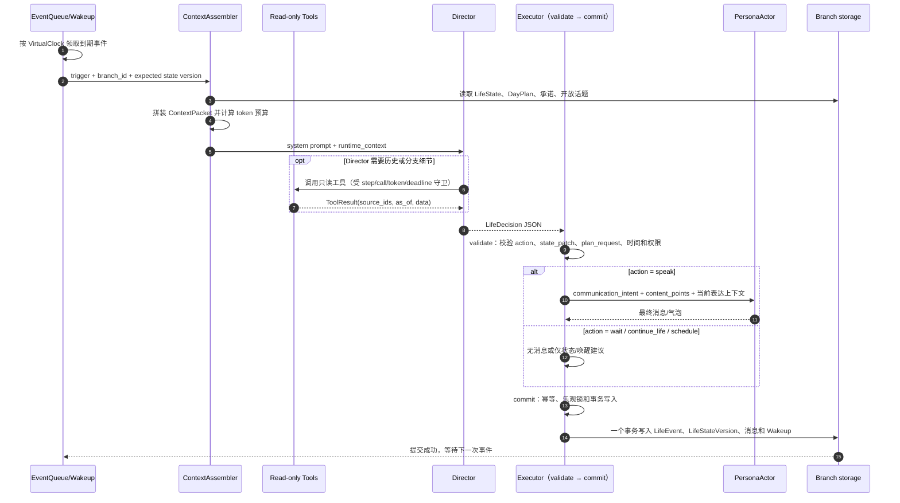

# 数据提取完成后的数字人 Agent Runtime 设计

> 2026-09-12 架构更新：Director 与 DayPlan 采用同级 Agent + LangGraph 共享协商 State。
> 本文旧图中的 RoutineResolver、LoRA 表达路径及 Director 中心式编排不再代表当前目标。
> 运行期协作以 [同级 Agent 共享 State 设计](2026-09-12-runtime-peer-agents-shared-state-design.md)
> 为准；提取阶段和其他未覆盖边界仍保留本文作为历史设计参考。
> 职责补正：Director 直接依据预加载的三天共享计划判断安排与冲突；只有需要修改计划时
> 才向 DayPlan 发明确调整请求。三天本版默认为虚拟日期的昨天、今天、明天，替代旧版三块摘要。

## 1. 文档定位

本文件的实现主体是**人物背景已经提取完成之后**，数字人如何在一条分支时间线上持续生活，以及如何在需要时与用户交流。
第 2.1 节保留提取侧的边界图，目的是说明 Runtime 从哪个版本接入；别名候选审核和
`amerge_entities` 属于 Runtime 之前的建图后处理，不会在分支运行时再次执行。

本文件覆盖并收窄早期 Runtime 设计中的记忆部分：`PerceptionEvent`、`CognitiveCycle`、
`PrivateCognitionNote` 和 `MentalStateVersion` 暂不属于 Runtime v1，不进入本轮 Agent
上下文或调度图。早期文档中关于这些对象的内容视为后续扩展，不作为当前实现要求。

它不负责：

- 从聊天记录重新提取人物事实；
- 修改 LightRAG 图谱（建图后的别名审核流程见 2.1.1，但不属于分支 Runtime）；
- 在没有人工审核的情况下自动合并人物节点；
- 把新的事实写进 LoRA 权重。

这些工作属于导入、LightRAG 和人物档案编译阶段。Runtime 使用它们的结果，但不把它们混成一个 Agent。

## 2. Agent 的基本分工

数字人 Runtime 不是一个“模型自己想办法做所有事情”的 Agent，而是代码驱动、模型辅助的运行系统：

```text
历史资料：LightRAG + PersonWorldProfile
             ↓
生活状态：VirtualClock + DayPlan + LifeState
             ↓
上下文组装：ContextAssembler
             ↓
决策模型：Director
             ↓
表达模型：PersonaActor（基础模型 + LoRA）
             ↓
执行代码：Executor + EventQueue
```

各组件只回答一个问题：

| 组件 | 负责的问题 | 不负责的事情 |
| --- | --- | --- |
| LightRAG | 过去发生过什么、人物和世界如何关联 | 当前分支的实时状态 |
| PersonWorldProfile | 编译后的身份、工作、关系、规律和事件 | 自动推进时间 |
| VirtualClock | 分支现在几点 | 判断人物此刻该做什么 |
| DayPlan | 今天大体有哪些生活阶段 | 精确安排每一分钟 |
| LifeState | 当前正在做什么、能否回应 | 重新分析整份历史 |
| ContextAssembler | 按来源、时间和预算组织本轮输入 | 代替模型决定事实或写入状态 |
| Director | 下一段生活怎么推进、是否需要表达 | 生成最终口吻文本 |
| PersonaActor LoRA | 把意图说成目标人物的语言 | 管理数据库和任务队列 |
| Executor（后端应用服务） | 校验并持久化决定、状态和事件 | 调用模型、理解语义或自行创造人物事实 |

## 2.1 完整 Agent 系统架构图

下面这张图把一次性的人物背景提取、分支初始化、持续运行和表达放在一起。左侧是只读历史资料，中间是当前分支状态，右侧是模型决策和唯一的副作用出口。

这是 Runtime v1 的目标架构图，不表示所有节点已经在当前代码中落地。当前仓库已经具备人物背景/LightRAG、分支状态和 Wakeup 的部分基础；`BranchDayPlan`、独立的 `LifeStateVersion`、ContextAssembler、Director 工具循环和统一 Executor 事务仍按下图作为后续实现边界。

```mermaid
flowchart LR
  %% ---------- extraction boundary ----------
  subgraph EXTRACT[提取阶段：建立只读世界资料]
    RAW[聊天原文]
    CLEAN[预处理与角色标注]
    HIST[(原始消息与 Bundle 存储)]
    RAG[LightRAG 图谱与原文索引]
    NODES[读取全部图节点]
    PEOPLE[筛选人物节点]
    PROPOSALS[生成别名合并候选]
    REVIEW[人工审核候选]
    MERGE[amerge_entities<br/>写入已确认合并]
    GRAPH[(WorldGraphVersion<br/>当前图版本)]
    PROFILE[PersonWorldProfile 编译器]
    PWP[(PersonWorldProfile<br/>身份·关系·规律·事件)]
    RAW --> CLEAN --> HIST --> RAG --> NODES --> PEOPLE --> PROPOSALS --> REVIEW
    REVIEW -->|审核完成且有 confirmed| MERGE --> GRAPH
    REVIEW -->|审核完成且无 confirmed<br/>无候选/全拒绝/全暂缓| GRAPH
    GRAPH --> PROFILE --> PWP
  end

  %% ---------- branch bootstrap ----------
  subgraph BOOT[分支创建：冻结起点]
    NODE[时间线节点\ncutoff_at]
    SNAP[历史切片编译器]
    ORIGIN[(OriginWorldSnapshot<br/>截至 cutoff 的背景快照)]
    CLOCK[VirtualClock<br/>virtual_now]
    RULES[RoutineResolver<br/>规律 → RoutineRule]
    PLAN[(BranchDayPlan<br/>DayPlanBlock)]
    INIT[initialize_life_state]
    LS[(LifeStateVersion v1)]
    NODE --> SNAP --> ORIGIN
    PWP --> SNAP
    ORIGIN --> RULES --> PLAN --> INIT --> LS
    CLOCK --> INIT
  end

  %% ---------- runtime ----------
  subgraph RUNTIME[每条分支的 Runtime]
    USER[用户消息 / 分支事件]
    QUEUE[(EventQueue + Wakeup)]
    CLAIM[领取到期 Wakeup]
    ASSEMBLE[ContextAssembler<br/>生成 ContextPacket]
    DIRECTOR[Director<br/>LangGraph 决策节点]
    ACTOR[PersonaActor<br/>基础模型 + Persona LoRA]
    OUT[BranchMessage / 对外消息]

    subgraph EXEC[Executor（同一个后端服务）]
      VALIDATE[validate<br/>纯校验阶段]
      COMMIT[commit<br/>唯一产生副作用的事务阶段]
    end

    USER --> QUEUE --> CLAIM --> ASSEMBLE --> DIRECTOR
    DIRECTOR --> VALIDATE
    VALIDATE -->|需要表达| ACTOR
    VALIDATE -->|无需表达| COMMIT
    ACTOR --> COMMIT --> OUT
    COMMIT --> QUEUE
    COMMIT --> LS
    COMMIT --> PLAN
  end

  %% ---------- read-only tools ----------
  subgraph TOOLS[Director/PersonaActor 可用的只读工具]
    MEMORY_TOOL[search_memory]
    STYLE_TOOL[get_style_examples]
    STYLE_INDEX[(ExpressionStyleProfile<br/>已批准对话示例)]
  end

  %% ---------- unified memory ledger ----------
  subgraph MEMORY[统一记忆账本]
    MEM_WRITE[Executor 记录已确认事实]
    STATE[(MemoryRecord 索引<br/>MemoryIndexVersion)]
    MEM_WRITE --> STATE
    COMMIT --> MEM_WRITE
  end

  %% connections across boundaries
  HIST -. 按 cutoff 截取原始消息 .-> SNAP
  PWP -. 只读背景 .-> ASSEMBLE
  ORIGIN -. 只读快照 .-> ASSEMBLE
  CLOCK -. 当前时间 .-> ASSEMBLE
  PLAN -. 三天共享计划完整生活块 .-> ASSEMBLE
  LS -. 当前运行状态 .-> ASSEMBLE
  STATE -. 当前有效记忆 .-> ASSEMBLE

  DIRECTOR -. 工具调用，受 step/call/token/deadline 守卫 .-> MEMORY_TOOL
  ACTOR -. 需要具体表达示例时 .-> STYLE_TOOL
  MEMORY_TOOL -. 查询统一记忆服务 .-> STATE
  MEMORY_TOOL -. 查询历史投影 .-> RAG
  STYLE_TOOL -.-> STYLE_INDEX

  classDef readonly fill:#243447,stroke:#6ea8d9,color:#fff
  classDef state fill:#49351c,stroke:#d4a24c,color:#fff
  classDef model fill:#3b2855,stroke:#b998e6,color:#fff
  classDef sideeffect fill:#4b2525,stroke:#e08a8a,color:#fff
  class RAG,PWP,ORIGIN,STATE,STYLE_INDEX readonly
  class PLAN,LS,CLOCK,QUEUE state
  class PROFILE,SNAP,RULES,ASSEMBLE,DIRECTOR,ACTOR model
  class COMMIT,MEM_WRITE,OUT sideeffect
```



图中实线表示主流程，虚线表示只读查询或上下文注入。`Director` 和 `PersonaActor` 都是模型节点，但职责完全不同：Director 只输出 `LifeDecision`，PersonaActor 只把已经批准的表达意图写成待提交的聊天文本。`Executor.validate` 和 `Executor.commit` 是同一个后端服务的两个阶段；Actor 生成的文本也必须回到 `commit`，只有 `commit` 可以创建 `LifeEvent`、`LifeStateVersion`、`BranchMessage`、DayPlan 覆盖和下一次 Wakeup。

这张图可以按四条路径理解：

1. **历史路径**：聊天原文只在提取阶段进入 LightRAG 和 `PersonWorldProfile`；Runtime 通过只读快照使用它们，不重新建图。
2. **生活路径**：`VirtualClock` 推动 Wakeup，DayPlan 给出默认生活块，LifeState 保存当前实际状态。
3. **决策路径**：ContextAssembler 组织上下文，Director 必要时查询工具并输出结构化决定，Executor 校验后才落库。
4. **分支记忆路径**：只有 `user_message` 明确确认，或 Executor 已确认的分支事实，才可进入统一 `MemoryRecord(scope=branch)`；这条路径不会反向修改 `PersonWorldProfile`。

### 2.1.1 建图后处理的交接状态

建图和人物背景编译不是同一个 Job，也不能在一次任务中并行完成。实现上只保留两个工作阶段，
审核是 `world_graph_ready` 阶段内部的门控条件，不另起一条并行任务：

```text
stage=world_graph_ready, review=pending
  → stage=world_graph_ready, review=complete
  → stage=world_profile_compile
  → stage=world_ready
```

- `stage=world_graph_ready`：LightRAG 已完成建图，已读取全部节点、筛选人物节点并生成候选；此阶段不编译 `PersonWorldProfile`。
- `review=pending`：候选等待人工逐条标记 `confirmed`、`rejected` 或 `deferred`。只确认一条而其它候选仍待审核时，阶段仍保持 `world_graph_ready`。
- `review=complete`：候选列表为空，或每条候选都有本轮最终审核结果。`deferred` 只表示本轮暂不合并，但对本轮是终态，候选会保留到下一次审核。
- `stage=world_profile_compile`：若存在已确认候选，先调用 `amerge_entities`，再重新查询 LightRAG；若没有候选或全部拒绝/暂缓，则使用当前图版本重新查询。该阶段应提供 `retrieve → compile → persist` 的进度，前端在完成前不能展示新的 `PersonWorldProfile`。
- `stage=world_ready`：保存新的 `WorldGraphVersion`、`PersonWorldProfile` 和来源版本，Runtime 只能读取这个版本。

`review=complete` 是代码判断，不由模型自行宣布。审核页面和 API 都应返回当前候选总数、已完成数和剩余数；候选总数为零时直接视为审核完成，避免系统永久停在审核阶段。

前端只根据这两个字段决定页面：`stage=world_graph_ready` 且 `review!=complete` 显示候选审核页；
`stage=world_profile_compile` 显示编译进度并隐藏档案正文；只有 `stage=world_ready` 才请求和展示
`PersonWorldProfile`。这样不会在候选审核完成前误读旧档案，也不会因只确认一条候选就提前编译。

### 2.2 统一记忆机制

Runtime 只使用一个 `MemoryService` 和一套 `MemoryRecord` 语义。记忆记录有范围字段，
而不是维护两个互相竞争的“人物记忆”和“分支记忆”系统：

```yaml
MemoryRecord:
  id: string
  scope: world | branch
  branch_id: string | null       # scope=branch 时必填
  snapshot_id: string | null     # scope=world 时指向 OriginWorldSnapshot
  subject: string
  predicate: string
  object: string
  summary: string
  status: asserted | confirmed | superseded | rejected
  valid_from: datetime | null
  valid_to: datetime | null
  source_ids: [string]
  supersedes_id: string | null
  confidence: number
```

`MemoryRecord` 是唯一的可复用事实单位。`LifeEvent` 和 `BranchMessage` 是原始事件，带来源
的 `MemoryRecord` 是它们的规范化记忆；`LifeStateVersion` 仍然只表示当前状态，不属于长期
记忆。`PersonWorldProfile` 也不是第二个记忆库，而是 `scope=world` 的历史记录经过编译后的
展示投影；`OriginWorldSnapshot` 保存分支创建时使用的 world 记录版本。

Runtime v1 使用 `MemoryIndexVersion` 表示统一记忆索引的读取边界。数据库中已有的
`BranchStateVersion` 只作为迁移期间的兼容快照，不再作为新的运行时事实表；它不能替代
`LifeStateVersion`，也不能提供附近聊天原文。

记忆写入只有一个入口：Executor。在 `user_message` 明确表达确认/记忆意图，或系统已经保存了确定的分支事实后，
Executor 在同一事务中写入原始事件并创建/更新对应的 `MemoryRecord`。Director、PersonaActor
和查询工具都没有写入权限；模型猜测、临时情绪和未确认推断不能成为记忆。

记忆生命周期固定为：

```text
EventQueue 中的 user_message 明确提出记忆请求
    → Executor 校验 source_ids、scope 和有效时间
    → MemoryRecord(status=confirmed)
    → MemoryService 建立索引
    → 后续 Cycle 通过 search_memory 读取
```

没有“模型先写 proposal、后台再替用户确认”的隐式阶段。用户撤销或新事实出现时，
Executor 写入新的 `MemoryRecord`，并用 `supersedes_id` 关闭旧记录；历史记录保留，
索引只暴露当前有效记录。

每轮 `ContextAssembler` 只组装一个 `MemoryContext`，其中记录 scope 和来源：

```text
world records   → 建图截止点以前的历史背景
branch records  → 这条分支后来确认的事实
LifeState       → 此刻状态（不进入 MemoryRecord）
```

读取冲突时使用：`branch.confirmed` > `branch.asserted` > `world.confirmed` > `world.asserted`。
同一主谓词出现新事实时必须通过 `supersedes_id` 替代旧记录；没有替代关系的矛盾同时保留，
交给 Director 选择 `wait` 或请求澄清。任何记录都不被物理删除。

与当前仓库的对应关系是：`world.models.PersonWorldProfile` 作为 world 投影，
`branches.continuity_models.BranchMemoryItem` 迁移为 branch 范围的 `MemoryRecord`，
`BranchStateVersion` 只保存当前记忆索引版本，不再承载另一套事实。后续适配器统一由
`MemoryService` 和 `ContextAssembler` 负责。

这里的“审核记忆”不是一个新的记忆种类。它只是旧实现中 `BranchMemoryItem.review_status`
的叫法：模型先从一轮对话提出候选，再由 `BranchStateEngine` 复核。这个流程从 Runtime v1
移除；新设计不再让模型先生成待审核记忆，也不把“审核”当作查询层。记忆在明确确认时
直接写成 `MemoryRecord(status=confirmed)`，撤销或被新事实替代时写新记录并关闭旧记录。
数据库中现有的 `review_status=pending/approved/rejected` 字段属于旧流程兼容字段，迁移
完成前保留，但 Runtime v1 不再创建 `pending` 记忆。

当前数据库里的 `BranchStateVersion` 也不是一条条记忆。它是某一时刻的**分支记忆物化快照**，
实际字段包括：

```text
persona_state          分支人格状态摘要
relationship_state     与用户/其他对象的关系状态
user_model             对用户的已确认交互模型
emotional_tendency     稳定的情绪倾向摘要
active_belief_ids      当前有效的记忆条目 ID
contested_belief_ids   存在冲突、暂不采用的条目 ID
current_goals          当前分支目标
current_concerns       当前分支关注事项
field_evidence         各字段对应的 source IDs
field_confidence       各字段置信度
version/previous_version_id/rollback_of_version_id
                       快照版本、前一版和回滚关系
```

它不保存 `PersonWorldProfile`、LightRAG 原文、当前 `LifeState` 或完整聊天记录；这些仍由
各自的表和快照管理。统一设计下，`BranchStateVersion` 只作为 `MemoryService` 的读取缓存
和回滚边界，真正可检索的事实仍然是带来源的 `MemoryRecord`。

人物背景更新仍然是显式流程：别名审核通过后生成新的 `WorldGraphVersion`、world 记录和
`PersonWorldProfile`。运行中的 branch 记忆不会自动写回 world；用户要求刷新时，才将带有
`source_ids` 的 branch 记录作为后处理输入，产生新的 world 版本。

### 2.3 一次 Runtime Cycle 的时序图



如果 Director 失败、工具超时、上下文超过硬上限或版本锁冲突，系统不会让模型直接改状态：失败结果是重新读取并重试，或者由代码保存 `wait`/恢复状态。PersonaActor 也不能绕过 `Executor.commit` 写库。

## 3. Runtime 的输入：提取阶段的只读结果

创建分支时，Runtime 固定记录一个 `OriginWorldSnapshot`。它不是把全量
`PersonWorldProfile` 不加区分地复制一份：从历史节点创建分支时，全量档案
可能含有该节点之后才发生的事情，直接复制会造成“未来泄漏”。

当前 LightRAG 1.5.6 的查询接口没有 `time_range`、文档 metadata filter 或
“查询某一图版本”的参数。因此不要为每一个时间线节点建立一张 LightRAG 图；
也不要拿全量图的 `mix` 查询结果当作历史节点的事实来源。

快照应当是一次**按需的历史切片编译**：以节点时间 `cutoff_at` 为截止，读取
原始消息和 Bundle 中不晚于该时间的内容，编译出“截至这一刻”的背景 JSON，
并把结果缓存。它是一次编译任务，不是一张新的长期 LightRAG 图。

```text
选中时间线节点
→ 取得节点的 cutoff_at
→ SQL 按 timestamp 筛选原始消息（跨越 cutoff 的 Bundle 截断）
→ 使用节点附近上下文 + 截止日前历史材料编译 Snapshot
→ 冻结并按 (source_graph_version_id, source_node_id, cutoff_at,
             snapshot_compiler_version) 缓存
→ 创建分支
```

从“最新人物世界”创建分支没有未来泄漏，可以直接冻结当前 ready 的 Profile。

```yaml
OriginWorldSnapshot:
  id: string
  branch_id: string
  source_graph_version_id: string
  source_profile_id: string
  source_node_id: string | null
  cutoff_at: datetime
  timezone: string
  snapshot_mode: latest_profile | historical_cutoff
  source_message_ids: [string]
  person_world_profile: object
  routine_profile: object
  created_at: datetime
  compiler_version: string
```

`routine_profile` 不需要单独再提取；它从同一次切片编译的
`recurring_activities` 和 `routine_summary` 中取出。

原来的最小表达如下：

```yaml
OriginWorldSnapshot:
  graph_version_id: string
  profile_id: string
  source_node_id: string | null
  created_at: datetime
  person_world_profile: object
  routine_profile: object
```

该快照是分支的背景起点。后续原始图谱重新编译，不会悄悄改变已经运行的分支；用户明确创建新分支时，才使用新的快照。

分支自己的变化存放在 `BranchOverlay`：

```yaml
BranchOverlay:
  branch_id: string
  events: [LifeEvent]
  commitments: [Commitment]
  relationship_changes: [object]
  plan_overrides: [object]
```

因此，Runtime 每次决策都能区分：

- **历史背景**：提取阶段得到的资料；
- **分支事实**：这条模拟时间线中已经发生的事情；
- **当前状态**：此刻正在进行的活动；
- **模型建议**：尚未执行的下一步安排。

模型建议只有被 Executor 保存后，才成为分支事实。

## 4. VirtualClock：分支里的时间

### 4.1 作用

VirtualClock 解决“用户从历史节点继续生活后，时间如何往前走”的问题。它让数字人拥有一个确定的分支时间，而不是每次收到消息才临时猜时间。

```yaml
VirtualClock:
  branch_id: string
  virtual_anchor: datetime
  wall_anchor: datetime
  time_scale: number
  status: running | paused
  timezone: string
```

计算方式：

```text
virtual_now = virtual_anchor
             + (wall_now - wall_anchor) × time_scale
```

第一版只需要支持 1:1 运行、暂停、恢复和从历史节点创建分支。暂停、恢复或改变倍率时创建新的锚点，不修改已经发生的 `LifeEvent`。

LLM 不得决定当前时间。所有 Director 和 PersonaActor 调用都接收同一次计算出的 `virtual_now`。

## 5. LifeState：分支中的当前状态

`PersonWorldProfile` 描述“这个人通常怎样”，`LifeState` 描述“她在这条分支里现在怎样”。

```yaml
LifeState:
  branch_id: string
  virtual_now: datetime
  location_role: string | null
  activity: string | null
  social_context: string | null
  availability: available | busy | resting | asleep | unknown
  energy: low | medium | high | unknown
  mood: string | null
  attention: string | null
  current_goal: string | null
  open_conversation_threads: [object]
  active_commitments: [object]
  last_transition_at: datetime
  current_plan_block_id: string | null
  version: integer
```

它是模拟分支的状态，不是对真实人物此刻位置和情绪的事实断言。因此不要求每个字段都附带历史证据，但每次变化必须能追溯到以下至少一种原因：

- DayPlan 的时间边界；
- 分支内已经发生的 LifeEvent；
- 用户新消息；
- 已有承诺或开放话题；
- Director 根据背景提出并被 Executor 接受的生活安排。

第一版不做连续数值心理模型。`energy` 在有依据时只使用低、中、高，没有依据时使用 `unknown`；`mood` 使用简短自然语言或空值，避免建立一套难以校准的情绪分数系统。

### 5.1 LifeState 和现有状态表的边界

LifeState 是运行时的“现在正在怎样”，需要随着 DayPlan 边界、用户消息和分支事件频繁变化。因此它不等同于项目现有的几类状态：

| 现有对象 | 含义 | 与 LifeState 的关系 |
| --- | --- | --- |
| `BranchStateVersion` | 分支 `MemoryRecord` 的物化索引版本 | 作为背景输入；不承载当前活动和可用性 |
| `Branch.state_snapshot.situational_state` | 已有的短期、带有效期的情境槽位 | 可迁移为 LifeState 的字段来源，但不能代替完整 LifeState |
| `LifeStateVersion` | 当前活动、计划块、可用性、短期注意力和开放话题 | Runtime 每次状态切换的当前版本 |

第一版新增独立的 `LifeStateVersion` 表，而不是继续把字段堆进 `Branch.state_snapshot`。`Branch.state_snapshot` 可以保留当前版本 ID 作为读取缓存；真正的历史和回滚以不可变的 `LifeStateVersion` 行为准。这样长期分支记忆的版本和生活状态的版本互不覆盖。

`LifeState` 的字段建议补充来源和有效期：

```yaml
LifeStateVersion:
  id: string
  branch_id: string
  version: integer
  virtual_now: datetime
  current_plan_block_id: string | null
  location_role: string | null
  activity: string | null
  social_context: string | null
  availability: available | busy | resting | asleep | unknown
  energy: low | medium | high | unknown
  mood: string | null
  attention: string | null
  current_goal: string | null
  open_conversation_threads: [object]
  active_commitments: [object]
  last_transition_at: datetime
  valid_until: datetime | null
  reason: plan_boundary | user_message | branch_event | director | expiry | recovery
  source_event_ids: [string]
  field_sources: object
  previous_version_id: string | null
  is_current: boolean
```

`activity`、`availability` 和 `current_plan_block_id` 描述眼前状态；`energy`、`mood` 和 `attention` 是短期工作状态；开放话题和承诺是需要继续处理的对象。没有证据时使用 `unknown` 或空值，不使用“中等精力”“在家”等看似自然但没有依据的默认事实。

### 5.2 LifeState 的初始化

分支创建成功后，由代码执行一次 `initialize_life_state`：

```text
读取 branch.virtual_now
→ 找到当天 DayPlan 中包含 virtual_now 的 block
→ 以 block 的默认活动和可用性初始化当前字段
→ 从 OriginWorldSnapshot 读取稳定目标和关系背景
→ 没有计划或证据的字段设为 unknown/null
→ 保存 version=1，并创建下一个计划边界 Wakeup
```

初始化不会让 Director 猜测当前情绪或地点。若分支从某个历史节点创建，`virtual_now` 以该节点的时间为准；若从最新人物背景创建，则使用用户选择的分支起始时间。`current_plan_block_id` 只引用这条分支自己的 DayPlan，不能引用全局模板。

### 5.3 LifeState 如何变化

状态更新分为四种来源，代码按字段合并而不是整份覆盖：

1. DayPlan 时间边界：自动切换 `activity`、`current_plan_block_id` 和默认 `availability`；
2. 分支中已经保存的 LifeEvent、承诺，或本轮用户消息经 Director 提议并由 Executor 接受的局部变化：覆盖相关时间段；
3. Director 的 `state_patch`：只能提出局部变化，必须经过 Executor 校验后保存；
4. 有效期到达：把过期字段降为 `unknown` 或恢复到当前 DayPlan 默认值。

同一字段冲突时按“已保存分支事件（包括经 Executor 接受的用户消息影响） > 当前计划覆盖 > DayPlan 默认值 > 人物背景规律 > unknown”处理。普通用户消息只是 `trigger`，不会自动把“你是不是在开会”写成目标人物正在开会；只有 Director 的建议经过 Executor 接受后，才会产生对应的 LifeEvent。

每次更新都创建新版本，并记录 `previous_version_id`、`reason`、变更字段的 `source_event_ids` 和 `field_sources`。Executor 使用 `UPDATE ... WHERE branch_id=? AND version=?` 的乐观锁；版本不匹配时重新读取当前状态并重算，不能静默覆盖另一轮 Cycle 的结果。

一次更新的实际顺序固定为：

```text
读取当前 LifeStateVersion
→ 根据 virtual_now 应用已跨过的 DayPlan 边界
→ 应用本轮之前已经落库的 LifeEvent
→ 将当前 trigger 和 working_window 交给 Director
→ Director 只返回局部 state_patch
→ Executor.validate 检查字段权限、有效期和 expected_version
→ Executor 在一个事务中写 LifeEvent（如有）、新 LifeStateVersion 和 Wakeup
```

`state_patch` 的最小结构如下；它不是完整状态替换：

```yaml
StatePatch:
  field: availability | activity | location_role | social_context | energy | mood | attention
  value: object | null
  valid_until: datetime | null
  reason: string
  source_event_ids: [string]
```

如果本轮只有用户消息而没有明确的状态变化，Executor 仍可以记录消息，但不创建新的
`LifeStateVersion`；如果跨过了计划边界，则必须创建版本，即使 Director 最终选择 `wait`。

Director 可以提出的 `state_patch` 仅限当前状态字段，例如把 `availability` 改为 `busy`、关闭一个 `open_conversation_thread` 或更新 `attention`。它不能修改 `virtual_now`、历史背景、已发生的 LifeEvent、其他分支或字段来源。`activity` 变更如果跨越当前计划块，必须同时提供 `PlanRevisionRequest` 或明确引用已经存在的分支事件；DayPlanAgent 会独立给出可审计的计划提案。

### 5.4 有效期和恢复规则

LifeState 不是永久事实，各字段按来源设置有效期：

| 字段 | 默认有效期 |
| --- | --- |
| 计划块活动和默认可用性 | 到当前 block 的 `end_at` |
| 用户消息触发、且经 Executor 接受的临时活动/地点 | 4 小时，最长 24 小时；明确结束时间优先 |
| `mood`、`energy`、`attention` | 到下一次睡眠 block，最长 12 小时 |
| 开放对话线程 | 直到回复、关闭或被用户明确取消 |
| 承诺 | 直到完成、取消或过期 |

过期只改变当前字段，不删除原始 LifeEvent。服务重启时先按 `virtual_now` 推进已经跨过的计划边界，再清理过期字段；不补写中间每一分钟的状态。若没有可用 DayPlan，恢复为 `activity=unknown`、`availability=unknown`，安排下一次“重新生成当天计划”的代码任务，而不是调用模型编造日程。

### 5.5 一个状态切换例子

```text
18:00  DayPlan 从 work 切换到 commute
       → 代码创建 plan_boundary LifeStateVersion
       → activity=通勤，availability=busy，valid_until=19:00

18:20  用户消息：“今晚直接回家”
       → Director 提议临时 LifeEvent 和局部 plan override
       → Executor.validate 通过后由 Executor.commit 写入
       → 只覆盖 18:20–19:00，不修改已经发生的 work block

18:25  用户发来未回复消息
       → ContextAssembler 读取当前 LifeState、未回复线程和剩余 block
       → Director 提出 action=delayed_reply
       → Executor 保存 attention、下一次 Wakeup 和新的 LifeStateVersion
```

LifeState 的每个版本都能回到触发它的计划边界、用户消息、分支事件或 Director 决定；PersonWorldProfile 仍然只读，历史背景不会因为一次短期状态变化而被改写。

## 6. DayPlan：生活的粗粒度骨架

DayPlan 用来提供生活惯性，避免每次唤醒都重新猜测人物在做什么。

```yaml
DayPlan:
  branch_id: string
  date: date
  blocks:
    - id: string
      start: time
      end: time
      activity: string
      location_role: string | null
      default_availability: available | busy | resting | asleep | unknown
```

生活块不是精确日历，也不是强制剧本。第一版每天只生成少量块，例如睡眠、工作、午饭休息、通勤和私人时间。

生成依据按优先级排列：

1. 分支中已经确认的承诺和计划；
2. PersonWorldProfile 与 RoutineProfile；
3. 工作日、周末和节假日；
4. 少量变化，用于避免机械重复。

临时事件可以覆盖某个生活块，但只影响相关时间段，不重写整天，也不凭空创造重大人生变化。

### 6.1 DayPlanAgent：规划与执行分离

DayPlan 是一个独立的 LangGraph Agent 工作流，而不是 Director 在 `LifeDecision`
中直接修改某个 block。它使用与 Director 相同的认知模型配置，但拥有独立的
system prompt、只读工具集合和 `DayPlanProposal` 输出契约：

```text
新分支 / 新日期 / Director 的 PlanRevisionRequest
  → PlanContextAssembler
  → DayPlanAgent（受限只读工具循环）
  → DayPlanProposal
  → Executor.validate_day_plan_proposal / commit_day_plan_proposal
  → 已确认 DayPlan
```

`Director` 只能输出 `PlanRevisionRequest`（原因、目标日期、受影响范围和已有
来源），不能输出 `plan_patch` 或数据库 ID。`Executor` 仍是唯一写入者：它校验
全天连续覆盖、最小 30 分钟粒度、证据归属、已开始 block 不可重写，并重新安排
下一条计划边界 Wakeup。Bootstrap 只建立没有生活块的 `pending` 槽位，不得注入
睡眠、通勤、工作等确定性模板。Planner 失败、工具无结果或提案被拒绝时，计划标记为
`unavailable`，当前状态保持 `unknown`；它会在下一条真实分支事件中重试，绝不提交
半成品或伪造的固定日程。

Planner 的 `PlanContext` 与聊天的 `ContextPacket` 分开。它只包含目标日期、时区、
已确认承诺/已执行 block、冻结 Snapshot 中的工作/地点/规律投影、日期特征和本次
修订请求；不包含整段近期聊天或表达风格。`OriginWorldSnapshot` 是带 `snapshot_id`
和 `cutoff_at` 的只读资料区，不能拼进 system prompt。工具只返回带 `source_ids`
的聚合结果：计划约束、由代码正则和时间戳分析的规律、Snapshot/Branch 记忆，以及
可回溯到 Snapshot 来源的 LightRAG 语义证据。

## 7. EventQueue 与 Wakeup：让 Runtime 按事件运行

### 7.1 为什么不每分钟运行

每分钟运行一次会产生大量无意义的模型调用，也会让数字人不断制造没有后果的“内心活动”。没有需要处理的事情时，Runtime 应该休眠。

### 7.2 EventQueue

EventQueue 是分支所有待处理触发的持久化队列。用户消息必须先写入队列，再由 Worker 领取；HTTP 请求不能直接调用 Director。`Wakeup` 只是 EventQueue 中由系统安排的一类事件，不是另一套调度通道。

队列中的统一事件外壳是：

```yaml
RuntimeEvent:
  id: string
  branch_id: string
  event_type: user_message | plan_transition | delayed_reply | commitment_due | system
  occurred_at: datetime
  payload: object
  idempotency_key: string
  status: queued | claimed | completed | cancelled | invalidated
```

例如：

- 用户消息到达；
- DayPlan 生活块开始或结束；
- 延迟回复到期；
- 已答应的事情到期；
- 已打开的话题需要再次处理。

收到用户消息时，API 只负责保存 `user_message` 事件并唤醒对应分支的 Worker；Worker 再把它与同一时刻到期的 Wakeup 合并成一个 `MergedTrigger`。这样网络重试、Worker 重启和模型重试都不会让同一条用户消息进入两次 Director。

### 7.3 Wakeup

Wakeup 是队列中的一条可执行任务：

```yaml
Wakeup:
  id: string
  branch_id: string
  wake_at: datetime
  reason: string
  trigger_type: plan_transition | delayed_reply | commitment | user_message
  idempotency_key: string
  status: scheduled | executing | completed | cancelled
```

`wake_at` 使用 VirtualClock 的时间。`idempotency_key` 保证服务重启或任务重试时，同一事件不会执行两次。

第一版不允许 Director 无限创建主动 Wakeup。主动检查必须有明确原因、时间和执行上限；否则数字人会变成不断自言自语的任务生成器。

### 7.4 用户消息和 Wakeup 同时到达

用户消息和 Wakeup 都属于同一条分支的触发事件，不能各自启动一个并行 Director。调度器在领取事件时以分支为锁定单位，把同一时间窗口内的触发合并成一个 Cycle：

v1 的合并窗口固定为：领取第一个事件后最多等待 250ms 收集同一分支的新事件，或直到 `ContextPacket` 开始组装，以先发生者为准。已经进入 Director 调用的 Cycle 不再修改；之后到达的用户消息走实时优先级和乐观锁保护。这样既能合并真正同时到达的事件，也不会为了等待 Wakeup 长时间阻塞用户消息。

```yaml
MergedTrigger:
  branch_id: string
  trigger_ids: [string]
  primary_trigger: user_message | commitment | delayed_reply | plan_transition | system
  input_cutoff_at: datetime
  priority: realtime | commitment | plan | proactive
```

触发优先级固定为：

```text
用户消息 > 到期承诺 > 延迟回复 > DayPlan 边界 > 普通主动检查
```

因此，在 Wakeup 正好到期时收到用户消息，系统只调用一次 Director，但 ContextPacket 同时包含：

```text
primary_trigger = user_message
additional_triggers = [delayed_reply 或 plan_transition]
```

Director 先处理用户消息，再判断是否需要兑现 Wakeup 的原定目的。用户消息已经回答了延迟回复话题时，Executor 会在同一事务中把旧 Wakeup 标记为 `completed` 或 `cancelled`，并在 evidence 中记录 `superseded_by_trigger_id`，不会再次发送一条重复回复。承诺到期事件即使有用户消息也不能静默丢弃；它作为次级 trigger 进入同一轮，或者在用户消息处理完成后创建下一次有明确理由的 Wakeup。

事件使用稳定幂等键，确保合并和重试不会重复执行：

```text
user_message:{branch_id}:{branch_message_id}
wakeup:{branch_id}:{wakeup_id}
cycle:{branch_id}:{sorted(trigger_ids)}:{input_cutoff_at}
```

调度器在数据库事务中完成“领取事件 → 读取当前 LifeState 版本 → 生成合并 trigger”。如果用户消息在 Wakeup 已领取但 Director 尚未开始时到达，实时消息会附加到当前未提交 Cycle；如果已经进入不可取消的模型调用，就新建一个实时 Cycle，并由 Executor 根据 `expected_state_version` 拒绝旧 Cycle 覆盖新状态。旧 Cycle 可以保存为 `invalidated`，但不能产生第二条公开消息。

正在执行低优先级 `proactive` 或 `offline` 推理时，实时用户消息可以请求取消模型调用；取消只影响模型请求，不回滚已经提交的 LifeEvent。Executor 的写入始终是单分支串行事务，因而不会出现“用户消息回复”和“Wakeup 回复”同时写入的情况。

## 8. 一次 Runtime Cycle

一次 Cycle 是“被某个事件叫醒后，处理一次并安排下一次”的完整事务：

```text
1. 代码计算 virtual_now
2. 锁定并领取一个或多个到期 Wakeup
3. 读取 LifeState、当前 DayPlan 和未完成承诺
4. 合并本轮 Trigger，去重同一事件
5. 读取 OriginWorldSnapshot 与 BranchOverlay
6. 查询需要的历史上下文（LightRAG / PersonWorldProfile）
7. Director 输出离散 LifeDecision
8. 若 action=speak，PersonaActor 生成表达内容
9. Executor 原子保存 LifeEvent、消息和新 LifeState
10. 标记 Wakeup 完成，并安排下一次 Wakeup
```

如果进程中断，恢复时不补写每一分钟的心理活动，只处理已经跨过的计划边界、到期承诺和延迟回复。多个到期事件合并到同一个 Cycle，避免重复调用模型。

## 9. Director：决定生活，不负责说话

Director 接收确定的运行上下文：

下面的 `RuntimeContext` 是逻辑字段；实际发送给模型时统一封装为后文定义的
`ContextPacket`，并经过预算裁剪、来源标记和压缩处理。

```yaml
RuntimeContext:
  trigger: object
  virtual_now: datetime
  person_world_profile: object
  routine_profile: object
  life_state: object
  day_plan: object
  recent_branch_events: [object]
  historical_context: [object]
  branch_context: [object]
```

它只输出离散决定，不输出“准备程度 0.73”之类的连续分数：

```yaml
LifeDecision:
  state_patch: object
  plan_request: object | null
  action: speak | wait | continue_life | schedule
  speech_mode: reply | proactive | delayed_reply | null
  communication_intent: string | null
  content_points: [string]
  next_wakeup_at: datetime | null
  private_reason: string
```

基本规则：

- `reply`：用户消息需要回应；
- `delayed_reply`：当前活动导致稍后再回；
- `continue_life`：生活状态变化，但没有必要发消息；
- `schedule`：产生有明确理由的后续 Wakeup；
- `wait`：没有足够理由采取外显行动。

Director 可以安排“她继续上班”“晚些时候回复”，但不能直接写入数据库，也不能把猜测变成历史事实。所有输出必须经过 Executor 的约束检查。

### 9.1 Director 到底是什么

这里的 Director 不是另一个数字人，也不是负责写回复的“总管模型”。它是 Runtime 中的一个决策节点：把代码准备好的时间、生活状态、背景和触发事件转换成一个有限的 `LifeDecision`。它只回答“这一轮要不要改变生活、要不要回复、下一次什么时候再检查”，不回答“具体用什么口吻说”。

Director 可以实现为 LangGraph 中的一个节点，外加一个受预算和进展守卫控制的只读工具调用循环：

```text
assemble_context
      ↓
director_model ──需要资料──→ read-only tool ──→ director_model
      ↓
Executor.validate
      ↓
Executor.commit
```

`Executor.validate` 失败、模型超时或工具不可用时，默认输出 `action=wait`，保留当前 `LifeState`，只安排代码能够证明理由的下一次 Wakeup。Director 不得直接写数据库、发送消息、修改 LightRAG 或调用 PersonaActor。

### 9.2 ContextPacket：每轮到底给模型什么

Runtime 不把数据库对象直接拼进 Prompt，而是先由代码生成一个带来源和时间边界的 `ContextPacket`。字段顺序固定；同一输入必须得到同一顺序，便于重放和审计。

```yaml
ContextPacket:
  protocol_version: runtime-context-v1
  generated_at: datetime
  virtual_now: datetime
  timezone: string
  trigger:
    type: user_message | plan_transition | delayed_reply | commitment | system
    id: string
    occurred_at: datetime
    payload: object
  origin:
    cutoff_at: datetime
    snapshot_id: string
    person_world_profile: object
    routine_profile: object
  current:
    life_state: object
    day_plans: # 虚拟日期 D-1、D、D+1；双方共享同一版本
      - date: date
        status: available | missing | unavailable
        version: string | null
        blocks: [object] # 当天完整已提交生活块；缺失不等于空闲
    open_commitments: [object]
    open_conversation_threads: [object]
  branch:
    working_window:
      from_sequence: integer
      to_sequence: integer
      messages: [object]
      active_thread_ids: [string]
      unresolved_items: [object]
    recent_events: [object]
    overlay_summary: string | null
  memory:
    retrieved_records: [MemoryEvidence]
  budgets:
    input_tokens: integer
    compressed: boolean
    compression_round: integer
```

各区域的含义和优先级如下：

| 区域 | 内容 | 默认上限 | 冲突时的权威性 |
| --- | --- | ---: | --- |
| `trigger` | 本轮唤醒原因和用户最新消息 | 1,500 tokens | 最高，原文保留 |
| `current.life_state` | 当前活动、可用性、情绪、目标、话题 | 1,200 tokens | 分支当前事实 |
| `current.day_plans` | 昨天、今天、明天的完整已提交计划、日期状态及版本 | 按实际完整内容计入预算，不以旧 1,000 tokens 截断 | 已确认计划高于惯例；昨天只读 |
| `current.open_commitments` | 未完成承诺及到期时间 | 1,000 tokens | 分支事实 |
| `origin` | 身份、关系、规律、事件和别名 | 3,500 tokens | 提取背景，只读 |
| `branch.working_window` | 当前触发附近的连续对话和未解决事项 | 4,000 tokens | 当前分支事实最高 |
| `branch.recent_events` | 附近时间片之外但仍与当前周期相邻的事件 | 1,000 tokens | 分支事实高于历史背景 |
| `memory` | `search_memory` 返回的历史/分支记忆证据 | 4,000 tokens | 必须带 scope 和来源 |

`PersonWorldProfile` 不应每轮原样塞入。代码先保留身份、稳定关系、工作/地点、规律和与当前触发相关的事件；完整档案只在工具查询或调试中读取。`DayPlan` 预加载虚拟日期昨天、今天、明天的完整已提交生活块及版本，双方共享；当前块可额外标注，但不能代替三天计划。缺失日期显式标记，不编造历史、不解释为全天空闲。`LifeState` 放完整的当前字段，但 `open_conversation_threads` 和 `commitments` 只放未关闭项。`BranchOverlay` 先由代码展开为已确认的事件、承诺和计划覆盖；没有被 Executor 保存的 Director 建议不能进入这里。

`branch.working_window` 是本轮的第一层上下文，也叫“工作上下文”，不是长期记忆：它由代码根据当前触发消息向前取固定条数/固定时间片的 `BranchMessage`，并带上同一开放话题的必要消息。原始内容的唯一存储位置是 `BranchMessage`；`working_window` 可以每轮重新计算或放在缓存中，不能写进 `LifeStateVersion`。`LifeStateVersion` 只保存 `active_thread_ids`、最后观察到的 sequence 等引用字段。

它和 `BranchStateVersion` 的读取路径完全不同：

```text
EventQueue trigger
   ├─→ BranchMessage 查询 ─→ branch.working_window（附近原文）
   ├─→ LifeStateVersion ─→ current.life_state（当前状态）
   └─→ MemoryService ─→ memory（窗口之外的结构化记忆）
```

`BranchStateVersion` 不参与附近原文的生成，也不能把自己的 JSON 快照当成聊天记录。
它最多提供 `MemoryService` 当前索引版本，帮助查询确定读取边界；`ContextAssembler`
仍必须根据 `BranchMessage` 的 sequence/时间范围读取原文。这样即使长期记忆索引回滚，
附近对话窗口也不会被改写。

v1 的窗口规则固定为：以当前 trigger 为锚点，取虚拟时间上最近 2 小时内最多 16 条
`BranchMessage`，总预算 4,000 tokens；若 `active_thread_ids` 指向更早的未关闭话题，
额外取该话题最近 6 条消息，超出预算的部分只保留 thread 摘要和 source IDs。窗口不跨
`OriginWorldSnapshot` 的 cutoff，也不包含已被撤销或 generation failed 的消息。

对应的持久化职责是：

| 对象 | 保存什么 | 是否保存附近对话正文 |
| --- | --- | --- |
| `BranchMessage` | 分支中每条用户/数字人消息、sequence、turn_id、时间和发送状态 | 是，唯一事实来源 |
| `ConversationActorState` | 当前关注、开放对话序列、已观察到的 message sequence、租约和版本 | 否，只保存游标和线程元数据 |
| `LifeStateVersion` | 当前活动、可用性、精力、计划块和状态变更原因 | 否 |
| `ContextPacket.branch.working_window` | 本轮从 `BranchMessage` 计算出的附近时间片 | 只存在于本轮输入/短期缓存 |

第二层 `memory` 是 `search_memory` 的结果。它查询统一 `MemoryService`，返回窗口之外的分支事实或 world 背景；不得把已经在 `working_window` 中的消息再次作为独立证据返回。两层通过 `source_ids` 去重：工作上下文优先保留原文，长期记忆优先保留结构化摘要。

因此两层的调用方式不是对称的：

```text
ContextAssembler（代码自动执行）
  → 读取 BranchMessage
  → 生成 working_window
  → 直接放进 ContextPacket

Director（模型按需决定）
  → 发现窗口内证据不足
  → 调用 search_memory
  → 将窗口外 MemoryRecord 追加到 memory.retrieved_records
```

Director 不得调用工具获取 `working_window`；也不应在每轮开始时主动调用
`search_memory`。只有当工作窗口、LifeState、承诺和开放话题不足以完成判断时，才查询
窗口之外的长期记忆。

上下文中的每条事实都带统一的来源标记，模型可以据此判断能否使用：

```yaml
ContextEvidence:
  text: string
  source_kind: profile | branch_event | branch_message | memory_record | lightrag | user_trigger
  source_ids: [string]
  occurred_at: datetime | null
  valid_until: datetime | null
  certainty: observed | approved | inferred | unknown
```

代码按以下顺序序列化，不允许模型自行重排事实优先级：

```text
协议与安全规则
→ virtual_now、timezone、trigger
→ origin profile 与 routine
→ LifeState
→ 当前及后续 DayPlan
→ 未完成承诺和开放话题
→ 最近分支事件与对话
→ 本轮工具返回的历史证据
→ LifeDecision 输出格式
```

### 9.3 Director 的 system prompt

Director 使用固定的 system prompt；人物姓名、时间和数据放在结构化的 user context 中，不通过字符串拼接改变规则。下面是 v1 的完整语义模板，实际代码可以把它存为版本化常量 `runtime-director-v1`：

```text
你是 MoonlightBox Runtime Director。你负责在一个虚拟分支里决定
目标人物下一步如何生活，以及是否需要安排表达。你不是 PersonaActor，
不要生成可直接发送给用户的聊天文字。

当前时间、时区和触发事件由系统提供，不能猜测、修改或用现实时间替代。
分支中已经由 Executor 保存的事件、消息、承诺和 LifeState 是当前事实；
OriginWorldSnapshot 和 PersonWorldProfile 是截止时间以前的只读历史背景；
LightRAG 返回的内容只是带来源的证据。发生冲突时按以下顺序处理：
用户本轮消息和分支已保存事实 > 当前 LifeState/已确认 DayPlan >
PersonWorldProfile > LightRAG 历史证据 > 一般常识。不能把推断写成事实。

只能通过只读工具补充资料。工具返回的文本必须保留 source_ids；
不要因为工具没有结果而编造人物、地点、关系、承诺、情绪或时间。
不要主动制造重大人生变化，不要无限安排 Wakeup，不要把内部理由或
工具结果写成对用户可见的回复。

请只返回符合 LifeDecision schema 的 JSON：
- action=speak：确实需要现在表达；同时填写 speech_mode、
  communication_intent 和 content_points；content_points 是意图要点，
  不是成文台词。
- action=wait：没有足够理由外显行动。
- action=continue_life：只更新当前生活状态，不发送消息。
- action=schedule：有明确的承诺、计划边界或延迟回复理由时安排 Wakeup。
- state_patch 只能修改 LifeState 允许的字段；plan_request 只能请求
  DayPlanAgent 重新规划，不得携带 block、数据库 ID 或直接覆盖 DayPlan。
- next_wakeup_at 必须晚于 virtual_now，并且必须有对应 reason；没有理由时为空。
- private_reason 供审计，不得包含新的事实断言。

若当前活动是 busy、resting 或 asleep，除非用户消息紧急或承诺到期，
优先继续生活或延迟回复。若资料不足，选择 wait 或 continue_life，
不要用想象填空。
```

user message 只包含一个 `<runtime_context>` JSON 区块和一个 `<tool_results>` 区块。模型输出使用严格的 `LifeDecision` JSON schema；拒绝自由文本、Markdown 和额外字段。`private_reason` 会保存到审计记录，但不会传给 PersonaActor。

### 9.3.1 给模型的工具使用规约（不是 schema）

上面的 schema 只约束参数形状，不能教模型什么时候查资料。Director 的 system prompt 还必须包含下面这段“工具使用规约”；它是行为规则，随 `runtime-director-v1` 一起版本化。工具调用由 LangGraph 的 `should_continue` 条件边执行，模型不能绕过条件边直接循环。

```text
工具使用规则：
1. 先读完 <runtime_context>，再决定是否需要工具。当前 LifeState、当前和后续
   DayPlan、未完成承诺、开放话题和最近 6 轮对话已经在上下文中，不要重复查询。
2. 只有在“现有上下文不足以支持一个具体判断”时才调用工具；调用前先写出一个
   单一问题（query），问题必须能改变本轮 LifeDecision，而不是泛泛地搜索人物。
3. 查询历史或分支事实时统一调用 search_memory，通过 scope 选择 branch、world 或 both。
   scope=branch 用于本分支事件、承诺和对话；scope=world 用于人物背景、历史经历、关系
   和原始聊天证据。默认先用 branch；只有问题明确涉及建图截止点以前的背景，或 branch
   证据不足时才使用 world/both。不要为了同一个问题先后调用多个 scope。
4. query 要包含人物/关系、时间范围或事件关键词，长度保持简短；limit 只取满足
   判断所需的最小数量。需要核对原话时才把 include_original 设为 true。
5. 每次调用后先检查 ToolResult.source_ids、as_of 和 truncated。只使用返回的证据，
   不得把工具未返回的内容当事实；证据冲突时优先较新的分支事实，并在 private_reason
   中记录冲突。
6. 如果结果已经足够作决定，立即停止调用工具并输出 LifeDecision；不要为了“更有
   把握”继续搜索。若结果为空或仍不足，输出 wait/continue_life，并说明缺口，
   不得用常识补全。
7. 同一 query 不得原样重复调用。工具报错只允许重试两次；返回相同 source_ids
   视为没有进展，应停止查询。不得调用任何写入工具，也不得自行发送消息。
8. 工具调用总量、模型 step、token 和时间由运行时硬上限控制。收到运行时的
   `TOOL_BUDGET_EXHAUSTED` 或 `NO_NEW_EVIDENCE` 指令后，必须在不调用工具的情况下
   根据已有上下文输出最终 LifeDecision。
```

这段规约与工具返回结果分开注入：规约在 system prompt 中固定不变，`<tool_results>` 只放本轮实际返回的数据。这样模型学习到的是“先判断缺口 → 定向查询 → 核对来源 → 有证据就停止”的流程，而不是把工具当作每轮必做的搜索接口。

三层职责要分开实现：

| 层 | 写什么 | 谁执行 |
| --- | --- | --- |
| system prompt 工具规约 | 何时查、选哪个工具、query 怎么写、拿到证据后何时停、失败如何处理 | 模型遵循；版本化管理 |
| tool schema/description | 参数类型、长度、枚举、返回外壳 | LangChain 校验；代码绑定身份参数 |
| LangGraph 条件边 | 是否允许继续、预算/超时/重复调用/错误重试上限 | 代码强制执行，模型不能绕过 |

例如：

| 当前缺口 | 模型动作 | 结束条件 |
| --- | --- | --- |
| “她是否答应过今晚交材料？” | `search_memory(scope="branch", query="今晚 交材料 承诺", limit=4)` | 找到承诺或确认无证据后立即输出决定 |
| “用户问她大学在哪读的” | `search_memory(scope="world", query="大学 就读地点", limit=4, include_original=false)` | 证据足够回答是否应回复；不再查其他 scope |
| 只需要按已有口吻回复 | 不调用工具，直接使用 `ExpressionStyleProfile` | 生成 `ActorMessage` |
| 工具返回空结果 | 不换关键词无限搜索 | `wait`/`continue_life`，记录缺口 |

### 9.4 Director 的工具边界

Director 只绑定读取工具。工具不接受任意 SQL、不返回数据库对象，也不产生写入副作用。当前状态、三天共享 DayPlan、未完成承诺和最近对话已经由 `ContextAssembler` 预加载，因此不再把它们重复做成工具；工具只用于“当前上下文确实不足时的定向查询”。

Director 直接根据共享计划判断有无空闲、安排冲突以及如何回应；用户意图不清楚时直接询问用户。
这些判断不需要请求 DayPlan。只有决定新增、移动、取消或重排活动时，才通过共享协商消息
向同级 DayPlan 发送明确修改目标与保留约束。DayPlan 负责排程落地，发现新增约束时反馈，
Executor 校验提交；Director 根据真实回执表达结果，不能把候选安排说成已经生效。

运行时只保留两种只读能力；Director 绑定 `search_memory`，PersonaActor 绑定 `get_style_examples`：

| 工具 | 何时调用 | 必填参数 | 返回 |
| --- | --- | --- | --- |
| `search_memory` | 当前上下文不足，需要查询历史或分支事实 | `scope`, `query`, `limit`, `include_original` | 带 scope 和 source_ids 的统一记忆证据 |
| `get_style_examples` | 仅由 PersonaActor 在需要模仿具体表达习惯时调用 | `model_version_id`, `intent`, `limit` | 已批准的同意图对话示例 |

`get_current_state`、`get_open_commitments` 和 `get_conversation_thread` 不作为 Director 工具：它们已经是每轮 ContextPacket 的固定区域。原文摘录由 `search_memory(include_original=true)` 按 scope 返回，不再单独设置 source 工具。

### 9.4.1 `search_memory` 与统一记忆账本

`search_memory` 是唯一的记忆查询入口。它查询 `MemoryService` 的统一只读索引，
通过 `scope` 区分历史基线和当前分支，不再存在两个工具各自维护一份记忆：

```text
scope=branch: LifeEvent / BranchMessage   这条分支已经发生或确认的事实
scope=world:  PersonWorldProfile          建图截止点以前的历史背景投影
```

如果未来需要压缩旧分支事件，`BranchMemoryItem` 只能作为 `scope=branch` 的摘要记录，
必须携带原始 `source_ids`，不能成为新的事实来源。未确认、被否决或仅由模型推断出的
内容不会进入索引。

调用 `search_memory` 时，代码先排除本轮 `ContextPacket` 已经携带的 source IDs，再按
“scope 优先级 > 与 query 的相关性 > 时间新近度”排序。若摘要已经覆盖原始事件，默认只
返回摘要并附原始 source IDs；只有 `include_original=true` 才返回少量原文。这样 Director
不会把同一事实看成两条独立证据。

如果最新 branch 事实与旧摘要冲突，索引使用 `supersedes_id` 隐藏旧摘要，并把新事实作为
唯一当前结果；没有明确替代关系的冲突则同时返回两条证据，Director 必须选择 `wait` 或
请求用户澄清。`search_memory` 永远只读，不会因为查询而创建、合并或更新记忆；记忆写入
只能由 Executor 在明确确认后完成。

因此查询边界只有一个工具、两个 scope：

```text
search_memory(scope=branch) → 这条分支后来发生/确认了什么
search_memory(scope=world)  → 建图截止点以前这个人通常怎样
```

人物口癖、标点、常用词和说话节奏不是 Director 的工具。它们属于 `ExpressionStyleProfile`，由 ContextAssembler 以小型稳定摘要注入 PersonaActor；`get_style_examples` 只是 PersonaActor 的可选读取工具，用于取少量相似表达示例，不允许修改风格档案。Director 只提供表达意图和内容要点。

所有工具使用同一个返回外壳，便于 ContextAssembler 丢弃重复结果并保留证据链：

```yaml
ToolResult:
  tool_name: string
  scope: branch | world
  as_of: datetime
  source_ids: [string]
  truncated: boolean
  data: object | [object]
```

工具由代码注册为 LangChain `StructuredTool`（或等价的 LangGraph tool node），参数 schema 固定且禁止额外字段。两个工具的输入 schema 是：

```python
class SearchMemoryArgs(BaseModel):
    scope: Literal["branch", "world", "both"]
    query: str = Field(min_length=2, max_length=300)
    limit: int = Field(default=8, ge=1, le=12)
    include_original: bool = False

class GetStyleExamplesArgs(BaseModel):
    model_version_id: str
    intent: str = Field(min_length=2, max_length=160)
    limit: int = Field(default=4, ge=1, le=6)
```

`search_memory` 的 `branch_id`、`snapshot_id` 和 `as_of`，以及 `get_style_examples` 的
`model_version_id`，必须由代码绑定当前 Cycle，不能由模型改成别的分支、快照或模型版本；
模型只能选择 `scope` 和查询条件。`limit`、查询长度和原文开关由 schema 限制。工具结果
进入 `<tool_results>` 后由 ContextAssembler 去重，并保留 `scope`、`source_ids`、`as_of`
和 `truncated`。

Director 没有 `send_message`、`write_memory`、`merge_entities`、`update_profile` 或任意数据库写工具；写入统一由 Executor 完成。

### 9.4.2 LangGraph 调用循环

实现上不让模型自己决定下一节点。图中只有两个可循环节点：`director_model` 和 `tool_node`；`should_continue` 是代码节点，读取 `DirectorLoopState` 后返回 `"tool"`、`"final"` 或 `"force_final"`。

```python
director_model = chat_model.bind_tools(
    [search_memory],
    strict=True,
)

graph.add_node("director_model", director_model_node)
graph.add_node("tool_node", tool_node)  # 只执行已注册的只读工具
graph.add_conditional_edges("director_model", should_continue, {
    "tool": "tool_node",
    "final": "executor_validate",
    "force_final": "force_final",
})
graph.add_edge("tool_node", "director_model")

def should_continue(state: DirectorLoopState) -> Literal["tool", "final", "force_final"]:
    if state.last_model_output_is_valid_decision:
        return "final"
    # 以下是事故熔断器，不是 Agent 的计划或成功条件。
    if state.model_steps >= 24 or state.tool_calls >= 48:
        return "force_final"
    if state.tool_tokens >= 16000 or state.elapsed_seconds >= 300:
        return "force_final"
    if state.repeated_call_count >= 2 or state.tool_error_count >= 3:
        return "force_final"
    if state.model_requested_tool:
        return "tool"
    return "force_final"  # 自由文本/非法输出也不能继续盲循环
```

`tool_node` 执行完后把规范化的 `ToolResult` 追加到 `<tool_results>`，再回到 `director_model`；它不会把工具异常直接当成模型消息。异常会增加 `tool_error_count`，超过两次就走 `force_final`。`force_final` 使用同一 system prompt 的无工具版本，并附加“仅依据已有证据输出 LifeDecision”的内部指令；仍然解析失败则由代码生成 `action=wait`。因此“如何调用”和“何时停止”由 system prompt 提示模型、由 LangGraph 条件边和运行时预算共同兜底。

### 9.5 压缩阈值和压缩内容

Token 由实际 Director 模型的 tokenizer 计算，不能用字符数估算。v1 按 32K context window 配置，包含 system prompt、ContextPacket、工具结果和输出预留：

```yaml
director_context:
  model_context_window: 32768
  output_reserve: 4096
  input_soft_limit: 16000       # 超过即启动语义压缩
  input_target_after_compact: 12000
  input_hard_limit: 24000       # 超过前必须再次压缩，禁止请求模型
  max_model_turns: 24           # 仅作供应商失控熔断；不是“做满 24 轮”
  max_tool_calls: 48            # 仅作成本熔断；模型在有效决定时立即结束
  max_tool_total_tokens: 16000
  deadline_seconds: 300         # 仅作单个 Runtime Cycle 的墙钟熔断
  max_same_call_without_new_source: 2
  max_compaction_attempts: 2
```

这里没有把工具轮数固定为 2。模型可以在有进展时继续查询，并在产出通过 Schema 校验的决定时立刻结束；不会为了“用完轮数”继续调用。`max_model_turns`、`max_tool_calls`、工具结果上下文容量和截止时间只防止异常成本；同一工具使用相同参数连续重复两次、连续工具错误或没有新证据时会提前熔断。熔断后向模型追加一次“仅根据现有 ContextPacket 输出 LifeDecision”的内部消息，禁止再提供工具；如果结构化输出仍无效，返回 `action=wait`。

```yaml
DirectorLoopState:
  model_steps: integer
  tool_calls: integer
  tool_tokens: integer
  started_at: datetime
  last_call_fingerprint: string | null
  repeated_call_count: integer
  no_progress_count: integer
  compaction_attempts: integer
  terminal_reason: final | budget | repeated_call | deadline | tool_error | invalid_output
```

这套终止方式采用“模型可以自主结束，但运行时永远有硬上限”的原则。Codex 的公开实现也把一次模型响应作为 step，并在每个 step 重新捕获上下文、检查待处理输入和 token 状态；其公开提示指南要求明确阶段、可用工具、输出 schema、重试次数和停止条件，而不是只告诉模型“尽量少用工具”。

压缩是 ContextAssembler 的代码步骤，不交给 Director 自己决定。顺序固定：

1. 去掉重复的历史段落、重复消息和已经包含在 `branch.working_window` 中的工具结果；
2. 将超过最近 12 轮的分支对话压成 `overlay_summary`，保留未解决话题、承诺、拒绝、时间和 source IDs；
3. 将已关闭的生活块和已完成承诺移出当前区，只保留计数和最后变更时间；
4. 按当前 trigger 查询重新排序历史证据，先保留与当前人物、关系和时间直接相关的内容；
5. 仍超过 16K 时，生成或更新分支滚动摘要，再裁掉最旧的原文。

以下内容永远不能被摘要或删除：用户本轮原文、当前 `LifeState`、当前 DayPlan block、未完成承诺、开放话题的最后消息、最近 6 轮对话、所有正在引用的 source IDs、当前时间和触发类型。压缩后仍超过 24K 时，不调用模型，写入 `context_budget_exceeded` 审计事件并采取 `wait` 安全结果。

滚动摘要不是新的事实表。每条 `ContextSummary` 必须记录覆盖范围和来源：

```yaml
ContextSummary:
  id: string
  branch_id: string
  covered_until: datetime
  source_event_ids: [string]
  source_message_ids: [string]
  text: string
  unresolved_items: [string]
  created_by: runtime-context-summarizer-v1
  compression_round: integer
```

摘要模型只能压缩已有内容，不能推断新的动机、关系或人物事实；无法确认的内容写入 `unresolved_items`。新的分支事件不会修改旧摘要，而是通过 `covered_until` 之后的新摘要或当前事件覆盖它。重放 Cycle 时使用同一份摘要版本，保证结果可审计。

### 9.6 DayPlan、LifeState 和历史背景如何协作

三者在 ContextPacket 中承担不同职责，不能互相替代：

```text
PersonWorldProfile / LightRAG：这个人过去通常怎样
RoutineProfile：哪些生活模式有历史依据
DayPlan：今天按什么粗粒度骨架生活
LifeState：当前正在做什么、是否可回应
BranchOverlay：这条分支已经确认发生了什么
Trigger：为什么现在被唤醒
```

例如当前时间为工作日 18:30，DayPlan 的当前块是 `work`，LifeState 是“刚下班、energy=low、availability=available”，而用户有一条未回复消息。Director 看到的是“活动结束边界 + 当前低精力 + 未回复线程”，可以决定 `delayed_reply` 并安排 18:50 检查；它不需要重新从 LightRAG 猜测“她平时几点下班”。只有当用户问到具体历史经历，或当前状态和背景发生冲突时，才调用 `search_memory(scope=world)`。

DayPlan 的时间边界由代码产生 Wakeup；LifeState 的变化由 `state_patch` 提议并由 Executor 校验后保存；PersonWorldProfile 永远只读。这样可以避免每次模型调用同时重写日程、心理状态和历史人物档案。

## 10. PersonaActor：把决定表达出来

PersonaActor 的输入包括：

- Director 的 `communication_intent`；
- `content_points`；
- 当前 LifeState；
- 最近分支对话；
- 需要引用的历史上下文；
- Persona LoRA 的表达协议。

它负责：

- 用目标人物的口吻组织文字；
- 决定一条消息还是连续气泡；
- 使用目标人物常见的标点、表情和节奏；
- 在已有意图范围内表达亲密、疲惫、拒绝、关心等状态。

它不负责：

- 判断当前时间；
- 决定是否应该主动联系；
- 修改人物档案；
- 创建不存在的工作、地点、关系或事件；
- 直接调用外部工具。

### 10.1 PersonaActor 的 system prompt 与工具规约

PersonaActor 也需要行为规约；不能只把 `get_style_examples` 的 schema 交给模型。它的 system prompt 固定为“只表达已批准意图”，并明确工具是补充示例而不是必经步骤：

```text
你是 PersonaActor。把 Executor 已批准的 communication_intent 和
content_points 写成目标人物会发送的短消息。不得改变意图、添加未给出的事实、
承诺新的时间，或替 Director 决定是否发送。

ExpressionStyleProfile 已经提供口癖、称呼、标点、长度和语气摘要。只有当摘要
不足以完成当前意图（例如需要模仿一种特定的安慰/拒绝表达）时，才调用一次
get_style_examples；intent 要描述本条消息的表达目的，limit 取最小值。若摘要
已经足够，直接写消息，不调用工具。

调用后只吸收与当前意图一致的表达习惯，不复制示例中的姓名、事件、时间或承诺。
返回的 source_ids 仅用于审计，不要输出给用户。工具为空、重复或超时，直接依据
ExpressionStyleProfile 写作；不得重试超过两次，不得调用其他工具。

输出严格的 ActorMessage schema（text、bubbles、style_applied），不要输出解释、
工具内容或 Markdown。
```

PersonaActor 的 LangGraph 图同样使用代码条件边：`actor_model → (需要示例 ? style_tool : validate_output)`；`style_tool` 最多一次正常查询、最多两次错误重试，随后强制回到 `validate_output`。这样口癖和说话方式由上下文稳定注入，工具只在确有表达缺口时提供少量相似范例，不会把风格检索变成每轮固定动作。

LoRA 学习的是表达方式和反应风格，变化中的背景通过 Runtime Context 注入，而不是不断重新训练模型。

## 11. Executor：后端事务服务，不是 Agent

Executor 是普通的后端应用服务/事务协调器，不是 LLM、Agent 或 LangGraph 节点。它不拥有
system prompt，不调用工具，不决定人物该做什么，也不理解自然语言；它只接收已经通过
schema 校验的 `LifeDecision` 和代码计算出的当前版本，在数据库事务中执行允许的副作用：

```text
LifeDecision JSON + expected_state_version
        ↓
Executor（纯代码校验、幂等、乐观锁）
        ↓
数据库写入与队列调度
```

Executor 将 `LifeDecision` 转换成可持久化结果，并在同一个数据库事务中完成：

```text
LifeEvent（状态变化）
Message（需要发送的消息）
LifeState（新状态和版本号）
Wakeup（下一次唤醒）
```

Executor 不会因为模型的一句推断自动创建长期记忆。只有 `user_message` 明确确认，或已有事件满足
产品定义的“已确认事实”条件时，才在同一事务中把该事实标记为可长期检索；Runtime v1
直接依赖 `LifeEvent`/`BranchMessage`，需要跨窗口检索时由 `MemoryService` 生成带来源的
`MemoryRecord(scope=branch)` 摘要索引。

它必须保证：

- 分支之间互不污染；
- Wakeup 幂等；
- LifeState 使用乐观锁版本号；
- 消息发送失败可以重试，不重复创建 LifeEvent；
- 模型超时不会破坏上一份有效状态。

模型输出不通过 Executor 校验，就不能成为分支事实。

## 12. 一个完整例子

```text
18:30  DayPlan 从 work 切换到 personal_time
      ↓
Wakeup 触发 Runtime
      ↓
LifeState：刚下班、精力低、可回复但不适合长聊
      ↓
用户此前有一条未回复消息
      ↓
Director：action=delayed_reply，安排 18:50 再检查
      ↓
18:50 再次唤醒
      ↓
Director：action=speak，意图是解释刚下班并继续原话题
      ↓
PersonaActor LoRA：生成符合人物口吻的短消息
      ↓
Executor 保存消息、状态和下一次 Wakeup
```

如果 18:30 没有用户消息、承诺或计划切换，就不会调用模型；系统只保留下一次计划边界的 Wakeup。

## 13. 第一版实现边界

第一版先完成以下闭环：

1. 从 `OriginWorldSnapshot` 创建分支；
2. VirtualClock 支持 1:1、暂停和恢复；
3. 每天生成少量 DayPlan 生活块；
4. LifeState 持久化并支持版本控制；
5. EventQueue 支持用户消息、计划边界和延迟回复；
6. Director 使用结构化输出做离散决定；
7. PersonaActor 使用基础模型或 LoRA 生成最终表达；
8. Executor 原子保存结果并安排下一次 Wakeup；
9. 服务重启后可以从数据库恢复，不重复执行事件。

暂不实现：

- 每分钟心理活动；
- 无限主动消息；
- 复杂连续情绪模型；
- 自动改变历史人物档案；
- 自动把模型猜测写回 LightRAG；
- 用 LoRA 权重保存实时状态。

## 14. 最终边界

可以把整个 Agent 设计概括为一句话：

> 提取阶段负责告诉 Runtime“这个人通常是谁”；Runtime 负责让她在分支里连续地生活；Director 决定这一刻做什么；PersonaActor LoRA 决定她会怎样说；Executor 负责让结果真正发生并留下记录。

只要这条边界保持清楚，人物背景、实时状态、行动决策和语言表达就不会互相污染，也不会因为一次模型调用失败而丢失整条分支的连续生活。
