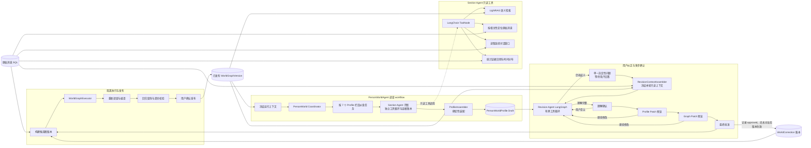

# PersonWorld Agent 与 LightRAG 图谱治理设计

## 1. 文档定位

本文定义 MoonlightBox 在聊天导入完成以后，如何通过一个可调查、可核验、可被用户纠正的
`PersonWorldAgent` 生成 `PersonWorldProfile`，以及如何在多轮人工确认后安全地修改和发布
LightRAG 知识图谱。

> **2026-09-10 v3 修订（当前 Profile 设计真源）**
>
> 本文原有的 `PersonWorldProfile v2` 七个“事实栏目”、`EpisodeFact` / `InteractionObservationFact`
> 等单次即展示的输出类型，以及要求心理理解必须有明确自述、逐项证据和重复性证明的设计，已被
> [2026-09-10-person-world-profile-lived-world-redesign.md](2026-09-10-person-world-profile-lived-world-redesign.md)
> 取代。该修订是 PersonWorldProfile、Section Agent、审核页、Revision 和 Runtime 接入的当前设计真源。
>
> v3 的关键变化是：
>
> 1. Agent 直接撰写七栏中文综述、固定子项和心理画像，并遵守明确编辑要求与目标字数；
> 2. 心理推断允许使用语气、表情、玩笑、文风和整体互动印象，不设明确自述、引用数量或跨日门槛；
> 3. 工作、学习、求职、照料等按 Agent 理解选择情境模块，可并存；具体未知事实不编造；
> 4. Profile 统一为七栏：identity 含 Big Five/MBTI，agency 含 SDT，两个关系栏各含 IPC，
>    life_course 采用 Narrative Identity；完整结构与填写要求集中于 v3 第 3 章，无独立 psychology 对象；
> 5. 每个栏目 Agent 对本栏全部字段负责，可综合跨栏材料；删除 Signal 编码、权重、Reducer 评分与模板正文；
> 6. `PersonaContextAssembler` 按当前事实 → IPC/SDT 情境 → Big Five → MBTI → 叙事线索的优先级组装
>    角色扮演上下文。
>
> 本文其余关于原始消息、图谱候选版本、人工纠正、Revision 四重确认和 Executor 的治理规则继续有效。
> 若本文旧版第 7、14、15、16、17、21、22、23、24 节与 v3 修订冲突，**以 v3 修订为准**。
> 这些旧节中的心理证据准入规则仅保留作历史记录，不再约束 v3 的生成、审核或 Runtime 使用。

本文以以下现有文档为背景：

- `2026-09-03-person-world-compilation-fidelity.md`；
- `2026-09-03-lightrag-entity-alias-postprocessing.md`；
- `2026-09-04-agent-runtime-after-extraction-design.md`。

当本文与上述文档冲突时，人物世界生成与图谱治理部分以本文为准。Runtime 中 Director、
PersonaActor、DayPlanAgent、OriginWorldSnapshot 等运行时职责不因本文而合并进
PersonWorldAgent。

本文最重要的边界变化是：

1. `PersonWorldProfile` 不再由固定八次检索加一次大模型总结直接生成；
2. 别名归并不再是唯一允许人工纠正的知识类型；
3. 用户可以纠正目标人物的工作、教育、地点、关系、偏好、规律、事件和时间状态；
4. 经过确认的纠正必须同时进入可审计的纠正账本，并反映到新的 LightRAG 图版本；
5. 当前已发布图谱禁止原地修改，所有写入在候选图版本中完成；
6. 只有用户完成多步确认后，候选图版本才能成为新的已发布版本。

## 2. 问题定义

当前 PersonWorld 流水线把所有聊天构造成 Conversation Bundle，交给 LightRAG 建图，
然后对一组固定问题做 `mix` 检索，最后通过一次结构化模型调用生成整份 Profile。

这个实现存在以下结构性问题：

1. 模型一次读取大量混合检索结果，容易把发送人误当成陈述对象；
2. LightRAG 的图摘要和原始消息混在同一个上下文中，已有图谱错误会反向影响档案编译；
3. Bundle 文本没有消息 ID，但模型被要求生成真实 `source_message_ids`；
4. 当前清洗器只验证文档 ID，不验证消息 ID、原文摘录、主体指代和事实蕴含；
5. Profile 顶层来源是所有命中文档内消息的并集，无法证明某条消息支持某条事实；
6. OriginWorldSnapshot 会直接复制 Profile，Runtime 又会把这些陈述升级为
   `confirmed / confidence=1.0`；
7. 用户只能审核人物别名，不能纠正工作时间、关系、地点等普通人物事实；
8. 当前别名合并直接修改已有 LightRAG workspace，不具备真正的版本隔离与发布回滚；
9. 用户纠正没有独立账本，重新建图后无法稳定重放；
10. 当前 Sidecar 只公开查询、列实体和合并实体，没有公开完整、安全的实体与关系 CRUD；
11. 按栏目拆开模型调用以后，证据仍保存在一个全局列表中并截取前 640 条，第二轮新证据会
    排在旧证据之后被再次截掉；
12. 栏目证据选择按旧检索到新检索“先到先得”，每栏取满前 40 条后停止，针对缺口发起的
    第二轮检索即使成功也可能无法进入模型上下文；
13. `identity.roles`、`work_and_education`、`life_phases` 等栏目边界重叠，而所有栏目共用同一个
    宽泛 Claim Schema，导致格式正确但语义属于别栏的内容被放行；
14. 空栏目、证据不足和云端调用失败被混成同一种“缺失”，错误 trace 又只保留异常类名，无法
    判断是无资料、超时、限流还是结构化响应无效。

因此，修复目标不是再增加几句 Prompt，而是建立完整的知识治理协议。

## 3. 设计目标

### 3.1 功能目标

PersonWorldAgent 必须能够：

1. 明确知道 PersonWorldProfile 各栏目需要调查什么；
2. 根据当前证据覆盖情况动态制定检索计划；
3. 使用 LightRAG 找候选材料，但回到 SQL 原始消息完成栏目内判断；
4. 把聊天解析成带发送者、陈述对象、时间、语气和来源的原子事实；
5. 每个 Profile 栏目独立处理，证据不足时不生成事实并记录待补问题；
6. 从各栏目已收录的原子事实装配 PersonWorldProfile 草稿；
7. 与用户进行多轮纠正对话，并逐步确认用户的真实意图；
8. 将确认后的纠正转换成 Profile Patch 和 Graph Patch；
9. 在用户最终批准后，通过受控执行器对候选 LightRAG 图进行增删改查；
10. 修改完成后重新查询、重新编译、展示前后差异，再由用户决定是否发布；
11. 让每个栏目拥有独立的 Agent 调查循环、证据账本、状态、预算和输出契约；
12. 明确区分“找到事实”“已检索但无证据”“需要继续调查”“云端失败”和“输出不符合契约”；
13. 对主体归属、栏目归属、规律重复性等关键边界使用栏目专属结构约束，不依赖 Prompt 自觉；
14. 保留 LightRAG 的相关性顺序，并使后续针对性检索能够优先进入栏目上下文。

### 3.2 安全目标

系统必须保证：

- 原始聊天消息不可由 PersonWorldAgent 修改；
- 已发布的 LightRAG workspace 不被原地修改；
- 模型不能直接调用无条件的删除或覆盖接口；
- 用户批准的是一份内容固定、带哈希的具体变更集；
- 执行内容和用户看到的预览不一致时必须拒绝执行；
- 任意失败都不能让当前已发布图谱进入半修改状态；
- 所有纠正、批准、执行结果和发布记录均可追溯；
- 旧图版本始终可用于回滚；
- 重新建图时可以重放所有仍然有效的人工纠正。

### 3.3 非目标

本文不要求：

- 让 Runtime Agent 在普通聊天中自动修改 PersonWorld；
- 把未经确认的分支记忆自动写回全局人物世界；
- 让模型直接访问 LightRAG 底层图数据库；
- 修改、删除或伪造原始聊天记录；
- 为每条 Runtime 分支维护一张独立 LightRAG 图；
- 把 PersonWorldAgent 与 Director、PersonaActor 合并为一个 Agent。

## 4. 核心原则

### 4.1 原始消息、纠正账本、图谱和 Profile 是四种不同资产

```text
原始消息：事实证据，不可修改
人工纠正：用户对证据解释的已确认结论，可版本化
LightRAG 图谱：用于语义检索的已发布派生资产
PersonWorldProfile：面向 Runtime 和用户展示的结构化投影
```

LightRAG 是系统的核心在线知识资产，但不能成为人工纠正的唯一存储位置。如果只修改图谱，
以后从原始消息重新建图时，所有纠正都会丢失。因此必须把纠正持久化为独立的
`WorldCorrection`，再在构建新图版本时重放。

### 4.2 LightRAG 只负责发现候选，不负责证明事实

LightRAG 返回的实体描述、关系摘要和 `mix` 上下文都可能经过模型归纳。它们可以帮助 Agent
找到相关 Bundle，却不能单独作为 `direct` 事实的最终依据。

最终证据必须来自 SQLAlchemy 保存的原始消息，并包含：

- 真实 `message_id`；
- 消息发送者及角色；
- 完整原文；
- 前后对话窗口；
- 所属 Bundle 和图版本；
- 消息时间。

### 4.3 发送者、陈述对象和被提及对象必须分离

PersonWorld 的最小判断不是“这句话是谁说的”，而是：

```text
speaker：谁发送了消息
addressee：这句话在对谁说
referent：事实描述的是谁或什么
mentioned_entities：句中还提到了哪些人、地点或组织
```

`speaker=target_person` 不能推出 `referent=target_person`。

### 4.4 Profile 是分栏目事实的投影，不是大模型自由摘要

模型按照 Profile 的现有栏目分别读取该栏目的规则和证据，在同一次调用中决定哪些原子事实可以
收录，最后由确定性装配器把结果放回对应栏目。不能让最后一步从长上下文自由生成整份档案，
也不再把相同材料交给第二个模型重复判断。栏目不是一个仅供模型填写的字符串：每类栏目必须有
自己的输入输出契约，模型不能用一个通用 Schema 把一次性事件塞进规律栏目，或把用户自身事实
塞进目标人物档案。

### 4.5 调用、证据和失败都按栏目隔离

按栏目处理不能只表现为“并发调用七次模型”。七个 Profile 顶层栏目各有一个 Section Agent
任务；栏目内部的子字段由该任务在同一事实边界内处理，而不是再拆成新的 Agent。每个栏目必须
独立拥有：

- 查询计划和已经尝试过的问题；
- 保留相关性与轮次信息的证据账本；
- 模型与工具调用预算；
- 调查状态和停止原因；
- 栏目专属结果 Schema；
- 未解决问题和安全错误诊断。

禁止再建立跨栏目的固定长度消息池。大体积原文保存在数据库中，Agent 只通过工具按需展开。

### 4.6 Agent 提案，Executor 执行

PersonWorldAgent 可以：

- 查询；
- 调查；
- 请求澄清；
- 生成 Profile 草稿；
- 生成变更提案；
- 提交待审核变更集。

PersonWorldAgent 不可以直接修改已发布图谱。真正的 CRUD 由确定性的
`WorldGraphExecutor` 执行，并且必须验证用户批准记录、变更集哈希、父图版本和操作前置条件。

### 4.7 澄清不是一段 Prompt，而是可审计的交互协议

“每轮只问一个问题”“先理解、后提案”“用户确认后才进入下一阶段”不能只依赖模型遵守自然语言
指令。它们必须同时在 Revision Agent 的输出类型、服务端状态迁移和前端交互中表达：

- 模型只能提交一个带 `question_id` 的 `QuestionTurn`，服务端拒绝包含多个待回答问题的回合；
- 用户的普通聊天回答只推进该 `question_id` 对应的探索回合，不能被解释为批准；
- 理解确认、Profile 批准、Graph 批准和发布确认都是带版本及 hash 的独立 API 状态迁移；
- 每一轮使用的只读上下文、工具调用和 Agent 输出都要可回放，用户能够看到其结论依据；
- 用户一旦改变事实、范围或结论，旧摘要、旧 Patch 和旧批准立刻失效，重新从探索阶段收敛。

这些是协议的结构约束，不是通过正则、关键词或后端中文语义分类来判断“用户到底想说什么”。事实
主体、时间、重复性和图谱操作意图仍由 Revision Agent 阅读上下文后与用户协作澄清。

## 5. 总体架构



`PersonWorld Coordinator` 是确定性的 LangGraph 编排节点，只负责创建、调度和汇总栏目任务，
不调用模型，也不阅读全量聊天；真正执行语义调查的是一次只负责一个栏目的 `Section Agent`。
纠正阶段另有独立的 `Revision Agent` 子图：服务端先组装受版本约束的上下文，Agent 才能在有界
工具循环中决定下一步是继续调查、提出一个问题，还是提交理解摘要。不存在一个“总 Agent 读取
640 条消息再生成整份 Profile”的步骤，也不存在“最后一条用户消息触发一次固定检索和一次模型
调用”这种伪对话流程。

## 6. PersonWorldAgent 的 LangGraph workflow

### 6.1 运行上下文与状态拆分

启动任务时先冻结一个不可变的 `PersonWorldRunContext`：

```yaml
run_id: string
project_id: string
target_participant_id: string
user_participant_id: string
base_graph_version_id: string
base_profile_version_id: string | null
source_cutoff_at: datetime
timezone: string
mode: initial_compile | audit | correction | recompile
prompt_version: string
contract_version: string
```

`project_id`、内部数据库路径和工具鉴权范围只保存在服务端上下文中。工具注册时已经绑定项目、
图版本和消息边界，模型不能自行提交另一个 `project_id` 或 `graph_version_id`。模型可见的运行
上下文只包含完成语义判断必需的信息，例如目标人物名称、用户名称、时区、当前栏目契约和当前
已发布栏目内容。

`OriginWorldSnapshot` 不整份拼进 system prompt。它是 Runtime 的只读历史基线；初次生成时
PersonWorldAgent 读取当前发布图和原始消息，重新编译或纠正时则通过工具按需读取与指定版本
绑定的 Profile、纠正和图谱内容。

Coordinator 与每个栏目分别保存状态，禁止共享一个可被全局截断的证据列表。

Coordinator 状态：

```yaml
run_context_id: string
requirements: [ProfileSectionContract]
section_task_ids: [string]
section_results: {section: SectionResultRef}
conflicts: [ClaimConflict]
profile_draft_id: string | null
status: initializing | researching | assembling | complete | failed
```

栏目状态：

```yaml
section_task_id: string
section: string
status: pending | researching | completed_with_claims | completed_without_evidence | needs_more_research | cloud_error | schema_error
attempted_queries: [ResearchQueryRef]
retrieval_ids: [RetrievalRecordRef]
evidence_ledger_id: string
claim_ids: [string]
unresolved_questions: [string]
tool_call_count: integer
research_round: integer
deadline_at: datetime
last_error: SafeAgentError | null
```

大体积检索上下文不直接塞进 LangGraph checkpoint。状态中只保存数据库记录 ID、摘要和哈希，
正文由工具按需读取，避免 checkpoint 无限膨胀。

### 6.2 Coordinator 节点

#### `initialize_run`

冻结 `PersonWorldRunContext`，读取活动 Publication，并检查 Graph 与 Profile 是否来自同一个发布
版本。输入在运行中发生变化时整次任务失效，不能把两个版本的证据混在一起。

#### `load_requirements`

从版本化栏目契约中读取 7 个顶层 Profile 栏目：`identity`、`life_context`、`social_world`、
`agency`、`practices`、`life_course`、`relationship_with_user`。栏目集合由 Profile Schema 决定，
不允许全局 Research Planner 因为“觉得没有资料”而跳过栏目。`PersonWorldInvestigationReport`
不是 Profile 栏目，由 Coordinator 汇总生成，不派发 Agent。

#### `dispatch_sections`

为每个栏目建立独立任务并有界并发执行 Section Agent 子图。初版并发度可配置，供应商出现限流
时自动降低；一个栏目失败不回滚其他已完成栏目。

#### `assemble_profile`

等待所有栏目进入终态后调用确定性的 `ProfileAssembler`。它只消费栏目结果和结构化错误，不
重新读取全局聊天，也不调用另一个模型重新判断 Claim。

#### `persist_draft`

保存 Profile Draft、栏目状态、Claim、证据和 trace。草稿不会替换当前 Published Profile。

### 6.3 Section Agent 子图

每个栏目运行同一个 LangGraph 结构，但加载该栏目的专属契约与结构化输出模型：

```text
load_section_contract
  → inspect_current_section
  → section_agent_model
      ↔ LangChain ToolNode
          search_world
          locate_source_messages
          get_message_context
          analyze_evidence_dates
          get_current_profile_section
  → finalize_section_result
```

Section Agent 先查看栏目目的、当前内容和缺口，再自行提出一到三个完整的自然语言 LightRAG
问题。它先读取有界的引用摘要，对可能相关的消息按需展开连续上下文；主体、时间或重复性不明
时可以换一个问题继续查询，而不是等所有栏目完成后统一补查。

模型调用只看到当前栏目需要的内容。它不看到其他栏目的全部证据，也不能输出任意
`profile_section`。工具是否继续调用由 LangGraph 条件边和 Agent 当前调查结果共同决定；最大
轮数、工具次数、token 和 deadline 由代码守卫。

### 6.4 栏目证据账本

每个栏目使用独立 `SectionEvidenceLedger`：

```yaml
section_task_id: string
entries:
  - message_id: string
    retrieval_id: string
    query_id: string
    research_round: integer
    reference_rank: integer
    document_rank: integer
    is_primary_match: boolean
    context_window_id: string | null
    first_seen_at: datetime
```

证据正文仍在 SQL 中，Ledger 只记录引用关系。工具和上下文组装必须遵守：

1. 保留 LightRAG 返回的 reference 和 document 顺序，不再用 Bundle 的全局 `ordinal` 覆盖相关性；
2. 同一轮多个查询轮流取证，防止单个大 Bundle 占满栏目预算；
3. 针对缺口发起的新一轮检索优先于旧的泛化检索；
4. 同一消息去重，但保留它被哪些查询命中的 provenance；
5. 命中消息与必要的连续上下文一起读取，不能把上下文消息当成新的主证据；
6. Prompt 仍有每次调用的消息数和字符数上限，但不存在跨栏目的固定 640 条总池；
7. 不用正则表达式或关键词命中直接判断事实，时间分析工具也只提供统计，不生成语义结论。

因此第二轮证据不会被追加到旧列表末尾后再次截掉；第一轮旧证据也不能靠顺序永久占满栏目
上下文。

### 6.5 栏目终态

每个栏目必须进入以下状态之一：

| 状态 | 含义 | 是否可重试 |
| --- | --- | --- |
| `completed_with_claims` | 找到满足栏目契约的事实 | 仅用户要求重新调查时 |
| `completed_without_evidence` | 已完成规定调查，但没有足够证据 | 新数据或用户补充后 |
| `needs_more_research` | 存在线索，但主体、时间或覆盖不足 | 在预算内继续查询 |
| `cloud_error` | 供应商、网络、超时或限流失败 | 按错误策略重试 |
| `schema_error` | 模型响应无法满足栏目输出契约 | 允许一次结构修复调用 |

`completed_without_evidence` 是正常结果，不计作系统故障；`cloud_error` 和 `schema_error` 也不能
伪装成空栏目。Coordinator 的“完成”表示七个栏目都进入可解释终态，不表示七个栏目都必须有
内容。

### 6.6 停止条件

单个 Section Agent 不能无限查询。满足以下任一条件时停止本栏调查：

1. 已经找到满足本栏目契约的证据并完成输出；
2. 已尝试不同角度的查询但没有新的可检索线索；
3. 达到最大调查轮数、工具次数或 deadline；
4. 出现必须由用户解释的歧义；
5. 图版本或原始消息版本在调查过程中发生变化。

停止不等于把未知内容写成事实。未知内容进入 `unresolved_questions`；版本变化使整次 Run 失效，
云端失败则保留独立错误状态。

## 7. Profile 要求与原子事实模型

### 7.1 定义边界与理论取材

`PersonWorldProfile` 不是临床心理档案，不是人格量表，也不是对聊天内容的自由摘要。它是一个
**有来源、带时间范围的“人物所处世界”投影**：记录此人如何定位自己、处在哪些生活情境、与谁
存在什么关系、反复做什么、正在追求什么，以及哪些有证据的经历改变了这些内容。

该定义使用四类互补的学术框架作为栏目边界，而不是把任何理论直接当成对个人的诊断：

1. [McAdams 与 Pals 的人格整合框架](https://doi.org/10.1037/0003-066X.61.3.204) 区分广义特质、
   情境化的适应（目标、价值、应对与关系模式）和生命叙事；因此 Profile 要把稳定自我表述、
   具体目标偏好和人生经历分开存储。
2. [WHO ICF](https://www.who.int/classifications/international-classification-of-functioning-disability-and-health)
   明确把活动/参与和环境因素区分开；因此“做什么”“在哪里、受什么环境约束”不能混成一栏。
3. [生命历程理论中的轨迹、转变与转折点](https://www.cambridge.org/core/books/abs/stress-and-adversity-over-the-life-course/trajectories-and-turning-points-over-the-life-course-concepts-and-themes/F7525B240590C4CC47DA2586956B5C9C)
   要求以时间和既有基线识别变化；单次抱怨不是 life phase，单个事件也不能自动称作转折点。
4. 社会关系研究区分网络结构、关系质量和支持/冲突等功能；参见
   [社会关系与健康综述](https://pmc.ncbi.nlm.nih.gov/articles/PMC3150158/)。因此“认识谁”不能
   与“对方提供什么支持、关系是否有冲突、与用户这个特殊二元关系如何变化”混为一谈。

这意味着：Big Five、依恋类型、精神疾病、人格障碍、情绪诊断和“本质上内向/自私”等标签
**不得从聊天记录推断**。除非目标人物明确自述、用户在纠正流程中确认，且产品的隐私策略允许，
系统也只保存带来源的原话或其谨慎转述，而不生成量表分数或临床结论。

### 7.2 PersonWorldProfile v2：人物世界的七个事实栏目

Profile v2 使用七个互不竞争的事实栏目。每个事实只能有一个 `primary_domain`；其他栏目只通过
`related_fact_ids` 引用它，避免同一工作抱怨同时复制到角色、工作和 life phase。调查覆盖、冲突、
未解决问题和失败诊断不属于人物事实，统一移入 Profile 外部的 `PersonWorldInvestigationReport`。

```yaml
PersonWorldProfileV2:
  identity:
    identifiers: []
    self_descriptions: []
    self_narratives: []
  life_context:
    work_and_learning: []
    home_and_care: []
    places_and_environment: []
    functional_context: []
  social_world:
    ties: []
  agency:
    preferences: []
    values_and_interpretations: []
    goals_and_commitments: []
  practices:
    recurring_activities: []
    temporal_rhythms: []
  life_course:
    episodes: []
    transitions: []
    trajectories: []
  relationship_with_user:
    standing: []
    interaction_patterns: []
    history: []
```

| 层面 | 回答的问题 | 能收录什么 | 明确不收录什么 |
| --- | --- | --- | --- |
| `identity` | 此人如何被识别、如何直接描述自己、如何讲述自己的经历？ | 姓名/别名、直接自我描述、明确的自我叙事或意义表述 | 从语气推断的“性格”、诊断标签、工作和关系的事实细节 |
| `life_context` | 此人正处于哪些客观生活情境和环境？ | 工作/学习、家庭照料责任、稳定地点关联、被明确说明的功能性限制 | 单次到访、无依据的居住地、一般情绪；健康诊断默认不自动采集 |
| `social_world` | 除用户以外，此人与谁有什么有方向的关系？ | 关系对象、关系类型、角色语境、支持/冲突/合作等明确功能 | 同场出现、关系类型猜测、与用户的二元关系 |
| `agency` | 此人偏好什么、重视什么、想做什么或已经承诺什么？ | 偏好、明确价值/解释、目标、承诺、时间受限计划 | 一次选择升级成偏好；愿望写成已发生事实 |
| `practices` | 此人反复做什么，什么时候通常做？ | 跨时间重复活动、带条件的时间规律 | 单次活动、消息发送时间冒充活动时间、用户作息 |
| `life_course` | 哪些经历、转变和持续轨迹构成其历史？ | 对后续生活有影响的 episode、带前后状态的 transition、跨期 trajectory | 当前工作抱怨直接称为阶段；没有基线的一次事件称为转折点 |
| `relationship_with_user` | 目标人物与当前用户之间的关系状态和模式是什么？ | 双方称呼/边界、经重复证据支持的互动模式、带时间顺序的变化 | 单次视频/图片/问候；用户自身的饮食、工作或身体事实 |

#### 7.2.1 独立调查审计报告

`PersonWorldInvestigationReport` 是 `PersonWorldProfileDraft`/`PersonWorldAgentRun` 的伴随审计资产，
而不是 `PersonWorldProfileV2` 字段、人物事实、Runtime memory 或第八个 Section Agent。它由
Coordinator 根据七个 Section Agent 的状态、证据账本和冲突记录确定性汇总：

```yaml
PersonWorldInvestigationReport:
  profile_draft_id: string
  section_statuses: {section: SectionStatus}
  coverage: [CoverageRecord]
  unresolved_questions: [UnresolvedQuestion]
  conflicts: [ClaimConflict]
  cloud_and_schema_errors: [SafeAgentError]
  trace_refs: [TraceRef]
```

它可在前端以“调查与证据”面板展示，帮助用户判断哪些栏目尚无可靠资料或需要重试；但不会被
`ProfileAssembler` 写入 Profile，也不会被 Runtime、DayPlan 或 PersonaActor 作为人物背景读取。

#### 7.2.2 解决当前重叠的归属规则

| 旧栏目/歧义 | v2 唯一主归属 | 允许的关联 |
| --- | --- | --- |
| `identity.roles` 中的“某公司员工” | `life_context.work_and_learning` 的角色字段 | `identity` 可引用“职业角色”，但不复制雇主、职位或处境正文 |
| “被平级同事使唤、没有出头之路” | `life_context.work_and_learning` 的工作条件/解释 | 可关联一条 `social_world.tie`（同事）和一个未来的 transition，但本身不是 life phase |
| `life_phases` 与重要事件 | `life_course.episodes` 保存事件；只有有前后状态和持续影响时才建立 `transition` 或 `trajectory` | 其他层只引用 episode ID |
| `places` 与工作、学习地点 | `life_context.places_and_environment` 保存地点关联和关联强度 | 工作/学习事实以 place ID 引用地点 |
| `social_relationships` 与用户关系 | `social_world.ties` 只保存第三人；`relationship_with_user` 只保存目标—用户二元关系 | 两者都可引用同一共同事件，但不复制关系结论 |
| `routine_summary.workdays/weekends/other_patterns` | `practices.temporal_rhythms`，用 `condition` 表示工作日、周末或其他条件 | `recurring_activities` 可以引用 rhythm，不另写同一规律 |
| `unresolved_candidates` | `PersonWorldInvestigationReport.unresolved_questions` | 不进入 Published Profile 的人物事实层 |

#### 7.2.3 三个最容易混淆的层次

`preference` 是“较倾向选择什么”，例如明确喜欢某类食物；`value_or_interpretation` 是“认为何事
重要或如何解释一件事”，必须来自直接且有语境的表述；`goal_or_commitment` 是面向未来的打算，
必须带状态（愿望、计划、已承诺、已取消）和有效期。三者不能互相替代。

`episode` 是一个有时间锚点的经历；`transition` 是从 before 到 after 的明确变化；`trajectory`
是有多个时间点支持的持续方向。模型不得因一句“公司没有出头之路”就生成任何一种 life-course
结论。

`social_world.tie` 描述目标人物与第三人的关系结构和功能；`relationship_with_user` 描述目标人物
与当前用户这一对关系。后者的每条事实必须有 `direction=target_to_user | user_to_target | mutual`，
并且要么是关系状态，要么是重复互动模式；单次互动可作为证据或 episode，不能直接成为关系概览。

#### 7.2.4 边界资产

- `ExpressionStyleProfile`：口癖、长度、称呼和表达习惯，归 PersonaActor，不属于 PersonWorld；
- `LifeState`：此刻的情绪、可用性、当前活动，归 Runtime，不属于 PersonWorld；
- `DayPlan`：某日的生活安排，归 DayPlanAgent，不属于 PersonWorld；
- 原始消息、证据、冲突、未解决问题：归 `PersonWorldInvestigationReport` 与调查账本，不能因为
  方便展示而变成人物事实；
- `functional_context`：只记录影响活动参与的、明确陈述或确认过的现实限制，默认不自动抽取诊断、
  治疗、性健康、政治立场、宗教或其他敏感个人信息。

### 7.3 事实模型与栏目 Contract

每个 `ProfileSectionContract` 至少包含：

```yaml
section: life_context.work_and_learning
primary_domain: life_context
output_model: WorkLearningSectionResult
purpose: 描述目标人物有来源的工作与学习情境
allowed_subjects: [target_person]
allowed_fact_types: [role, employer_association, work_condition, education_history, work_plan]
query_guidance:
  - 当前或过去的工作、学习、雇主、职位和职责
  - 有明确时间锚点的变动、计划和限制
acceptance_rules:
  - 用户和第三人的职业不能归给目标人物
  - 计划、愿望和当前事实必须分开
  - 工作处境不自动成为 life_course transition
ownership_rules:
  - 雇主、职位、行业、工作条件和教育经历只在本栏保存正文
  - 只有有前后状态的变化才创建对 life_course 的关联
```

所有 v2 Contract 都必须声明 `primary_domain`、`allowed_fact_types`、`temporal_policy`、
`sensitivity_policy` 和 `ownership_rules`。这样栏目边界由模型输出类型和后端的**结构与证据边界
校验**共同表达，不能只写在 Prompt 中。这里的后端校验不分析中文语义、不做关键词或正则匹配、
不替模型判断一句话“究竟是不是工作、关系或规律”。

### 7.4 原子事实

栏目 Agent 不直接输出一个可以容纳所有内容的通用 `AtomicWorldClaim`。它先输出栏目专属模型，
通过本栏目契约后，再转换为统一的持久化结构 `AtomicWorldClaim`：

```yaml
id: string
project_id: string
graph_version_id: string
primary_domain: identity | life_context | social_world | agency | practices | life_course | relationship_with_user
section: string
fact_type: string
subject_ref:
  kind: target_person | user | graph_entity | target_user_pair | unknown
  entity_name: string | null
subject_binding:
  grammatical_subject: string | null
  resolved_participant_id: string | null
  resolution_basis: first_person_speaker | second_person_addressee | named_reference | quoted_context | context_resolved | unknown
predicate: string
object: object
normalized_text: string
speaker_ref:
  participant_id: string | null
  role: self | target | other | unknown
addressee_ref:
  kind: target_person | user | graph_entity | unknown
assertion_kind: self_fact | other_person_fact | general_rule | plan | desire | report | joke | question | unknown
temporal_status: current | past | planned | recurring | one_off | timeless | unknown
valid_from: datetime | null
valid_to: datetime | null
recurrence_basis: explicit_statement | observed_pattern | null
occurrence_dates: [date]
evidence_ids: [string]
related_fact_ids: [string]
source_kind: target_direct | participant_report | user_correction | agent_summary
sensitivity: ordinary | restricted
derivation: direct | summarized | inferred
admission_status: accepted
supersedes_claim_id: string | null
created_by: agent | human_correction
```

`subject_ref` 是事实主体，不能再用含义模糊的 `referent + assertion_kind=self_fact` 组合猜测。
`speaker_ref` 与 `subject_binding` 必须同时存在：发送消息的人不等于消息描述的人。目标人物专属
栏目最终只接收 `resolved_participant_id=target_participant_id` 的 Claim。

七个 Section Agent 的栏目输出模型固定为：

```text
IdentitySectionResult
LifeContextSectionResult
SocialWorldSectionResult
AgencySectionResult
PracticesSectionResult
LifeCourseSectionResult
RelationshipWithUserSectionResult
```

每个结果模型在自己的顶层栏目内使用嵌套字段表达细分内容。例如 `LifeContextSectionResult` 内含
`work_and_learning`、`home_and_care`、`places_and_environment` 与 `functional_context`；
`LifeCourseSectionResult` 内含 `episodes`、`transitions` 与 `trajectories`。这些嵌套字段决定事实的
类型和装配位置，不代表另起一个 Section Agent。`PersonWorldInvestigationReport` 由 Coordinator 从
这七份结果、证据账本和错误状态汇总，不能作为模型输出的人物事实栏。

例如 `UserRelationshipStandingSectionResult` 不提供自由的 `subject_kind=user`，而是要求
`direction=target_to_user | user_to_target | mutual` 和受限的 `relationship_dimension`；
`TemporalRhythmSectionResult` 不提供 `temporal_status=one_off`。

### 7.5 证据记录

```yaml
WorldEvidence:
  id: string
  message_id: string
  bundle_id: string
  graph_version_id: string
  timestamp: datetime
  participant_id: string
  participant_name: string
  participant_role: string
  exact_quote: string
  context_before_ids: [string]
  context_after_ids: [string]
  content_hash: string
```

`exact_quote` 必须是原始消息正文的真实子串。消息 ID、消息内容或所属项目不一致时，证据无效。

### 7.6 栏目内准入

栏目提取 Agent 在一次调用里根据该栏目的 `acceptance_rules` 判断能否收录，不再把同一批材料
交给另一个模型重复判断。模型不确定时省略该事实，并把原因写入
`unresolved_questions`。

模型返回后，程序不做第二轮 LLM 语义裁决，也不使用正则、关键词表或文本分类器重新理解聊天。
它只执行不依赖中文语言理解的结构与证据边界校验：

1. 输出类型必须是本次栏目的专属 Pydantic 模型；
2. 主体绑定必须满足栏目要求；
3. 说话消息和全部证据 ID 必须真实存在于本栏目已读取窗口；
4. `exact_quote` 必须是对应原始消息的逐字子串；这是防止伪造引文的直接字符串包含检查，不是
   正则或事实判断；
5. `practices.temporal_rhythms` 的输出模型根本没有 `one_off` 可选值；
6. `recurrence_basis=observed_pattern` 时，后端仅用已保存消息的 `datetime` 统计不同本地日期，
   默认要求至少三个，不从消息正文提取或匹配日期；
7. `recurrence_basis=explicit_statement` 可以使用一条直接陈述，但语义是否真是“通常/每天”由
   Section Agent 在完整上下文中判断，后端只确保原话、说话人和 evidence ID 都可追溯；
8. `life_course.transitions` 的模型必须提供 before/after 字段和相应 evidence ID；后端只检查字段
   与证据存在，不判定文字本身是否已构成变化；
9. 用户关系模型必须包含枚举化的关系方向和关系维度；后端检查它们存在且 dyad 正确，不判断
   这段对话在语义上是否足以证明亲密或冲突；
10. Claim 的 canonical fact key 跨栏目重复时按 `ownership_rules` 归属唯一主栏目，其他栏目只保存
    引用，不复制同一陈述。

所以“这句话到底在说谁、是不是长期规律、是不是关系变化”始终由同一个 Section Agent 读取上下文
后作出语义判断，并由用户在 Draft/纠正流程中审查；后端只拒绝无法安全持久化、来源不存在或模型
跨越结构边界的结果。这不是恢复独立 Claim Verifier，更不是正则匹配系统。

### 7.7 ProfileAssembler 与跨栏目归属

`ProfileAssembler` 是纯代码服务，不调用模型。它按 `ProfileSectionContract.ownership_rules`
装配栏目，并使用不包含 `profile_section` 的 canonical fact key 识别跨栏目重复：

```text
subject identity + primary domain + fact type + predicate + normalized object + temporal interval
```

同一工作事实如果同时被身份、工作和生命历程 Contract 提交，Assembler 按照 ownership registry
只把正文保存到 `life_context.work_and_learning`：雇主、职位和工作处境都属于该处；`identity`
最多保存明确的自我定位；`life_course.transitions` 只有在存在开始、结束或转换边界时保存对工作
事实的引用。

Assembler 不替 Agent 猜测冲突的正确答案。相同 fact key 的对象或时间冲突时同时保留 Claim，
生成 `ClaimConflict`，并在草稿中标记需要用户审查。

## 8. Agent 工具设计

所有 Agent 可见工具使用 LangChain `StructuredTool` 注册。工具 schema 由函数参数和 Pydantic
模型生成，不拼进系统 Prompt。

### 8.1 只读调查工具

| 工具 | 输入 | 输出 | 用途 |
| --- | --- | --- | --- |
| `get_current_profile_section` | 栏目 | 当前栏目和 Publication 版本 | 查看已有结论 |
| `get_active_corrections` | 主题 | 有效纠正 | 防止重复犯已纠正错误 |
| `search_world` | query、mode、limit | LightRAG 上下文和引用 | 找候选材料 |
| `list_graph_entities` | 类型、分页 | 实体列表 | 查看图谱节点 |
| `get_entity_neighborhood` | entity、深度 | 实体和邻边 | 理解图谱关系 |
| `get_relation` | source、target | 关系详情 | 核对具体关系 |
| `locate_source_messages` | LightRAG reference IDs | 保留引用排名的原始消息 | 从候选 Bundle 定位证据 |
| `get_message_context` | message_id、前后轮数 | 完整对话窗口与参与者身份元数据 | 为模型解决指代和语气提供原始上下文 |
| `analyze_evidence_dates` | message_ids、时区 | 独立日期、星期和时间分布 | 为规律判断提供统计基础 |

所有工具都在创建 Section Agent 时绑定 `project_id`、`graph_version_id`、目标人物和原始消息
边界，模型参数中不暴露这些内部选择。`get_message_context` 的每条返回必须包含 `message_id`、
`participant_id`、`participant_name`、`participant_role`、`bundle_id`、`ordinal`、`timestamp` 和
原文；目标人物与用户的 participant ID 则由不可变 RunContext 单独注入。它只暴露数据库已知的
身份事实，不输出“这句话指谁”或“谁在对谁说”的语义推断。`locate_source_messages` 必须保留
LightRAG 的引用顺序，不能再把多个命中文档放进 SQL `IN` 查询后统一按 Bundle 时间排序。

工具只负责读取、定位和统计。不能通过“十点、上班”等正则命中直接得出工作规律，也不能把
日期聚合结果直接升级成语义事实；归因必须由 Section Agent 阅读完整上下文后完成。

### 8.2 提案工具

| 工具 | 作用 |
| --- | --- |
| `save_claim_candidates` | 保存原子事实候选，不发布 |
| `submit_profile_draft` | 保存可供用户审核的 Profile 草稿 |
| `submit_understanding_summary` | 保存 Agent 对用户纠正意图的当前理解 |
| `submit_profile_change_set` | 在理解确认后保存独立的 Profile Patch 草稿 |
| `submit_world_graph_change_set` | 只在 Profile Patch 已批准后保存 Graph Patch 提案 |

这些工具只写草稿和审核记录，不修改活动图谱。`submit_world_graph_change_set` 不会被注册到探索或
Profile 审阅阶段的 Agent 工具集合中；这由运行时工具目录和状态迁移共同保证，不能只靠 Prompt 要求。

### 8.3 图谱 CRUD 工具

当前安装的 LightRAG 1.5.6 原生提供：

```text
acreate_entity
acreate_relation
aedit_entity
aedit_relation
adelete_by_entity
adelete_by_relation
amerge_entities
```

Sidecar 需要为这些能力增加受控接口，但它们属于 `WorldGraphExecutor` 的内部工具，不作为
普通 LLM 工具直接注册。

内部操作类型固定为：

```text
CREATE_ENTITY
UPDATE_ENTITY
DELETE_ENTITY
CREATE_RELATION
UPDATE_RELATION
DELETE_RELATION
MERGE_ENTITIES
```

每个操作必须有：

```yaml
operation_id: string
operation_type: enum
target: object
before: object | null
after: object | null
precondition_hash: string | null
reason: string
claim_ids: [string]
correction_ids: [string]
source_message_ids: [string]
cascade: false
```

删除实体会连带删除关系，默认 `cascade=false`。如果影响关系不为空，必须在 Graph Patch 预览中
列出影响并让用户明确批准 `cascade=true`，否则执行器拒绝删除。

## 9. 用户纠正 workflow

### 9.1 纠正会话

用户从 Profile 任意一条陈述、图节点、关系或自然语言进入纠正流程，系统创建
`PersonWorldRevisionSession`：

```yaml
id: string
project_id: string
base_graph_version_id: string
base_profile_version_id: string
status: exploring | waiting_for_user | understanding_ready | profile_planning | profile_review | graph_planning | graph_review | approved | executing | validating | publish_ready | published | cancelled | failed
session_revision: integer             # 乐观锁；任何用户输入或状态迁移递增
scope: RevisionScope                  # 固化后的 Claim/图对象范围，不以展示文本作为身份
context_snapshot_id: string | null    # 本轮 Agent 实际读取的只读上下文
pending_turn_id: string | null        # 正在等待回答或确认的唯一回合
understanding_revision: integer
understanding_payload: object | null
understanding_payload_hash: string | null
profile_change_set_id: string | null  # 独立的 Profile Patch 与批准
graph_change_set_id: string | null
created_at: datetime
updated_at: datetime
```

`RevisionScope` 的既有陈述必须保存稳定 `claim_id` 或同等的不可变事实引用，不能只保存 Profile
上的展示文本；相同文字可能对应不同事实。用户从图节点或关系进入时也保存稳定图对象引用。没有
既有事实的自由纠正使用 `provisional_target`，直到探索结束前都不把它伪装成已存在 Claim。

每条 `RevisionMessage` 还保存 `turn_id`、`kind`、`in_reply_to_turn_id`、`context_snapshot_id`、
`session_revision` 和客户端幂等键。这样系统知道用户正在回答哪个问题，能拒绝过期回答，且可在
不同浏览器或设备中恢复会话；浏览器 `localStorage` 只能缓存最近打开的会话，不能成为会话的唯一
存储或恢复机制。

Revision Agent 不接收任意 `claim_id` 后自行查询的 `get_claim_evidence` 工具，也没有
`find_conflicting_claims` 工具。创建 Session、用户回复、扩大范围或进入一个新审批阶段时，服务端的
`RevisionContextAssembler` 都创建一份不可变的 `RevisionContextSnapshot`。它根据已确认的 Scope
组装只读上下文：

```yaml
scope:                           # 当前选中、待新增、明确排除的事实/图对象
selected_claims:                 # 已选 Claim 的结构化字段及当前 Profile 投影
evidence_windows:                # Claim.evidence_ids 对应的真实消息和连续上下文
related_claims:                  # 结构上可能相关的 Claim，不标为“冲突”
  - relation: same_fact_key | same_subject_and_fact_type | related_fact_id | temporal_overlap
graph_neighborhood:              # 与选中实体相邻的只读图节点/边
active_corrections: []
prior_turns: []                  # 已确认的用户回答和 Agent 摘要
human_assertions: []             # 用户本轮直接更正，显式标记，不能伪装成原始消息
base_versions: {graph: string, profile: string | null}
```

这里没有全文关键词搜索、正则匹配或语义冲突分类。`related_claims` 只通过已持久化的结构字段做
SQL 查询：同一项目、同一事实主体、相同 `primary_domain`/`fact_type`、显式
`related_fact_id`，或由 `valid_from`/`valid_to` 计算出的时间区间相交。它返回的是“需要一起给
Agent 和用户查看的候选”，不是“系统已判定为冲突”。是否真的矛盾、是事实变化还是不同语境，仍由
Revision Agent 阅读原始证据并与用户确认。

快照正文不重复复制到 LangGraph checkpoint；数据库保存受保护记录 ID、顺序、内容 hash 和访问范围，
原文由只读工具按需取回。每一个 Agent 回合都记录自己使用的 snapshot，后续不能把活动图的新内容
混进旧回合。

### 9.2 Revision Agent LangGraph 子图

Revision Agent 不是“最新用户消息 → 固定 LightRAG 检索 → 一次结构化模型调用”。它由以下有界子图
执行：

```text
assemble_revision_context（确定性）
→ decide_next_turn（Revision Agent）
→ ToolNode（零次或多次只读调查）
→ decide_next_turn
→ commit_turn（确定性校验并保存）
→ interrupt / 等待用户回答或批准
```

`revision.md` 作为此 Agent 的唯一行为 Prompt 来源；启动器读取 Markdown frontmatter，使用 LangChain
注册其允许的 `StructuredTool`，再把带版本的 Prompt 内容和简短工具能力说明传给 LangGraph。不能
再在 Python 常量中保留另一份 Revision Prompt，避免文件已更新而运行时仍使用旧规则。

`decide_next_turn` 每轮只能选择一件事：继续调查、提出一个问题、提交理解摘要，或在对应批准已经
存在时生成本阶段的 Patch。工具输出和原始聊天均是不可信材料，不可把其中的文字当作 Agent 指令。

不能把 `max_rounds` 写进 Markdown Prompt，更不能把“两轮”当作 Agent 的完成语义。一次后台执行应当
持续到 Agent 提交一个可校验的用户回合，或发现没有任何会改变理解的待调查缺口；用户确认、补充或
否定后，再开启下一次 Agent turn。后端统一 Runtime Policy 只保留下列熔断器：总工具调用、总墙钟时间、
连续相同调用/连续工具错误、以及防供应商失控的高位模型 turn 上限。它们都不是成功条件，触发时必须把
原因写入 trace，并让 Agent 基于已得材料产出“尚未解决什么”的诚实回合；绝不能跳过确认直接产生 Patch。

### 9.3 探索与单问题回合

PersonWorldAgent 的目标是理解用户究竟要改什么，而不是尽快生成 Patch。它先读取选中陈述的原始
证据和附近对话，再按需核对结构上相关的事实、图节点和关系；随后区分用户正在纠正主体、谓词、
对象、时间、重复性、言语行为还是展示措辞。

探索阶段的输出是判别联合（discriminated union），而不是一个可任意写多段文字的 `open_question`
字段：

```yaml
RevisionTurn:
  turn_id: string
  context_snapshot_id: string
  kind: question | understanding | profile_patch | graph_patch | progress | validation
  payload: object

QuestionTurn.payload:
  premise: string                 # 已确认的现状及必要依据
  decision_key: subject | predicate | object | time | recurrence | speech_act | wording | scope
  question: string                # 恰好一个、会改变结果的问题
  options:                        # 仅在确有互斥理解时提供，允许自由文本补充
    - id: string
      label: string
      effect: string
      recommended: boolean
  source_refs: [EvidenceRef]
```

服务端只作协议校验：`kind=question` 必须恰好有一个 `question`，`pending_turn_id` 必须一致，且当前
状态必须是 `exploring`。它不通过分析中文文本判断“这是不是两个问题”。模型生成不合格回合时可要求
同一模型按 Schema 修复一次，仍失败则记录 `schema_error`，不给用户展示混乱问题。

每个问题先说清已确认材料和为什么这一点会影响最终修改；已能从 Scope 或证据确定的内容不重复问。
若存在两三种合理解释，展示互斥选项及各自影响和暂定建议。用户可选择选项或自由回答。普通回答只
作为对当前 `turn_id` 的输入，不是批准；含糊回答、无关回答和多个新主题都由 Agent 继续澄清或拆分
为下一轮的一个问题。

发现可能相关内容时，Agent 提交 `ScopeProposal`，前端让用户明确“纳入本轮”或“本轮排除”。只有
用户选择纳入后，服务端才更新 Scope 和 ContextSnapshot。用户也可以随时撤销已有范围或补充新的
纠正；这种变化会递增 `session_revision`、使所有旧理解/Patch/批准失效，并回到探索阶段。

用户本轮明确提供但原始聊天无法证明的事实可用于纠正，但保存为 `human_correction`，并在所有摘要和
Patch 中与原始消息证据分开显示，不能伪装成历史聊天。

### 9.4 第一确认门：共同理解

仅当没有会改变结果的未决问题时，Agent 才提交 `UnderstandingTurn`。它必须以用户可审阅的自然中文
说明：

```yaml
UnderstandingTurn.payload:
  wrong_interpretation: string
  corrected_interpretation: string
  affected_dimensions: [subject | predicate | object | time | recurrence | speech_act | wording]
  included_scope: [ClaimOrGraphRef]
  excluded_scope: [ClaimOrGraphRef]
  source_evidence: [EvidenceRef]
  human_assertions: [HumanAssertionRef]
  profile_impact_preview: [string]
  graph_impact_preview: [string]
  unresolved_items: []            # 只有为空时才允许确认
  summary_for_user: string
```

摘要按“现状 → 正确理解 → 影响范围 → 明确不改动的内容 → 原始证据与用户直接更正”组织。它不展示
数据库 UUID、工具参数或 JSON Schema，但每个证据可在界面中展开查看原消息及连续上下文。

用户必须通过 `confirm-understanding` 提交当前 `understanding_revision` 和
`understanding_payload_hash`。服务端原子记录这次批准并进入 `profile_planning`；模型不能把“嗯、
好像、差不多”解释为确认。用户否认、补充或修改范围时回到 `exploring`。

### 9.5 第二确认门：Profile Patch

只有共同理解已经确认，Agent 才生成独立的 `ProfileChangeSet`，状态进入 `profile_review`。每一项
必须是一个原子新增、替换或删除，并在可读 Diff 卡片中展示：当前陈述、目标陈述、所在栏目、理由、
证据/人工更正及其是否在本轮范围内。

```diff
practices.temporal_rhythms
- 洪欣羽早上十点开始上班
```

目标人物的 Profile 不新增用户自身事实。若用户确认的是用户或第三人的信息，Profile 只移除或修改
错误的目标人物陈述；是否需要在图中表达对方事实，留到下一阶段单独讨论。Profile Patch 的批准绑定
其自身 revision 和 hash；用户选择“继续修改”后，该 Patch 和共同理解批准均作废，重新探索。

### 9.6 第三确认门：Graph Patch

**Graph Patch 不得与 Profile Patch 同时生成。** 只有 Profile Patch 获得批准，服务端才冻结获批的
Profile Patch、重新组装上下文，并让 Agent 生成最小的 `WorldGraphChangeSet`，状态进入
`graph_review`。

Graph Diff 对每个操作展示：操作类型、对象、改动前后、证据或用户更正、被影响的节点/关系、以及
级联风险。例如：

```yaml
operations:
  - type: DELETE_RELATION
    source: 洪欣羽
    target: 早上十点上班
    before: {relation: usually_does}
    after: null
    reason: 原文描述对象为用户
  - type: CREATE_RELATION
    source: 用户
    target: 早上十点上班
    after: {relation: usually_does, source: human_correction}
    reason: 用户确认原文指向自己且要求写入图谱
```

能删除一条错误关系时不得删除整个实体。删除实体时必须先列出完整受影响关系，用户在该 Graph Patch
上明确批准 `cascade=true`；否则 Executor 拒绝。Graph 批准绑定：

```text
graph_change_set_id
graph_change_set_revision
canonical_payload_hash
base_graph_version_id
approved_profile_change_set_hash
approved_by
approved_at
```

任何字段变化、父图变化或获批 Profile Patch 变化都会使 Graph 批准失效。

### 9.7 第四确认门：验证与发布

Graph Patch 只在隔离的候选图版本执行。执行后重新运行 PersonWorldAgent，并展示可审阅的验证报告：

- 新旧 Profile 差异；
- 新旧实体和关系差异；
- 每一条回归查询的预期、实际结果、通过/失败和来源；
- 是否仍出现被纠正的错误答案；
- 是否引入新的冲突、丢失来源或不在 Scope 内的变化。

用户确认发布后，候选版本才成为新的 `ready` 版本。用户拒绝时保留当前已发布版本，候选版本标记为
`rejected` 或回到探索；前端不得把“Agent 已生成 Patch”或“候选图构建中”显示成“修改已经生效”。

## 10. WorldCorrection 纠正账本

建议新增：

```yaml
WorldCorrection:
  id: string
  project_id: string
  revision_session_id: string
  correction_type: claim | entity | relation | temporal | attribution
  target_key: string
  original_interpretation: object
  corrected_interpretation: object
  user_explanation: string
  source_message_ids: [string]
  status: proposed | approved | active | superseded | revoked
  supersedes_id: string | null
  approved_change_set_id: string
  approved_at: datetime
  created_at: datetime
```

纠正不是覆盖旧记录，而是通过 `supersedes_id` 建立版本链。撤销纠正也新增一条记录，不删除历史。
用户批准 Graph Patch 后先把本次纠正保存为 `approved`，表示它可以用于构建对应候选图，但还没有
改变当前已发布世界。只有候选图和新 Profile 一起发布成功，纠正才在同一数据库事务中变成
`active`。如果构建失败，可以继续用这条 `approved` 纠正重试；它不会提前影响当前图谱或当前
Profile。

编译当前已发布 Profile 时只读取 `active` 纠正；编译候选 Profile 时读取全部 `active` 纠正和
该候选 ChangeSet 对应的 `approved` 纠正。有效纠正具有最高解释优先级：

```text
有效人工纠正
  > 经核验的原始消息解释
  > LightRAG 图摘要
  > 未核验模型推断
```

优先级高不代表可以伪造证据。人工纠正必须明确标记为人工来源。

## 11. 分阶段 Patch 与 ChangeSet

共同理解、Profile Patch 与 Graph Patch 是三个独立、版本化的审阅对象。不能为了实现方便把它们
提前打包成一份同时含 Profile 和图操作的 ChangeSet；否则用户在批准 Profile 前已经面对一份既成
图修改方案，协议的第二个确认门形同虚设。

```yaml
ProfileChangeSet:
  id: string
  project_id: string
  revision_session_id: string
  understanding_revision: integer
  understanding_payload_hash: string
  revision: integer
  status: draft | awaiting_approval | approved | superseded | rejected
  operations: [ProfilePatchOperation]
  canonical_payload_hash: string
  approval_id: string | null
  created_at: datetime
  updated_at: datetime

WorldGraphChangeSet:
  id: string
  project_id: string
  revision_session_id: string
  base_graph_version_id: string
  profile_change_set_id: string
  approved_profile_change_set_hash: string
  revision: integer
  status: draft | awaiting_approval | approved | applying | applied | validation_failed | publish_ready | published | rejected
  operations: [WorldGraphOperation]
  affected_entities: [string]
  affected_relations: [RelationKey]
  regression_queries: [RegressionQuery]
  canonical_payload_hash: string
  approval_id: string | null
  execution_result: object | null
  created_at: datetime
  updated_at: datetime
```

`ProfileChangeSet` 的 hash 覆盖已确认理解和 Profile 操作；`WorldGraphChangeSet` 的 hash 还覆盖父图
版本、已批准的 Profile Patch hash、图操作、级联影响和回归查询。用户在任一阶段补充事实、改变 Scope
或修改理解时，后续所有对象必须标记 `superseded`/`rejected`，批准记录不能复用。

同一个 correction 可以影响多条 Profile 陈述和多项图操作，但它们分别在对应阶段统一预览和批准。
`WorldCorrection` 只在 Graph Patch 批准后关联到本次 Graph ChangeSet，防止一个仅被用户查看但未批准的
Profile 草稿被错误重放进候选图。

## 12. 图谱版本与发布

### 12.1 禁止原地修改 ready workspace

当前 `WorldGraphVersion` 名义上是版本，但 `amerge_entities` 会直接修改该版本对应 workspace。
新设计中：

- `ready`、`superseded` 图版本只读；
- CRUD 只能作用于 `candidate` workspace；
- 发布通过数据库指针切换完成；
- 老版本和原始 Bundle 保留。

### 12.2 建议扩展 WorldGraphVersion

```yaml
parent_version_id: string | null
revision: integer
status: building | awaiting_review | candidate | applying_patch | validating | ready | superseded | rejected | failed
correction_head_hash: string
change_set_id: string | null
published_at: datetime | null
superseded_at: datetime | null
```

项目应保存明确的 `active_world_graph_version_id`，Runtime 和 API 不再依赖“按 created_at 取最新
ready”推测活动版本。

现有 `(project_id, source_fingerprint, config_fingerprint)` 唯一约束不能表达“同一批原始消息、
不同人工纠正”的多个图版本。需要把 `correction_head_hash` 或显式 `revision` 纳入版本身份；否则
第二个候选图会错误复用旧 workspace。

图版本和 Profile 必须成对发布，不能先切换其中一个。建议新增发布指针：

```yaml
WorldPublication:
  id: string
  project_id: string
  graph_version_id: string
  profile_version_id: string
  correction_head_hash: string
  previous_publication_id: string | null
  published_by: string
  published_at: datetime
```

项目只保存一个活动 `WorldPublication`。发布事务同时创建新 Publication、激活本次纠正并关闭旧
Publication；Runtime Snapshot 永远从同一 Publication 取得匹配的 Graph 和 Profile。

### 12.3 候选图如何产生

LightRAG 1.5.6 当前没有稳定的 workspace clone API。第一版采用安全但较慢的方案：

1. 创建新的 workspace；
2. 从 SQL 中读取与父版本相同的 Conversation Bundle；
3. 完整索引这些 Bundle；
4. 按批准时间顺序重放全部 active `WorldCorrection`；
5. 应用本次 Graph Patch；
6. 运行重新编译与验证；
7. 用户确认后发布。

不能通过直接复制 LightRAG 存储目录实现业务层克隆，因为不同存储后端的锁、索引和元数据语义
可能不同。后续如果 LightRAG 提供正式快照 API，再替换候选图构建实现。

## 13. WorldGraphExecutor

`WorldGraphExecutor` 是唯一图谱副作用出口，职责类似 Runtime 中的 Executor。

### 13.1 `validate`

执行前必须验证：

1. ChangeSet 状态为 `approved`；
2. Approval 的 payload hash 等于当前 ChangeSet hash；
3. 所关联的 ProfileChangeSet 已批准，且其 hash 等于 Graph ChangeSet 记录的
   `approved_profile_change_set_hash`；
4. base graph 仍是项目活动版本；
5. candidate graph 的 parent 等于 base graph；
6. 所有 operation ID 唯一；
7. 所有 evidence message ID 属于当前项目和已批准 Scope；
8. `before` 与候选图当前状态一致；
9. 删除操作的级联影响已经在批准内容中列出；
10. 操作没有修改原始文档或已发布 workspace；
11. 同一 ChangeSet 没有成功执行过。

### 13.2 `apply`

在 candidate workspace 的互斥锁内按依赖顺序执行：

```text
创建实体
→ 更新或合并实体
→ 创建/更新关系
→ 删除关系
→ 删除实体
```

每一步保存输入、输出、耗时和错误。Sidecar 接口必须支持 `idempotency_key`；重试时已经成功的
操作不重复执行。Sidecar 在调用 LightRAG 前先持久化 `pending` 记录；若进程在调用期间失联，
该操作标记为结果不明并拒绝自动重放，整个候选图必须废弃重建，避免对核心图资产重复写入。

LightRAG 当前不提供跨图存储与向量存储的通用数据库事务，因此不能承诺原地事务回滚。安全性
来自候选版本隔离：执行失败就废弃候选图，活动图不受影响。

### 13.3 `validate_result`

执行完成后至少检查：

- 目标实体和关系的最终状态符合 `after`；
- 被删除的错误关系不再存在；
- 新关系能通过局部查询和全局查询被检索；
- 图谱来源没有引用不存在的文档；
- 重新生成的 Profile 不再包含被纠正的错误；
- 与本次修改无关的关键人物事实仍然存在。

## 14. Prompt 与代码组织

沿用项目已经确认的 Muse 风格：行为 Prompt 单独维护，工具 schema 由 LangChain 注册，运行时
不把完整工具 JSON Schema 重复拼进 Prompt。

建议目录：

```text
backend/moonlightbox/world/person_world/
├── workflow.py
├── state.py
├── models.py
├── schemas.py
├── contracts/
│   ├── catalog.py
│   ├── identity.py
│   ├── life_context.py
│   ├── social_world.py
│   ├── agency.py
│   ├── practices.py
│   ├── life_course.py
│   └── relationship_with_user.py
├── subagents/
│   ├── identity.md
│   ├── life_context.md
│   ├── social_world.md
│   ├── agency.md
│   ├── practices.md
│   ├── life_course.md
│   ├── relationship_with_user.md
│   └── revision.md
├── prompt_loader.py
├── tools/
│   ├── current_profile.py
│   ├── graph_query.py
│   ├── source_messages.py
│   ├── temporal_analysis.py
│   └── change_proposal.py
├── assembly/
│   └── profile.py
├── investigation/
│   └── report.py
├── review/
│   ├── context.py
│   ├── revision_graph.py
│   ├── service.py
│   ├── turn_contracts.py
│   └── transitions.py
└── graph_executor.py

sidecars/lightrag_sidecar/
├── schemas.py
├── core.py
└── app.py
```

职责边界：

- `subagents/{identity,life_context,social_world,agency,practices,life_course,relationship_with_user}.md`：
  七个栏目各自唯一的 system prompt。每份文件在 YAML frontmatter 声明最小工具集、轮数和超时；
  正文写本栏的认识立场、收录/排除边界、工具调查顺序和收敛条件。不得以一个共享的“通用栏目
  Prompt”替代栏目行为；
- `subagents/revision.md`：唯一维护纠正探索、单问题追问和确认门行为；
- `prompt_loader.py`：读取 Markdown frontmatter 和正文，校验允许工具、计算 Prompt 内容 hash；运行时
  必须由它加载全部八份 Markdown Prompt，旧的 Python 字符串 Prompt 不得继续作为运行时来源；
- `contracts/*.py`：栏目专属 Pydantic 输出模型、归属规则和确定性准入约束；
- `tools/*.py`：每个工具自己的输入、输出、查询实现和工具描述；
- `assembly/profile.py`：把已经满足栏目契约的结果确定性地装配成 Profile；
- `investigation/report.py`：由七个 Section Agent 的栏目状态、证据账本、冲突和安全错误确定性生成
  `PersonWorldInvestigationReport`；不把它写进 Profile；
- `review/context.py`：确定性构建、版本化和持久化 `RevisionContextSnapshot`；
- `review/revision_graph.py`：Revision Agent 的 LangGraph 子图、`ToolNode` 路由、interrupt/resume；
- `review/turn_contracts.py`：`QuestionTurn`、`UnderstandingTurn`、Scope Proposal、Patch/验证卡片的
  Pydantic 判别联合；
- `review/transitions.py`：只处理带 revision/hash 的状态迁移、作废和幂等性，不判断聊天语义；
- `graph_executor.py`：批准校验和图谱副作用；
- Sidecar：LightRAG 原生 API 的最薄封装，不包含用户意图判断。

工具 Schema 不写进 Markdown，也不手工 dump 到 Prompt。启动 Section Agent 或 Revision Agent 时由
LangChain 根据 Pydantic 参数模型注册 `StructuredTool`，LangGraph 使用 `ToolNode` 执行；模型只在
能力说明中看到简短工具用途。Prompt 内容 hash、frontmatter 中声明的工具集合和实际注册工具集合必须
记录在回合 Trace 中；两者不一致时拒绝启动 Agent。

## 15. PersonWorldAgent Prompt 原则

Coordinator 是确定性代码，没有 system prompt。七个 Section Agent 也不共享一份抽象的“人物世界
Prompt”：身份、现实情境、社会关系、能动性、实践、生命历程和与用户的关系所需的认识方法不同，
必须分别维护于各自的 Markdown 文件。共同的安全性不是靠一个隐藏的长 Prompt 强加，而是由每份
栏目 Prompt 中与该领域有关的证据纪律，以及 `contracts/*.py` 的结构性准入约束共同承担。

每份栏目 Prompt 都必须做到：

1. 先说明本栏目究竟认识什么、哪些相邻事实必须排除；
2. 明确禁止把说话者等同于事实主体，禁止把 LightRAG/图谱检索摘要当作最终证据；
3. 说明本栏目从检索线索到原始消息、连续上下文、必要的时间统计的工具顺序；
4. 明确何时应保留未知而不是补全；
5. 只要求运行时已注册的结构化输出，不重复工具 JSON Schema、内部项目 ID、数据库路径、图版本 ID
   或人为拼出的工具说明。

七份 Prompt 的领域责任如下：

| Prompt | 行为重心 | 关键禁止项 |
| --- | --- | --- |
| `identity.md` | 由本人主张/使用的名称、自我描述与个人叙事 | 从语气推断人格，或把角色/事件写成身份 |
| `life_context.md` | 工作学习、照料、地点环境与现实行动条件 | 由一次消息诊断职业、住处、疾病或固定作息 |
| `social_world.md` | 用户之外的关系结构、质量和功能 | 由同框/昵称/一次互动推断亲密或互惠 |
| `agency.md` | 明确偏好、价值解释、目标与承诺 | 从行为结果、情绪或语气反推动机/价值 |
| `practices.md` | 重复活动、时段、条件和例外 | 由单次事件或 `sent_at` 推出日常规律 |
| `life_course.md` | 经历、前后状态明确的转变、跨期轨迹 | 把单个事件/抱怨称为人生阶段或转折点 |
| `relationship_with_user.md` | 这对人之间有方向的关系状态、边界和模式 | 把用户自身事实或单次亲近写入目标人物关系 |

栏目 Prompt 是行为真源；字段名、枚举、证据 ID 是否存在、主体绑定和跨栏目唯一归属等可机械验证
的要求，仍由 Pydantic Contract 与确定性装配层检查。后端绝不以正则或关键词判断一句话的真实语义。
语义归因由读取完整上下文的栏目 Agent 完成，用户仍可以在 Draft/Revision 流程中纠正。

`revision.md` 的核心行为规则包括：

```text
你的目标是和用户对“哪项事实错了、应变成什么、哪些东西不应受影响”建立共同理解，不是尽快
产出 Patch。先区分现有结论、原始证据、用户直接更正、你的解释假设和可能影响。

每一轮只提出一个会改变结果的问题。先说明已确认的材料和该问题的影响；若有多个合理解释，
给出互斥选择及后果。不要把含糊回答视为批准，也不要借一次纠正扩大修改范围。

理解完整后，先用自然中文复述现状、正确解释、纳入/排除范围、证据和不改动项，等待平台记录
明确理解确认。之后只生成 Profile Patch；Profile 批准后才生成 Graph Patch；只有绑定 revision
和 hash 的最终批准才能交给 Executor。你只能提交草稿，不能修改已发布图谱。
```

工具如何检索 LightRAG、怎样读取 SQL、怎样做向量重排等实现细节放在工具模块中，不写入主
Agent 或子 Agent Prompt。运行时动态注入的只有目标人物、用户、当前 RevisionContextSnapshot、
当前阶段和可用能力摘要。

## 16. API 与前端交互

### 16.1 建议 API

```text
GET  /api/projects/{project_id}/world-agent/sessions?status=active
POST /api/projects/{project_id}/world-agent/sessions
GET  /api/projects/{project_id}/world-agent/sessions/{session_id}
POST /api/projects/{project_id}/world-agent/sessions/{session_id}/messages
POST /api/projects/{project_id}/world-agent/sessions/{session_id}/scope
POST /api/projects/{project_id}/world-agent/sessions/{session_id}/confirm-understanding
GET  /api/projects/{project_id}/world-agent/sessions/{session_id}/profile-diff
POST /api/projects/{project_id}/world-agent/sessions/{session_id}/approve-profile
GET  /api/projects/{project_id}/world-agent/sessions/{session_id}/graph-diff
POST /api/projects/{project_id}/world-agent/sessions/{session_id}/approve-graph
GET  /api/projects/{project_id}/world-agent/sessions/{session_id}/validation
GET  /api/projects/{project_id}/world-agent/sessions/{session_id}/events
POST /api/projects/{project_id}/world-agent/sessions/{session_id}/publish
POST /api/projects/{project_id}/world-agent/sessions/{session_id}/cancel
POST /api/projects/{project_id}/world-agent/runs/{agent_run_id}/sections/{section}/retry
```

创建会话、发送回复、扩大/排除 Scope 和批准都使用异步 Agent 回合：接口立即返回当前
`session_revision` 与 job/turn ID，前端通过 `events` 的 SSE（不可用时短轮询）接收
`context_building`、`tool_started`、`tool_completed`、`waiting_for_user`、`turn_ready`、`failed` 等
事件。事件只含阶段、可显示的进度、Trace 引用和安全错误摘要；完整原始聊天不经事件流广播。

`POST .../messages` 必须携带 `in_reply_to_turn_id`、当前 `session_revision` 和幂等键；服务端据此
拒绝回答已被作废的问题或两个客户端同时覆盖同一会话。`POST .../scope` 只接受明确的
`include`/`exclude` 操作与稳定 Claim/图对象引用，不能传展示文本要求后端猜测对应事实。

理解确认、Profile 批准和 Graph 批准 API 不接受客户端重新提交整份摘要或 Patch，只接受服务端生成
对象的 revision、payload hash 与当前 `session_revision`，防止审核内容和执行内容不同。`profile-diff`、
`graph-diff` 和 `validation` 是独立的只读资源：每个响应包含可读条目、证据引用、版本/hash、阶段和
可否批准，而不是让前端从一个巨大的 Session JSON 中自行推断。

### 16.2 前端页面

页面采用“左侧 Profile + 右侧 Agent 工作区”的双栏结构。右栏类似 VS Code 的常驻工作面板，
不是一次性 Modal；窄屏时退化为从右侧覆盖的抽屉。它承载六类连续卡片：

1. **范围卡片**：显示初始选中陈述、Agent 提出的相关候选、已纳入和明确排除项；
2. **单问题卡片**：显示已确认前提、一个决定性问题、可选互斥方案及其影响，并允许自由文本补充；
3. **共同理解卡片**：显示现状、正确理解、影响/不影响范围、证据和用户直接更正，供第一确认门审阅；
4. **Profile Diff 卡片**：逐条显示新增/替换/删除前后、栏目、理由和证据；
5. **Graph Diff 卡片**：逐条显示节点/关系 before/after、受影响邻居、证据、级联风险和第二次批准；
6. **执行与验证卡片**：实时显示候选图阶段、可取消/重试状态、回归查询结果和最终发布动作。

问题、理解、Patch 和验证都以 `RevisionTurn.kind` 渲染；不能把 Agent 的问题当普通聊天气泡，也不能
把 Agent 已生成草稿渲染成已经生效。Agent 等待用户回答时，输入框必须绑定当前 `turn_id`；用户切换
选项、发送自由文本或修改 Scope 后，旧卡片显示“已作废”，不允许继续点击它的确认按钮。

左侧每个栏目必须展示独立状态：有事实、已调查但无证据、仍需调查、云端失败或 Schema 失败。
云端失败栏目提供单独重试入口，不能显示成空白栏目；“已调查但无证据”显示 Agent 尝试过的查询
和未解决问题，但不为了视觉完整性生成占位事实。

栏目重试只接受稳定的 `agent_run_id`、栏目名和客户端幂等键；服务端先以幂等键查找已有 Job，
再把该栏从错误终态转为 `pending` 并创建 `person_world_section_retry_v1` Job。同一网络请求重放
不得增加尝试次数，也不得创建第二次模型调用。该 Job 只重跑这一栏，将新的结构化结果替换到同名
Profile v2 栏目并保留其余六栏及其 Claim ID；模型调用结束前必须再次检查候选 Graph 与 Agent Run
仍在审核阶段。重试进行时不得发布候选 Profile，避免慢任务覆写已发布版本。

Profile 中每条陈述都是可多选的独立核对单元。创建 Session 时前端同时提交栏目路径、稳定 Claim ID、
原陈述和来源消息 ID，后端把这份结构化选择固化到 Scope 与首条消息 payload；不能只靠 Agent 从
自然语言反猜用户选中了什么。初始 Scope 在会话中保持可追溯，但不是不可修改：Agent 提出的相关
候选必须由用户显式纳入或排除，用户也可以主动调整范围；任何 Scope 变更都作废旧回合和批准，再由
服务端创建新的 ContextSnapshot。刷新、换设备或关闭工作栏后均通过 Session API 恢复，不能依赖
`localStorage` 保存唯一会话 ID。

纠正入口既可绑定一条或多条已有陈述，也可不绑定陈述、用于补充缺失事实。首次生成但尚未发布
的 Profile 草稿同样可以进入纠正流程；用户不需要先发布明知有误的初始版本。Agent 每轮最多问
一个实质问题。理解摘要、Profile Patch、Graph Patch 和发布动作分别用可读卡片展示，不向用户
倾倒原始 JSON；但证据引用必须可展开为原消息及足以判断指代、转述和时间的连续上下文。

图谱删除必须展示被影响的所有关系、before/after 和是否会级联；验证页必须展示每个回归查询的
预期、实际、来源和通过/失败原因。前端不能把“Agent 已生成 Patch”显示成“修改已经生效”，也不应
只显示“验证完成”而隐藏验证结果或失败诊断。

## 17. 与 Runtime 的关系

新图发布以后：

- 新建 Runtime 分支使用新 Profile 和新 GraphVersion；
- 已存在的 OriginWorldSnapshot 继续引用原版本，保持分支可重放；
- 不自动改写运行中分支的 world memory；
- 如用户希望已有分支升级，必须单独执行“重新基线化”并展示影响；
- DayPlanAgent 只能读取与 Snapshot 绑定的 Profile 和图版本，不能偷偷读取最新图。

这保证人物世界修正不会悄悄改变历史分支。

## 18. 并发、失败与恢复

### 18.1 乐观锁

Correction Session 创建时固定 `base_graph_version_id`，并维护单调递增的 `session_revision`。
用户消息、Scope 变更、理解确认、Profile 批准、Graph 批准、取消和 Agent 提交回合均需携带并检查
当前 revision；不匹配时返回 `409 stale_revision` 和最新可读状态。所有写操作带客户端幂等键，重试
同一个请求只返回原结果，不能重复创建 Message、Approval 或后台 Job。

如果用户确认前活动图已经变化、本次 Session 的 base Profile 被替换，或已经获批的上游对象 hash
变化，本次及其下游批准失效，Agent 必须基于新版本重新生成 ContextSnapshot 和差异。一个 Session
同一时刻最多允许一个 Agent 回合或一个候选图 Job；服务端用事务/租约串行化状态迁移，避免两个浏览器
同时回答不同问题后互相覆盖。

### 18.2 Agent 回合的异步、取消与恢复

创建会话和用户回复不在 HTTP 请求内同步执行 LightRAG 和模型调用，而是创建可恢复的 Agent Turn Job：

```text
context_assembling
→ agent_deliberating
→ tool_running
→ turn_validating
→ waiting_for_user | understanding_ready | profile_planning | graph_planning | failed
```

Job 在节点边界保存 checkpoint、当前 snapshot/turn ID、工具调用 ID 和安全错误。页面通过 SSE 收到
可读阶段与进度；断线后用 `Last-Event-ID` 或 Session 读取接口补齐事件。用户取消仍在探索/规划中的
Agent Job 时，只丢弃尚未提交的 Turn；已批准的候选图 Job 按候选图安全边界处理，绝不尝试修改活动图。

### 18.3 Job checkpoint

候选图构建、Correction 重放、Patch 执行、Profile 重编译和验证都作为可恢复 Job 阶段：

```text
candidate_graph_building
corrections_replaying
graph_patch_applying
profile_recompiling
regression_validating
publish_ready
```

checkpoint 记录已完成文档和 operation ID。服务重启后从最后安全边界继续，不从头重复已经成功
的操作。

### 18.4 失败处理

- Section Agent 的网络错误、超时、限流和服务端错误使用有界指数退避；重试次数耗尽后记录
  `cloud_error`，不能转换成“本栏目没有证据”；
- 模型返回 JSON 或字段不满足栏目 Schema 时，允许把精简的字段错误交给同一 Section Agent
  修复一次；仍失败则记录 `schema_error`，不引入另一个 Claim Verifier；
- 并发度必须可配置，并在供应商持续限流时降低，不能用大量并发栏目调用放大故障；
- 调查失败：保留其他栏目结果、失败栏目状态和 trace，不生成可批准 ChangeSet；
- 栏目重试：以独立 Job 和幂等键执行，只允许 `cloud_error` / `schema_error` 栏目；新任务不得
  重跑或改写其他六栏。重试期间候选被发布、替换或取消时，任务必须以 `section_retry_stale_graph`
  终止且不再写入候选 Profile；
- Revision Agent 回合失败：保留用户消息、ContextSnapshot、已完成工具结果和安全错误，前端展示
  “重试本回合”而不是伪造一个空问题或把会话卡死；
- Agent 输出多个问题、当前阶段不允许的 Patch 或过期 `turn_id`：记录 `protocol_error`，作废该输出，
  不把它降级成普通聊天文本；
- 候选图构建失败：活动图不变，允许重试或废弃候选；
- Patch 部分失败：候选图标记 failed，不发布；
- 验证失败：保留报告，返回纠正探索阶段；
- 发布竞争：活动版本已经变化时拒绝发布；
- 用户取消：草稿和审计记录保留，任何候选图不得发布。

## 19. 日志与审计

每次 PersonWorld workflow 至少记录：

```text
session_id
graph/profile base version
LangGraph node
session_revision、scope revision、ContextSnapshot ID/hash 和输入/输出 turn ID
pending question 的 decision_key、选项摘要、用户回答所对应的 question ID
section_task_id、栏目、调查轮次和栏目终态
模型、Prompt 版本、Markdown Prompt 内容 hash 与实际注册工具集合
工具名称、参数摘要、耗时、结果 ID 和安全错误码
模型请求耗时、尝试次数、供应商 request ID、token 使用量和结构化校验错误摘要
LightRAG query、mode、reference IDs、原始相关性顺序和返回上下文哈希
读取过的原始 message IDs、所属 query/round 和上下文窗口 ID
候选事实、栏目契约准入结果与逐条拒绝原因
理解、Profile、Graph 和发布各确认门的 revision/hash/审批者/审批时间
Scope Proposal 的纳入/排除决定、被作废的摘要/Patch/Approval 及原因
图谱操作 before/after
候选版本验证结果
最终发布者和发布时间
```

日志不能记录 API key、完整敏感 Prompt 或无界原文，也不能只保存异常类名或最终 Profile 而丢失
具体错误码、中间候选和拒绝原因。`NodeAnalysisCloudError` 至少保存 `code`、`attempts`、
`retryable` 和脱敏后的 `diagnostic`；不能只保存 `type(error).__name__`。

面向用户的事件流和卡片只暴露经授权的进度、可读证据引用和安全错误说明；完整 tool argument、完整
模型上下文、内部 hash 计算材料仅保留在审计/诊断权限范围内。这样既能回答“Agent 为什么问这一题”，
也不会把整段私密聊天或内部执行参数泄露到普通页面。

## 20. 具体案例演示

原始对话：

```text
洪欣羽：下班了
用户：她现在下班都下得非常早
用户：我非常羡慕
洪欣羽：啊呀
洪欣羽：这个笨入早上十点才上班！
用户：[表情]
用户：并不管
洪欣羽：我要把你打一顿
洪欣羽：我的小入
洪欣羽：你是否正属于我呢
```

新 workflow 的解析结果应为：

```yaml
speaker: 洪欣羽
speaker_role: target
addressee: user
subject_ref: user
subject_binding:
  grammatical_subject: 你 / 这个笨入
  resolved_participant_id: user_participant_id
  resolution_basis: second_person_addressee
predicate: work_start_time
object: "10:00"
assertion_kind: other_person_fact
temporal_status: unknown
recurrence_basis: null
admission_status: excluded_from_target_profile
reason: 后续“你”“我的小入”继续指向用户，不能把发送者当成事实主体
```

它不能进入 `target.practices.temporal_rhythms`，也不能仅凭这一条消息自动升级成用户的长期规律。
如果用户进一步确认这是其通常上班时间，而且要求修正图谱，Graph Patch 才可以删除错误的
target 关系并创建带 `human_correction` 来源的 user 规律关系。

回归查询至少包含：

```text
洪欣羽通常几点上班？
用户通常几点上班？
“这个笨入”在该段对话中指谁？
```

候选图必须满足：第一个问题不再把十点归给洪欣羽，后两个问题返回用户和对应原始证据。

## 21. 数据迁移

现有 PersonWorldProfile 不能整体视为已确认事实，也不能机械地把旧 JSON 字段改名后称为 v2。
迁移采用“保留、映射、审计、发布”四步：

1. 保留当前图和 Profile，增加 `profile_schema_version=v1`，不覆盖历史 JSON；
2. 新建 v2 Draft 时按下表进行**候选映射**，每条陈述仍须回到真实消息核验；
3. 无法判定唯一主归属、主体、时间或重复性的陈述进入
   `PersonWorldInvestigationReport.unresolved_questions`，不自动删除，也不进入 Published Profile；
4. 只有 Profile v2、对应候选图和 `WorldPublication` 一起通过审核后，新的 Runtime 分支才读取
   v2；旧 OriginWorldSnapshot 永远保持 v1 和原图版本。

| v1 字段 | v2 候选去向 | 迁移时必须重新判断的内容 |
| --- | --- | --- |
| `identity.names/aliases` | `identity.identifiers` | 是否稳定指向目标人物 |
| `identity.self_descriptions` | `identity.self_descriptions` 或 `self_narratives` | 是否为直接、稳定自述而非情绪 |
| `identity.roles` | `life_context.work_and_learning`、`home_and_care` 或 `social_world.ties` | 角色属于哪个生活情境，不能保留为无上下文标签 |
| `work_and_education` | `life_context.work_and_learning` | 主体、时间状态和计划/事实之分 |
| `places` | `life_context.places_and_environment` | 是稳定关联、环境约束还是单次到访 |
| `social_relationships` | `social_world.ties` | 关系方向、类型和功能是否有证据 |
| `preferences` | `agency.preferences`、`values_and_interpretations` 或 `goals_and_commitments` | 偏好、价值、愿望、承诺之间的类型 |
| `recurring_activities/routine_summary` | `practices.*` | 是否真有重复性、适用条件和事件时间 |
| `life_phases/important_events` | `life_course.episodes/transitions/trajectories` | 是否存在前后状态、持续影响和时间基线 |
| `relationship_with_user` | `relationship_with_user.*` | 是否为二元关系事实，而非单次互动或用户自身事实 |
| `unresolved_candidates` | `PersonWorldInvestigationReport.unresolved_questions` | 不得作为人物事实发布 |

迁移不会根据聊天语气补出 Big Five、心理状态或医学诊断。用户对重要冲突完成纠正后，系统生成第一个
治理后的候选图版本；用户发布以后，新 Runtime 分支才使用新版本。

## 22. 实施顺序

### 阶段一：栏目隔离的证据基础，不写图

1. 建立 `PersonWorldProfileV2`、`AtomicWorldClaim` v2 和 schema version；
2. 删除全局 640 条 Evidence Pool，建立 `SectionEvidenceLedger`；
3. 保留 LightRAG reference 排名，并实现跨 query 的均衡取证和新轮次优先；
4. 扩展带消息 UUID 的上下文工具，返回参与者 ID、角色和对话顺序，并实现证据日期分析工具；
5. 建立可区分空结果、调查不足、云端失败和 Schema 失败的栏目状态；
6. 完善逐栏目 trace 和安全错误诊断。

### 阶段二：栏目专属 Agent 与确定性装配

1. 建立栏目专属 Contract 和 Pydantic 输出模型；
2. 实现 Coordinator 与 Section Agent LangGraph 子图；
3. 通过 LangChain `StructuredTool` 和 LangGraph `ToolNode` 注册只读工具；
4. 实现主体绑定、重复性门槛、敏感字段策略、栏目归属和跨栏目去重；
5. 实现确定性 ProfileAssembler，生成 Profile v2 草稿但不替换当前 Profile；
6. 实现 v1→v2 的候选映射和逐条审计，不自动把旧字段视为已确认事实。

### 阶段三：用户纠正与多步确认

1. 建立带 `session_revision`、稳定 Claim Scope、Turn 和 ContextSnapshot 的
   PersonWorldRevisionSession；
2. 实现 `RevisionContextAssembler`，把选中 Claim、证据窗口、结构相关事实、图邻域和人工更正
   组装为版本化只读上下文；
3. 实现 `prompt_loader.py`，使 LangGraph 实际加载八份 `subagents/*.md`，删除或停用重复的 Python
   Prompt 常量；
4. 实现 Revision Agent 的有界 `ToolNode` 循环与判别联合 Turn Contract，保证一个回合只有一个
   决定性问题或一个阶段性产物；
5. 实现共同理解确认、独立 ProfileChangeSet、Profile 批准后才生成的 WorldGraphChangeSet；
6. 建立 WorldCorrection 和各确认门带 hash 的 Approval/作废记录；
7. 完成 Session/Scope/Diff/Validation API、乐观锁、幂等请求和 SSE 事件流；
8. 完成右侧工作区的范围、单问题、理解、Profile Diff、Graph Diff、验证卡片及跨设备会话恢复。

### 阶段四：候选图与 CRUD

1. 扩展 Sidecar 实体、关系 CRUD；
2. 实现 Graph Patch schema 和确定性 Executor；
3. 实现新 workspace 重建和 Correction 重放；
4. 实现幂等执行、前置条件和级联保护；
5. 禁止已有 ready workspace 的写接口。

### 阶段五：验证、发布与 Runtime 交接

1. 实现回归查询和 Profile 重编译；
2. 增加活动图版本指针；
3. 实现发布确认和回滚；
4. Runtime Snapshot 固定引用已发布版本；
5. 审计并迁移 legacy Profile；
6. 接入 Revision/Executor trace、用户可读进度与安全诊断，并完成端到端烟测。

## 23. 冒烟验收标准

测试保持少而关键，至少覆盖：

1. target 发言描述 user 时，不得归入 target Profile；
2. 没有真实消息 ID 的 direct claim 不能进入确定 Profile；
3. evidence quote 不是原文子串时核验失败；
4. 第二轮检索得到的新 message ID 能进入对应栏目，并优先于旧的泛化证据；
5. 一个栏目的证据量和顺序不会影响其他栏目；
6. 工作信息归入 `life_context.work_and_learning`，不能在 `identity` 和 `life_course` 重复保存正文；
7. 一次性视频、图片和用户个人事实不能进入 `relationship_with_user.standing` 或
   `relationship_with_user.interaction_patterns`；
8. 一次性事件不能进入 routine，推断规律时必须满足独立日期门槛；
9. 云端错误和 Schema 错误不能显示为 `completed_without_evidence`；
10. trace 能看到错误 code、attempts 和逐条拒绝原因；
11. 单次工作抱怨不能进入 `life_course.transition`，Big Five 或诊断标签不能由聊天自动产生；
12. `PersonWorldInvestigationReport` 中的冲突和待补问题不能作为 Runtime 人物事实读取；
13. 未完成理解确认时不能生成可执行 Graph Patch；
14. ChangeSet 修改后旧 Approval 立即失效；
15. Agent 无法直接调用实体或关系删除；
16. CRUD 只能修改 candidate workspace；
17. Patch 执行失败时活动图保持不变；
18. 发布新版本后旧 OriginWorldSnapshot 仍引用旧版本；
19. 本文案例的十点上班事实必须归属于 user；
20. 重新建图后 active WorldCorrection 仍然生效。
21. 七个栏目 Agent 与 Revision Agent 的实际 system prompt 均来自各自 `subagents/*.md`，其内容 hash
    和 frontmatter 工具集与 Trace 中记录的运行值一致；
22. Agent 若试图在一个 `QuestionTurn` 中提交两个问题，服务端拒绝该回合并记录 `protocol_error`，
    不向用户展示半成品；
23. 用户 Scope 变更或补充事实后，旧 understanding/Profile Patch/Graph Patch/Approval 都无法继续
    被确认或执行；
24. 共同理解确认前不能生成 Profile Patch；Profile 批准前不能调用 Graph Patch 生成节点或持久化
    图操作；
25. 过期 `turn_id`、过期 `session_revision` 和重复幂等键不会产生第二条回答、第二份批准或第二个
    后台 Job；
26. ContextSnapshot 只包含本项目、固定 base 版本和已授权 Scope 的证据，且能复现 Agent 本回合
    看到的来源顺序；
27. SSE 断线恢复后能补齐阶段事件；Revision Agent 回合失败时用户可安全重试，不会被永久卡在
    `waiting_for_user`；
28. 前端端到端烟测覆盖：选择陈述 → 单问题回答 → 理解确认 → Profile 批准 → Graph Diff →
    候选验证 → 发布；每个卡片都能展开对应证据上下文；
29. 验证页逐条显示回归查询的预期、实际、来源与通过/失败原因，发布操作在失败时不可用；
30. Trace 能把用户可见问题、ContextSnapshot、工具调用、Prompt hash 和最终 Patch/审批关联起来，
    同时不包含 API key 或无界原始聊天内容。

## 24. 最终架构结论

PersonWorld 不再是一份由大模型一次性总结出来的 JSON，而是一套受治理的知识生产系统：

```text
Coordinator 按 Schema 派发栏目
→ Section Agent 独立工具调查
→ 栏目证据账本
→ 七个 PersonWorldProfile 事实栏目与栏目专属事实契约
→ 独立的 PersonWorldInvestigationReport 审计汇总
→ 确定性 Profile 装配
→ Profile 草稿
→ 用户逐步纠正
→ 带哈希的变更批准
→ 候选图执行
→ 回归验证
→ 用户发布
```

PersonWorld Coordinator 负责调度，Section Agent 负责栏目内调查，ProfileAssembler 只执行确定性
契约，Revision Agent 负责理解和提案，WorldGraphExecutor 负责权限与副作用，用户拥有最终解释权
和发布权。LightRAG 仍然是项目的核心语义图谱资产，但它的任何增删改都必须有原始证据、人工
纠正、版本隔离和完整审计。`PersonWorldProfileV2` 描述的是人物在身份、情境、社会世界、能动性、
实践、生命历程和用户关系中的可证实内容，而不是对一个人的心理诊断或未经验证的人格定性。
