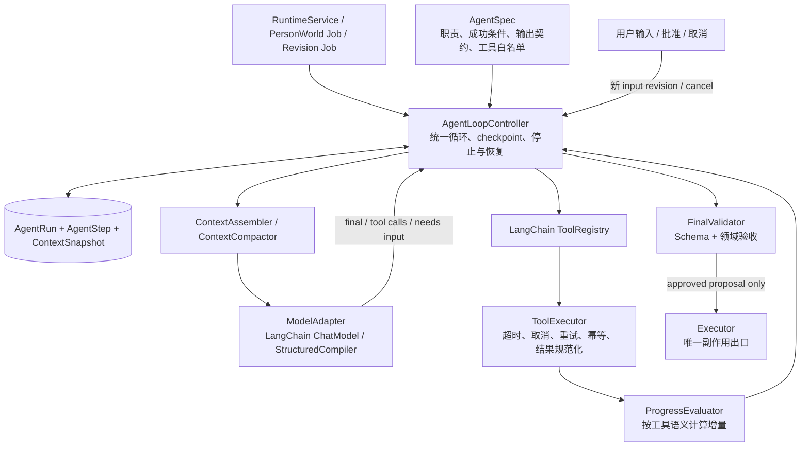
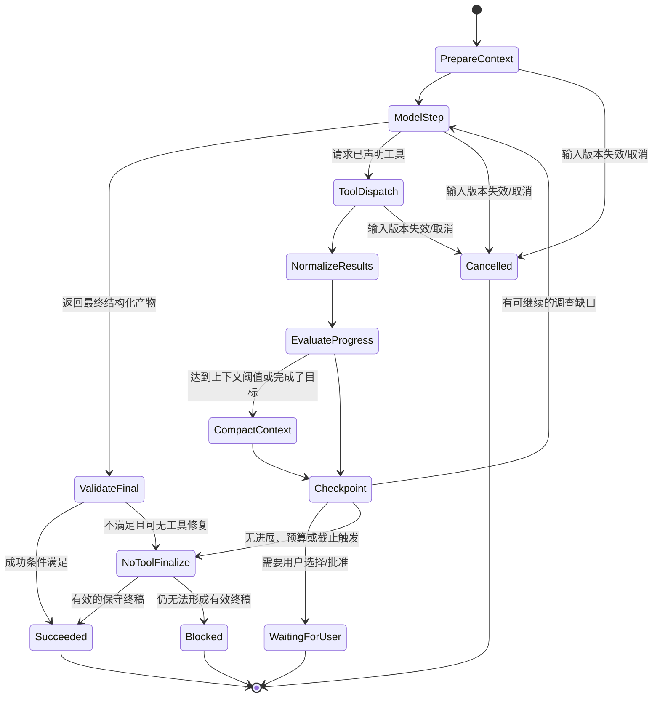
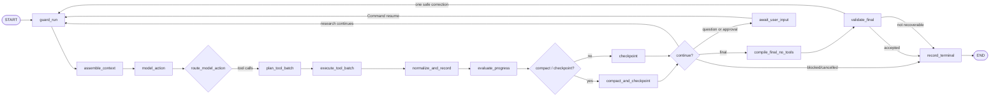

# Codex Harness 调研与统一 AgentLoopController 设计（已归档）

> 2026-09-12：Runtime 的多 Agent 编排补充为
> [同级 Agent 共享 State 设计](2026-09-12-runtime-peer-agents-shared-state-design.md)。
> AgentLoopController 继续负责单 Agent 内部执行；Director 与 DayPlan 在外层 LangGraph
> 中平级协作，不通过 Director 工具嵌套执行 DayPlan。本文为归档调研，不覆盖新协作契约。

> **实现状态（2026-09-10）**：本文原先主张的通用 `AgentRun` / `AgentStep` /
> `ToolInvocation` / `ContextSnapshot` 持久化账本已全部撤销，相关表会由迁移
> `0053_remove_agent_runtime_ledger` 删除。Phoenix 是唯一的 Agent 调用链观测来源。
> Harness 现在是无状态、单次进程内的 LangChain + LangGraph 循环，只保留预算、超时、输入版本
> 防护、上下文压缩和最终产物校验。本文保留为 Codex Harness 的调研材料，**不能作为当前持久化
> 账本、恢复或工具去重的实现依据**；以 `agent_runtime/controller.py`、README 的 Phoenix 章节和
> `docs/deployment.md` 为准。

## 1. 文档定位

本文研究 Codex 类 Agent Harness 的可迁移运行时原则，并定义 MoonlightBox 后续统一的
`AgentLoopController`。它解决的不是某一个 Prompt、某一项 LightRAG 查询或某一个模型的
“多跑几轮”，而是所有 Agent 怎样在长任务中可靠地：

1. 持续思考、调用工具、读取新状态并自然收敛；
2. 避免重复调用、上下文膨胀、失控成本与僵尸 Job；
3. 在用户可交互的任务中准确地停在“需要用户决定”的地方；
4. 在取消、重启、模型/工具失败后保留可恢复、可审计的执行状态；
5. 让 Director、DayPlan、PersonaActor、PersonWorld Section Agent、Revision Agent
   共享同一套循环语义，而不是各自复制一套 LangGraph 条件边。

本文是架构设计，不在本文中把所有既有循环一次性删除。实现顺序与验收条件见第 23 节。

本文补充并最终替代下列两份文档中的“每个 Agent 自己维护工具循环与预算”的部分：

- `2026-09-04-agent-runtime-after-extraction-design.md` 的 Director / DayPlan /
  PersonaActor 循环部分；
- `2026-09-09-person-world-agent-and-graph-governance-design.md` 的 Section Agent /
  Revision Agent 调查循环部分。

各 Agent 的领域职责、Prompt、Profile 七栏目、Graph 治理确认门槛及 Executor 写入边界
不受本文改变。

## 2. 调研结论：Codex Harness 的关键不是“小轮数循环”

### 2.1 三个必须区分的概念

Codex 风格的运行时至少区分三层：

| 名称 | 含义 | 不能混同为 |
| --- | --- | --- |
| 用户 Turn | 用户提出一个目标，到 Agent 将控制权交还用户为止 | 一次模型请求 |
| 模型推理步骤 | 模型读取当前状态后，输出最终消息或工具请求 | 一个工具调用 |
| 工具调用 | 某次具名工具以具体参数执行，并返回一个关联结果 | 一次 Agent 完成 |

一个用户 Turn 可以有很多模型推理步骤；一个模型步骤可以请求零个、一个或多个工具。只有模型
不再请求工具、并给出能被运行时接受的最终产物时，Turn 才自然结束。不能把“执行到第二次模型
调用”误当成 Agent 完成。

公开的 OpenAI Agent 指导也将停止条件定义为：当已有足够证据能完成用户核心目标时结束；同时
要求长工具链主动管理上下文，而不是用缩短循环替代上下文治理。[^openai-model-guidance]

### 2.2 Harness 维护的是追加式执行事实，不是自由文本聊天记录

每一次模型输出、工具调用、工具结果、用户中断、压缩、终止原因都是带 ID 的执行事件。下一步
推理必须建立在已完成事件的状态上：

```text
用户目标
  → 模型输出 tool_call(id=A, name=search_world, args=...)
  → Harness 执行并记录 tool_result(call_id=A, result=...)
  → 模型读取包含 A 与结果的新状态
  → 输出最终结果 / 继续请求工具 / 请求用户澄清
```

这带来两个硬约束：

1. 工具结果必须与原工具调用准确关联，不能只把一段文本拼回 Prompt；
2. 已执行步骤不可静默消失。即使压缩上下文，也要保留其完成状态、来源引用、失败码和摘要。

### 2.3 迁移到 MoonlightBox 的“避免无限循环”是多层防线

它不是依赖某一个 `max_rounds`。可迁移的防线如下：

| 层级 | 机制 | 解决的问题 |
| --- | --- | --- |
| 正常停止 | 有效最终产物或明确的用户问题 | 不为了耗尽预算继续调用 |
| 状态去重 | 相同能力、规范化参数、相同状态版本的调用指纹 | 原样重复请求 |
| 语义进展 | 评估本次结果是否带来新证据/约束/实体/状态 | 换个问法反复得到同一材料 |
| 工具契约 | 每个工具声明超时、重试、幂等、并发和副作用 | 把所有工具当成同一种 RPC |
| 上下文治理 | 工具结果外置、里程碑压缩、稳定 Prompt 前缀 | 长任务超窗、反复携带无用历史 |
| 资源熔断 | 每工具超时、总墙钟、成本、输出容量、高位模型步骤 | 模型或供应商异常失控 |
| 中断与恢复 | 取消令牌、Job lease、checkpoint、状态版本 | 用户改口、Worker 重启、过期写入 |
| 最终降级 | 无工具收敛一次，随后明确 blocked/failed | 在错误输出中无限自修复 |

高位模型步骤上限可以存在，但它是无人值守 Worker 的事故保险丝，不能定义业务完成条件。
例如“模型调用第 24 次”只应产生 `budget_exhausted` trace，随后允许模型基于现有证据做一次
无工具收敛；它绝不能意味着“第 24 次之前必须结束”，更不能出现在 Agent 作者维护的 Prompt 中。

这里必须严谨地区分**已由 Codex 源码确认的机制**与**MoonlightBox 应补上的领域机制**。Codex
源码的通用 `run_turn` 循环以“模型还是否请求后续动作（含工具）、是否有待接收输入、是否需要压缩
上下文、是否被取消”为驱动；它没有一个可以原样搬来的、通用于所有业务的
`SemanticProgressDelta`。本项目的“语义进展、调用指纹、一次无工具收敛”是针对 LightRAG、原始
聊天证据和计划约束的必要扩展，不能伪称为 Codex 已有字段。

### 2.4 上下文管理是循环正确性的一部分

Agent 持续执行时，若不断把完整工具原文、全部旧消息和每次思考拼入下一轮，模型会因为上下文
过长而降质、变慢甚至反复查同一件事。正确做法是：

1. 让固定 System Prompt、工具定义、稳定策略保持相同且位于上下文前部；
2. 将大体积工具原文保存在数据库/对象存储，只在模型需要时注入受控摘录与可展开引用；
3. 在完成一个调查子目标、工具结果过多或接近上下文阈值时做状态压缩；
4. 压缩后至少保留：用户目标、已完成动作、证据和其 ID、已否定的假设、待解决缺口、下一步；
5. 不能把压缩摘要升级为事实。原始消息、原始工具结果仍是可回读的权威来源。

官方模型指导明确建议长工具工作流采用 compaction，并在压缩中保留完成动作、活跃假设、ID、工具
结果、阻塞项和下一目标。[^openai-model-guidance]

### 2.5 用户中断不是异常，而是 Harness 的正常状态迁移

对于 Revision Agent，用户回答一个澄清问题、否定当前理解或改变范围，不应被当作“旧 Agent
继续第 N 轮”。它应创建新的输入版本，取消或标记旧执行为 stale，并从最后一个可验证 checkpoint
开始新的用户 Turn。后端不得让旧 Job 在用户改口后继续提交 Patch。

底层推理/工具请求也必须能被取消。若供应商不支持中断正在进行的同步 HTTP 请求，Harness 仍须在
请求返回后检查 cancellation token 与输入版本，禁止其结果进入后续状态或 Executor。

Responses API 也将取消与上下文压缩视为独立的运行时能力，而不是 Prompt 指令。[^openai-responses]

### 2.6 本次源码复核：哪些事实确实来自 Codex，哪些不应照抄

本次按 `openai/codex@bf5ebd98c567931d82e873a4afdac7548bd85979` 阅读了当前开源仓库，而
不是只参考博客或二手文章。下面的结论以该 revision 为准；代码演进后应重新核对。

| 源码位置 | 已确认的行为 | 对 MoonlightBox 的可迁移结论 |
| --- | --- | --- |
| `codex-rs/core/src/session/turn.rs::run_turn` | 一个 Turn 反复采样；模型请求后续动作或存在待处理输入才继续。每一步重新捕获当前 step context；压缩、停止 hook、错误和取消都有独立分支。 | Controller 的循环条件不能只有 `round < N`，必须读取当前状态、用户输入版本和模型动作。 |
| 同文件 `run_sampling_request` | 工具目录在每次采样作为模型可见 spec 传入；同一 turn 的 client session 在可重试请求中复用；响应流重试受 provider retry policy 约束。 | 工具 schema 由注册表/API 传入，不 dump 到 Prompt；重试属于运行时适配层。 |
| `tools/parallel.rs::ToolCallRuntime` | 每次工具调用带取消令牌；工具声明可并行时取共享读锁，不能并行时取写锁；取消会中止还在跑的任务并产生明确的 aborted tool result。 | `ToolContract` 要声明并发组与取消行为，不能默认所有 SQL / LightRAG 调用都并行。 |
| `compact.rs`、`session/context_window.rs` | 上下文窗口达到阈值会进入显式 compaction 生命周期；中途压缩会用摘要替换模型可见历史，并保留恢复所需初始上下文。 | 压缩应是可追踪 checkpoint，不是字符串截断；原始证据仍放在可回读的权威存储。 |
| `rollout_budget.rs`、`session/rollout_budget.rs` | Codex 有跨根线程树的加权 token 账本和临近预算提醒；预算耗尽是独立错误，不等价于“完成”。 | 本项目也应记录 provider usage 与预算状态；预算终止必须给出安全的终态，而不是将半成品伪装为结果。 |
| `session/turn_suspension.rs` | 暂停前先 flush 持久化状态，再取消；等待优雅结束有超时，之后才 abort；暂停输入队列有明确语义。 | 先 checkpoint/落账、后取消 Worker；绝不能先杀任务再希望内存状态侥幸保存。 |
| `agent/control/execution.rs` | 子 Agent V2 的执行容量通过 guard 限制，guard 释放时归还容量。它解决的是并发数，不是思考轮数。 | 七个 Section Agent 要有全局/项目级并发池；并发池不能替代停止策略。 |

Codex 源码同时提供了一个反例：它的通用 Harness 不知道“聊天记录是否真的支持某个作息结论”。
因此本项目不能把“Codex 有 turn loop”误解为“无需证据语义”。`ProgressEvaluator`、事实验收和
Graph Executor 的确认门仍是 MoonlightBox 的领域责任。

## 3. MoonlightBox 当前实现的缺口

目前已经具备 LangChain `StructuredTool`、LangGraph `ToolNode`、结构化输出、Cycle Trace、Job
lease 及部分上下文截断。但仍不具备统一 Harness：

| 现状 | 风险 |
| --- | --- |
| Director、DayPlan、PersonaActor、Section Agent 各自维护循环状态和条件边 | 停止、重试、Trace、预算语义逐渐分叉 |
| `source_ids` 或消息数量被泛化为“进展” | 图查询、计划约束、风格例子等工具的有效变化无法准确表达 |
| 工具调用数量按全局整数处理 | 48 次 SQL 读取与 48 次 LightRAG 调用的成本和风险完全不同 |
| PersonaActor 无法生成有效结果时会拼接 intent/content points 兜底 | 可能把未经过模型理解的内部意图直接作为用户可见消息 |
| Section Agent、DayPlan 各自用字符预算/局部截断 | 没有跨 Agent 统一的上下文 checkpoint 与恢复语义 |
| Job 只记录阶段进度，未持久化通用 Agent 运行账本 | 中断后难以解释、恢复或重放某次工具链 |
| `max_model_turns`、`max_tool_calls` 等仍散在不同 Agent 策略 | 数字失去领域含义，难以运营校准 |

因此，不能继续通过“把每个上限调大”来修正 Agent。需要把循环控制提升为独立基础设施。

## 4. 目标架构



`AgentLoopController` 不拥有任何人物世界、计划或聊天语义；它只拥有“怎样可靠地运行一个
Agent”的通用语义。领域逻辑通过 `AgentSpec` 与 `ToolContract` 注入。

## 5. AgentSpec：领域 Agent 只描述目标，不自己实现循环

每个 Agent 定义一个不可变 `AgentSpec`。Prompt 作者、工具作者和运行时作者的职责必须分开。

```python
@dataclass(frozen=True, slots=True)
class AgentSpec[InputT, FinalT]:
    name: str
    system_prompt_ref: PromptRef
    tool_names: tuple[str, ...]
    input_assembler: InputAssembler[InputT]
    output_contract: type[FinalT]
    success_evaluator: SuccessEvaluator[FinalT]
    finalizer: FinalValidator[FinalT]
    context_policy: ContextPolicy
    interaction_policy: InteractionPolicy
```

### 5.1 AgentSpec 不包含的内容

以下内容不得写入 Prompt frontmatter，也不应被每个 Agent 复制：

- `max_rounds`、`max_tool_calls`、`timeout_seconds`；
- 工具 JSON Schema；
- 数据库 ID、文件路径、图版本 ID、密钥；
- HTTP 重试、取消、租约、trace 持久化逻辑；
- 对所有工具通用的循环与上下文压缩代码。

工具 JSON Schema 仍由 LangChain `StructuredTool` 注册；模型只收到本轮 `AgentSpec` 白名单允许的
工具。模型不能绕过 `ToolRegistry` 调用内部 Python 服务。

### 5.2 各领域 Agent 的成功定义

| Agent | 终态产物 | 成功条件 |
| --- | --- | --- |
| Director | `LifeDecision` | Schema 有效，决策可被 Executor 校验 |
| PersonaActor | `ActorMessage` | Schema 有效，覆盖已批准内容点，未新增事实 |
| DayPlan | `DayPlanProposal` | Schema 有效、证据 ID 可用、全天约束通过 |
| PersonWorld Section | Section Result | 栏目 Schema 与主体/证据校验通过；允许未知与待调查项 |
| Revision | `RevisionAgentTurn` | 返回用户可理解的问题、理解摘要或经阶段批准允许的 Patch 草稿 |

“工具已经调用过”“到达某个轮次”“列表非空”都不是成功条件。

## 6. 统一运行状态与持久化账本

### 6.1 AgentRun

每次用户 Turn 或后台调查创建一条 `AgentRun`。它是可恢复执行的总账，不存放无边界原文：

```python
class AgentRun:
    id: str
    agent_name: str
    owner_type: Literal["runtime_cycle", "person_world", "revision"]
    owner_id: str
    input_revision: int
    status: Literal[
        "queued", "running", "waiting_for_user", "succeeded",
        "blocked", "cancelled", "failed", "stale",
    ]
    objective: dict[str, object]          # 可审计的目标，不含密钥
    spec_version: str
    prompt_hash: str
    tool_catalog_hash: str
    context_snapshot_id: str | None
    state_revision: int
    budget: AgentBudgetLedger
    cancellation_requested_at: datetime | None
    terminal_reason: str | None
```

`input_revision` 是用户输入和审批状态的版本。任何异步步骤准备提交结果前，都必须确认其
`input_revision` 仍等于 owner 的当前版本；否则记录为 `stale`，不能继续写入。

### 6.2 AgentStep 与 ToolInvocation

```python
class AgentStep:
    id: str
    agent_run_id: str
    sequence: int
    kind: Literal["model", "tool", "compact", "checkpoint", "terminal"]
    input_context_hash: str
    output_hash: str
    state_revision_before: int
    state_revision_after: int
    outcome: Literal["ok", "no_progress", "retryable_error", "error", "cancelled"]

class ToolInvocation:
    call_id: str
    agent_step_id: str
    tool_name: str
    normalized_args_hash: str
    input_state_revision: int
    status: Literal["pending", "running", "succeeded", "empty", "retryable_error", "error", "cancelled"]
    result_ref: ToolResultRef | None
    progress_delta: SemanticProgressDelta
    retry_count: int
```

模型上下文中只放必要的摘要、稳定 ID 和受控原文窗口；完整结果保存在 `ToolResultRef` 指向的本地
持久化记录。对于包含聊天原文的结果，数据库已经是权威存储，账本保存消息 ID、哈希和选择理由，
不再复制无上限正文。

### 6.3 ContextSnapshot

每个 checkpoint 产生一个 `ContextSnapshot`，它包括：

- 当前目标与成功条件；
- 已确认/已拒绝假设；
- 已读原始消息 ID、图实体/关系引用、计划约束版本；
- 已执行工具的调用指纹及结果摘要；
- 未解决的具体问题；
- 当前阶段、下一步可执行动作、预算消耗；
- Prompt hash、工具目录 hash、输入版本。

`ContextSnapshot` 是恢复入口，不是新的知识事实库。任何需要原文的 Agent 都要通过只读工具或
已保存的消息窗口重新取得原始材料。

## 7. ToolContract：把“工具进展”变成领域明确的契约

### 7.1 工具元数据

每个注册工具除 LangChain schema 外，必须注册 Harness 元数据：

```python
class ToolContract:
    name: str
    side_effect: Literal["read_only", "proposal", "executor_only"]
    idempotency: Literal["idempotent", "deduplicated", "never_retry"]
    timeout_seconds: float
    max_retries: int
    retryable_error_codes: frozenset[str]
    concurrency_group: str
    cache_scope: Literal["run", "state_revision", "none"]
    result_normalizer: ResultNormalizer
    progress_evaluator: ProgressEvaluator
    redaction_policy: ResultRedactionPolicy
    required_permissions: frozenset[str]
    data_classification: Literal["public", "project_private", "sensitive"]
```

`executor_only` 工具永远不能进入普通 Agent 的 `ToolRegistry`。PersonWorld 的图谱 CRUD 仍只能由
用户确认后、确定性的 `WorldGraphExecutor` 调用。

### 7.2 语义进展不能靠正则或统一的 source_ids 猜测

`SemanticProgressDelta` 由工具的确定性结果规范化器产生，而不是通过匹配消息正文推断：

| 工具 | 进展键 | 空结果的含义 |
| --- | --- | --- |
| `search_world` | 新的 `message_id`、`document_id`、检索版本 | 当前问题没有命中，不代表人物事实不存在 |
| `locate_source_messages` | 新的可访问 `message_id` | LightRAG 引用无法回链原文，需要记录诊断 |
| `get_message_context` | 新加入的窗口消息 ID | 已读窗口，不应重复注入 |
| 图实体/关系读取 | 新的实体 ID、关系 ID、图版本 | 仅增加候选范围，不自动成为事实 |
| `analyze_routine_evidence` | 新的 interval/fact 的规范 hash 和证据 ID | 没有可用规律，不可伪造 DayPlan 证据 |
| `get_plan_constraints` | 新的约束版本/hash | 约束未变，允许直接复用缓存 |
| `get_style_examples` | 新的例子 source ID 和风格检索版本 | 没有例子时 Actor 仍可基于 style profile 表达 |

Controller 只比较这些结构化键的集合差异：`delta.new_keys` 非空即是进展；否则该调用是
`empty` 或 `no_progress`。它绝不读取中文消息内容并用正则判断“有没有新信息”。

### 7.3 重复调用判定

一个调用在下列条件同时成立时才是可去重的重复：

```text
tool_name 相同
AND normalized_args_hash 相同
AND input_state_revision 相同
AND 上一次结果没有产生仍未消费的语义进展
```

若前一次工具新增了消息、约束或实体，状态版本会递增；同样的查询在新状态下仍可重新执行。
这避免把正常的“同一问题在新图版本/新证据下复查”误杀为循环。

## 8. AgentLoopController 状态机



### 8.1 控制器伪代码

```python
def run(spec: AgentSpec, run: AgentRun) -> AgentTerminal:
    while True:
        guard.ensure_current_input_revision(run)
        context = context_manager.build_or_resume(run, spec)
        model_output = model_adapter.invoke(spec, context)
        ledger.append_model_step(run, model_output)

        if final := spec.output_contract.try_parse(model_output):
            verdict = spec.finalizer.validate(final, run)
            if verdict.accepted:
                return terminal.succeeded(final)
            if guard.can_attempt_no_tool_finalization(run, verdict):
                ledger.append_validation_failure(run, verdict)
                return continue_without_tools(spec, run, verdict)
            return terminal.blocked(verdict.safe_reason)

        calls = tool_router.validate_and_normalize(model_output.tool_calls, spec)
        if not calls:
            return continue_without_tools_or_block(spec, run, reason="invalid_model_output")

        executable = deduplicator.filter(calls, run.state_revision)
        results = tool_executor.execute(executable, cancellation=run.cancellation_token)
        deltas = progress_evaluator.evaluate(results, run)
        ledger.append_tool_steps(run, results, deltas)
        checkpoint_manager.maybe_compact_and_checkpoint(run, spec)

        if guard.must_stop(run, deltas):
            return continue_without_tools_or_block(spec, run, reason=guard.reason(run))
```

`continue_without_tools` 最多执行一次：它明确告诉模型“不能再调用工具；请只依据已取得的证据
返回最终结果，或返回结构化 blocked/needs_user_input”。若仍不合格，控制器返回 `blocked`，不会
无休止地要求“再修一次 JSON”。

### 8.2 并行与顺序

同一模型步骤请求的只读工具可以并行，但 Controller 必须根据 `ToolContract.concurrency_group`
限制并发。共享 SQLAlchemy Session 的工具必须串行；独立 LightRAG 查询可在有限并发度内执行。
工具结果按原 `call_id` 合并，不按先返回者改变模型上下文顺序。

## 9. 预算：从“轮数”改为可解释的资源与进展政策

### 9.1 AgentBudgetPolicy

```python
class AgentBudgetPolicy:
    per_tool: Mapping[str, ToolBudget]
    max_wall_seconds: float
    max_model_input_tokens: int
    max_model_output_tokens: int
    max_tool_result_context_tokens: int
    max_cost_units: Decimal | None
    max_unchanged_state_steps: int
    emergency_max_model_steps: int | None
    compaction_threshold_tokens: int
    checkpoint_interval_steps: int
```

其中只有 `emergency_max_model_steps` 类似传统 `max_rounds`，且默认不应作为业务调优旋钮。
它只用于无人看守环境防止供应商异常；触发后必须经过一次无工具收敛，并记录
`emergency_model_step_limit`。

### 9.2 不同 Agent 的预算维度不同

| Agent | 应优先限制什么 | 不应采用的错误策略 |
| --- | --- | --- |
| Director | 交互墙钟、检索上下文、重复查询 | 固定两轮后强制 `wait` |
| PersonaActor | 单条消息延迟、风格例子上下文、重复风格检索 | 把一次 style tool 调用当作完成标准 |
| DayPlan | 调查总时间、日历/约束版本、证据量、计划验收重试 | 固定 8 次工具后用模板日程兜底 |
| Section Agent | 新原始消息、主体/时间消歧覆盖、栏目上下文 | 仅以命中条数或 640 条全局池停止 |
| Revision Agent | 用户输入版本、确认阶段、只读调查范围 | 后台连续追问用户或自动扩大修改范围 |

精确数值必须通过真实 Trace 的延迟、成本、成功率和失败类型校准后决定，不能在 Markdown
frontmatter 中由 Prompt 作者任意指定。

### 9.3 Token 预算

优先使用供应商响应中返回的 usage/token 统计。若 MiniMax 兼容接口没有公开精确 tokenizer，
本地字符数只能用于限制“回填给模型的最大文本体积”，不能伪装成精确 token 账单。

Controller 记录两类数：

- `provider_reported_tokens`：供应商实际返回时用于成本和上下文观测；
- `local_context_char_budget`：无 tokenizer 时的保守输入裁剪依据。

二者绝不相加或互相替代。

## 10. ContextManager 与压缩策略

### 10.1 输入分层

每次模型请求按照稳定性排列：

```text
固定：System Prompt + 工具目录 + 输出 Schema（由 API/StructuredTool 注入）
稳定：AgentSpec 行为约束 + 当前 ContextSnapshot 摘要
动态：本次用户/事件输入 + 新工具结果摘要 + 可展开原文窗口
```

固定前缀不在回合间重写；动态内容只追加新的状态增量。这样既便于 Prompt cache，也避免模型因
每轮重写规则而漂移。

### 10.2 领域压缩规则

| 场景 | 可压缩 | 必须保留 |
| --- | --- | --- |
| Director | 已完成事件的摘要 | 当前触发、有效 LifeState、未完成承诺、证据 ID |
| DayPlan | 已读取的冗余原文 | 锁定块、日历版本、约束 hash、已验收 interval 与证据 ID |
| PersonaActor | 历史 style 原文 | 当前 intent/content points、style profile、实际选用例子的 ID |
| Section Agent | 已回读原文的大段全文 | 证据 message ID、主体绑定判断、反证、未解决假设 |
| Revision | 旧对话全文 | 用户已确认/否定内容、当前 revision/hash、待确认单一问题 |

压缩器本身不得产出 Profile 事实或 Graph Patch。它只产生有来源引用的执行摘要；当摘要不够时，
模型重新调用只读原文工具。

## 11. 取消、恢复与副作用边界

### 11.1 取消

取消检查必须发生在以下边界：

1. 发起模型请求前；
2. 每个工具请求发起前与返回后；
3. 生成 checkpoint 前；
4. 调用任何 Executor 前。

`cancelled`、`stale` 与 `failed` 必须区分：

- `cancelled`：用户或系统明确取消；
- `stale`：输入/审批版本已变化，旧结果不再可提交；
- `failed`：不可恢复的模型、工具或持久化异常。

### 11.2 恢复

Worker lease 到期或进程重启时，新 Worker 只能从最后一个完成 checkpoint 恢复。正在执行的工具调用
必须先按其 `ToolContract.idempotency` 检查：

- `idempotent`：可以以同一 invocation key 重试；
- `deduplicated`：查询结果缓存存在则复用，否则重试；
- `never_retry`：标记为未知结果，交给人工/Executor 事务日志确认，绝不盲目重放。

### 11.3 Executor 仍是唯一副作用出口

统一 Controller 不授予模型写权限。Agent 的工具只允许 `read_only` 或 `proposal`；真正写入
BranchMessage、DayPlan、WorldCorrection、候选图和发布状态仍由领域 Executor 在独立事务中执行。
Controller 只记录“已验证提案可交给 Executor”，不执行它。

## 12. 观测、Trace 与前端体验

### 12.1 必须可解释的终态

`terminal_reason` 至少区分：

```text
success
needs_user_input
no_new_semantic_progress
duplicate_tool_call
tool_timeout
tool_retry_exhausted
context_compacted
context_limit
wall_deadline
cost_budget
emergency_model_step_limit
cancelled
stale_input_revision
invalid_final_output
executor_rejected
```

`context_compacted` 是步骤事件，不应把已成功的 Agent 标记为失败。每一个终态都要包含最后的
ContextSnapshot、已消费预算、安全错误码与用户可读摘要。

### 12.2 前端呈现

前端不展示内部 Prompt、密钥、完整模型思考或工具 JSON。但应能展示：

- 当前阶段：理解上下文 / 调查证据 / 等待用户确认 / 生成草稿 / 已停止；
- 本轮已查看的证据数量与范围；
- 无法继续的真实原因；
- `needs_user_input` 时唯一、可直接回答的问题；
- Revision 中输入版本发生变化时，旧草稿为何失效；
- 可用于调试的 trace ID 与安全的步骤摘要。

## 13. 推荐代码组织

```text
backend/moonlightbox/agent_runtime/
├── controller.py          # AgentLoopController 与统一状态机
├── contracts.py           # AgentSpec、ToolContract、FinalValidator
├── state.py               # AgentRun、AgentStep、ToolInvocation、ContextSnapshot
├── policy.py              # AgentBudgetPolicy、工具分组、租约/取消策略
├── context.py             # ContextManager、注入顺序、原文引用选择
├── compaction.py          # 仅执行状态压缩，不创造领域事实
├── progress.py            # SemanticProgressDelta 与工具进展评估器
├── executor.py            # ToolExecutor：超时、重试、取消、并发、规范化
├── checkpoint.py          # 事务化 checkpoint / 恢复
├── tracing.py             # 安全 trace、事件流与终态编码
├── langchain/
│   ├── model_adapter.py   # provider 参数、reasoning、usage 和模型错误归一化
│   ├── tool_registry.py   # StructuredTool + ToolContract 的联合注册
│   └── messages.py        # AIMessage / ToolMessage 与 result_ref 的安全转换
└── langgraph/
    ├── graph_factory.py   # 唯一的 StateGraph 构建入口
    ├── state.py           # AgentGraphState reducers 与兼容版本
    └── nodes.py           # 图节点仅调用 Controller services，不含领域规则

backend/moonlightbox/runtime_v1/
├── director_spec.py
├── persona_actor_spec.py
├── day_plan_spec.py
└── tools/

backend/moonlightbox/world/person_world/
├── section_specs.py
├── revision_spec.py
└── tools/
```

现有 `runtime_v1/prompts/`、`runtime_v1/subagents/` 与 `person_world/subagents/` 继续作为行为
Prompt 的唯一来源；它们不迁入 `agent_runtime/`。Tool schema 与检索模板仍留在各自工具实现附近。

## 14. 对现有 Agent 的适配方式

### 14.1 Director

- `AgentSpec.output_contract = LifeDecision`；
- `search_memory` 以新增 MemoryRecord/原始消息来源为进展；
- 最终 `LifeDecision` 通过 Executor 预校验才算成功；
- 资源耗尽后的无工具终稿只能给出已有证据支持的 `wait`/`speak`/`continue_life`，否则 `blocked`。

### 14.2 PersonaActor

- 只接收 Director 已批准的 intent 与 content points；
- `get_style_examples` 的进展是新增可用例子，不是“调用成功”；
- 不能生成有效 `ActorMessage` 时，应将 Cycle 标为可重试模型错误，而不是把内部 content points
  直接拼成用户消息；
- Actor 不拥有写入工具，消息提交仍由 Runtime Executor 完成。

### 14.3 DayPlan

- 日历、锁定块、约束、作息证据都形成带版本的结构化状态增量；
- `analyze_routine_evidence` 没有发现 interval 是一种有效负结果，不是重复调用的理由；
- 验收失败返回明确的领域验证错误给无工具收敛步骤；
- 仍无法得到可验收计划时标为 `blocked` 或 `unavailable`，不得回退为硬编码日程。

### 14.4 PersonWorld 七个 Section Agent

- 保留每栏目独立 Prompt、字段 Schema、工具白名单和事实边界；
- `SectionResearchDecision(action=continue/finalize)` 成为 Controller 的领域决策，而不是自建
  LangGraph 循环；
- 进展以新增的原始消息、主体绑定、时间分析和反证材料为准；
- 对同一问题的重复检索只有在状态版本未变且没有新证据时才停止；
- 最终结果通过现有 `validate_section_result` 验收。

### 14.5 Revision Agent

- 一个后台 AgentRun 至多形成一个用户可见回合，不在后台无限追问；
- `needs_user_input` 是正常成功终态，下一条用户消息创建新的 `input_revision`；
- 共同理解、Profile Patch、Graph Patch、最终批准的阶段门槛仍由确定性状态机与 hash 校验控制；
- 旧输入版本的 Job 即使完成，也只能写 `stale` trace，不能覆盖新对话或调用图谱 Executor。

## 15. LangChain 与 LangGraph 的明确分工

本项目已经决定使用 LangChain 和 LangGraph。这里的关键不是“套一个现成 AgentExecutor”，而是让
两个框架各自承担它们擅长的、可替换的职责：

| 层 | 采用的能力 | 不让它承担的事 |
| --- | --- | --- |
| LangChain | `BaseChatModel`/模型适配、`BaseTool`/`StructuredTool`、Pydantic 参数 schema、`AIMessage` 与 `ToolMessage` 的调用关联、回调接口 | 业务成功判定、跨工具预算、数据库 lease、图谱写权限、全局停止策略 |
| LangGraph | 显式 `StateGraph`、条件路由、持久 checkpoint、`interrupt()` / `Command(resume=...)`、流式节点事件 | 自动猜测何时任务有证据地完成，或默默替应用重放副作用 |
| MoonlightBox `agent_runtime` | `AgentLoopController`、领域进展、工具契约、账本、幂等、输入版本、恢复、最终验收和 Executor 边界 | 供应商特有的 tool-call 编码、框架的状态图执行器 |

因此不采用 `langchain.agents.create_agent()` 或旧 `AgentExecutor` 来直接运行 Director、DayPlan、
PersonaActor、PersonWorld。那些高层封装会自行拥有一套工具回环、错误重试和停止语义；一旦外面
再包一层 Controller，就会产生两套“谁让模型继续”的权威。我们使用较底层的
`model.bind_tools(...)` + `StateGraph`：LangChain 仍然负责标准工具协议，LangGraph 仍然负责可恢复
图执行，**只有 `AgentLoopController` 决定是否再次进入模型节点。**

LangChain 的标准工具调用也要求将工具绑定到模型，并以带相同 `tool_call_id` 的 `ToolMessage` 回传
结果；这一点正好符合第 2 节的追加式执行账本。[^langchain-models]

### 15.1 模型适配器与“思考模式”

每个非平凡 Agent 都使用同一份 `ModelInvocationProfile`，由配置和模型适配器控制，而不是由 Prompt
暗示或某个 Agent 临时关闭：

```python
@dataclass(frozen=True, slots=True)
class ModelInvocationProfile:
    provider: str
    model: str
    reasoning_enabled: bool
    reasoning_effort: Literal["low", "medium", "high"] | None
    temperature: float | None
    max_output_tokens: int
    request_timeout_seconds: float
    parallel_tool_calls: bool

class ModelAdapter(Protocol):
    def bind_tools(
        self,
        profile: ModelInvocationProfile,
        tools: Sequence[BaseTool],
    ) -> Runnable[list[BaseMessage], AIMessage]: ...

    async def ainvoke_final[
        FinalT: BaseModel
    ](
        self,
        profile: ModelInvocationProfile,
        messages: Sequence[BaseMessage],
        schema: type[FinalT],
    ) -> FinalT: ...
```

`reasoning_enabled=True` 是 Director、PersonaActor、DayPlan、PersonWorld Section 和 Revision 的默认
生产配置；只有一个经过明确评估的低风险、低延迟任务才能单独选择关闭。适配器负责把这一抽象转换为
MiniMax M3 或其他供应商实际支持的请求参数，并把 provider 的 usage、response ID、模型名、重试后
的最终请求 ID 返回给账本。它不保存或展示模型的私有 chain-of-thought；Trace 只保存模型可见的动作、
结构化终态和安全摘要。

模型有工具可用时走 `bind_tools`；无工具的最终编译走 `with_structured_output(FinalSchema)` 或等价
provider JSON schema 模式。不能在一个已经 `bind_tools` 的模型对象上再随意叠加 LangChain 的结构化
输出包装——当前 LangChain 文档也明确指出，预先绑定工具的模型不适合再被其 structured-output agent
路径复用。拆成“调查/工具步骤”和“禁止再调用工具的最终编译步骤”既避免该冲突，也使无工具收敛有
明确含义。[^langchain-agents]

### 15.2 工具注册：Schema、描述、实现和运行时契约四者分开

一个工具文件仍放在其领域目录中，例如 `runtime_v1/tools/` 或 `person_world/tools/`；工具不会迁入
Prompt 目录。该文件导出 Pydantic 参数、LangChain `StructuredTool` 和 `ToolContract`：

```python
class SearchSourceMessagesArgs(BaseModel):
    query: str = Field(min_length=1, description="要回到原始聊天核验的自然语言问题")
    scope: Literal["branch", "target_history"] = "branch"
    limit: int = Field(default=20, ge=1, le=50)

@dataclass(frozen=True, slots=True)
class RegisteredTool:
    tool: StructuredTool
    contract: ToolContract
    visible_to: frozenset[str]       # AgentSpec.name 白名单

def build_search_source_messages_tool(
    services: SourceSearchServices,
) -> RegisteredTool:
    async def search_source_messages(
        query: str, scope: str, limit: int,
        *, config: RunnableConfig,
    ) -> ToolExecutionResult:
        runtime = ToolRuntimeContext.from_config(config)
        # 这里调用领域 service；不读取全局 Flask/FastAPI request，也不直接写数据库。
        return await services.search(query=query, scope=scope, limit=limit, run=runtime.run)

    return RegisteredTool(
        tool=StructuredTool.from_function(
            coroutine=search_source_messages,
            name="search_source_messages",
            description="从允许范围内检索候选原始消息；返回消息 ID、说话者与受限摘录。",
            args_schema=SearchSourceMessagesArgs,
        ),
        contract=ToolContract(
            name="search_source_messages",
            side_effect="read_only",
            idempotency="deduplicated",
            timeout_seconds=20,
            max_retries=1,
            retryable_error_codes=frozenset({"lightrag_unavailable", "timeout"}),
            concurrency_group="lightrag_read",
            cache_scope="state_revision",
            result_normalizer=normalize_source_search,
            progress_evaluator=source_search_progress,
            redaction_policy=SOURCE_EXCERPT_REDACTION,
        ),
        visible_to=frozenset({"day_plan", "person_world_section"}),
    )
```

`StructuredTool` 的 docstring/description 是**何时使用工具**的紧凑、可维护说明；Pydantic schema 是
**参数的机器可验证边界**；`ToolContract` 是**Harness 如何调度该工具**；服务实现才是**怎样查询或
处理数据**。四者不得互相塞入 Prompt。LangChain 官方工具文档也将工具定义为“schema 与可执行函数”的
配对，并支持用 Pydantic 定义复杂输入。[^langchain-tools]

`ToolRegistry.for_spec(spec)` 只返回 `visible_to` 包含当前 Agent、且通过当前项目/分支权限过滤的
`BaseTool`。模型只能看见本轮允许的工具；即使恶意或错误地生成了别的名字，`ToolExecutor` 也会在
实际执行前拒绝。动态工具集变化时必须记录 `tool_catalog_hash` 并生成新的 ContextSnapshot；不得让
同一个 checkpoint 用静默变化的工具表恢复。

## 16. 统一 AgentLoopController 的 LangGraph 图

### 16.1 一个逻辑运行对应一个图线程

`AgentRun` 是业务和审计主键；LangGraph 的 `thread_id` 只作为该次执行的持久游标：

```text
AgentRun.id = 2c6f...                         # 业务总账、租约、input_revision 的权威
LangGraph thread_id = "agent-run:2c6f..."     # checkpointer 的恢复键
LangGraph checkpoint_ns = "runtime-loop:v1"   # 图定义/状态兼容版本
```

生产环境必须使用持久 checkpointer，而不是 `MemorySaver`。推荐以 Postgres/SQLAlchemy 可恢复存储实现
或采用与现有数据库兼容的 LangGraph 持久化适配；开发环境可用 SQLite。**不过 LangGraph checkpoint
不是业务事实的唯一来源：**`AgentRun`、`AgentStep`、`ToolInvocation`、`ContextSnapshot` 和领域
Executor 事务仍由本项目数据库维护。这样即使升级 LangGraph、清理 checkpoint 或恢复失败，也仍可
解释一次 Agent 做过什么。

图状态只存小而可序列化的调度数据及引用，绝不把整份聊天记录、LightRAG 原文或模型推理全文塞入
checkpoint：

```python
from typing import Annotated, Literal, TypedDict
from langchain_core.messages import AnyMessage
from langgraph.graph.message import add_messages

class AgentGraphState(TypedDict):
    run_id: str
    expected_input_revision: int
    expected_state_revision: int
    messages: Annotated[list[AnyMessage], add_messages]
    context_snapshot_id: str | None
    pending_call_ids: list[str]
    last_model_step_id: str | None
    no_tool_finalization_attempted_for_revision: int | None
    requested_terminal: Literal["none", "final", "needs_user", "blocked"]
    terminal_reason: str | None

@dataclass(frozen=True, slots=True)
class AgentRuntimeDeps:
    session_factory: async_sessionmaker[AsyncSession]
    registry: ToolRegistry
    model_adapter: ModelAdapter
    event_store: AgentEventStore
    cancellation_registry: CancellationRegistry
```

`messages` 只追加：用户输入、`AIMessage` 工具调用、带同一 `tool_call_id` 的短 `ToolMessage` 结果和
受控最终指令。大结果只以 `result_ref` + 为本轮挑选的安全摘要进入消息；下一轮要读原文时，模型调用
相应只读工具。使用 `add_messages` 是为了保留工具调用与结果的关联；覆盖式 reducer 只能用于
`expected_state_revision`、`context_snapshot_id` 等单值调度字段。

### 16.2 统一图的节点和边



这个图由 `AgentLoopGraphFactory` 统一构造，各领域只传 `AgentSpec`。不允许 Director、DayPlan、
PersonaActor、Section Agent 再手写 `model → ToolNode → model` 回边。

```python
def build_agent_loop_graph() -> CompiledStateGraph:
    graph = StateGraph(AgentGraphState, context_schema=AgentRuntimeDeps)
    graph.add_node("guard_run", guard_run)
    graph.add_node("assemble_context", assemble_context)
    graph.add_node("model_action", model_action)
    graph.add_node("plan_tool_batch", plan_tool_batch)
    graph.add_node("execute_tool_batch", execute_tool_batch)
    graph.add_node("normalize_and_record", normalize_and_record)
    graph.add_node("evaluate_progress", evaluate_progress)
    graph.add_node("compact_and_checkpoint", compact_and_checkpoint)
    graph.add_node("checkpoint", checkpoint)
    graph.add_node("compile_final_no_tools", compile_final_no_tools)
    graph.add_node("validate_final", validate_final)
    graph.add_node("await_user_input", await_user_input)
    graph.add_node("record_terminal", record_terminal)
    graph.add_edge(START, "guard_run")
    graph.add_edge("guard_run", "assemble_context")
    graph.add_edge("assemble_context", "model_action")
    graph.add_conditional_edges("model_action", route_model_action)
    graph.add_edge("plan_tool_batch", "execute_tool_batch")
    graph.add_edge("execute_tool_batch", "normalize_and_record")
    graph.add_edge("normalize_and_record", "evaluate_progress")
    graph.add_conditional_edges("evaluate_progress", route_after_progress)
    graph.add_conditional_edges("compact_and_checkpoint", route_after_checkpoint)
    graph.add_conditional_edges("checkpoint", route_after_checkpoint)
    graph.add_edge("compile_final_no_tools", "validate_final")
    graph.add_conditional_edges("validate_final", route_after_final_validation)
    graph.add_edge("record_terminal", END)
    return graph.compile(checkpointer=durable_checkpointer)
```

`ToolNode` 是 LangGraph 提供的通用工具执行节点，适合简单、无额外业务账本的 workflow；它不是
错误的框架。可是这里需要在**每一次**调用前后执行输入版本检查、幂等占位、并发组调度、结果引用
持久化、语义进展与领域 trace，故最外层使用 `execute_tool_batch` 包装 LangChain `BaseTool.ainvoke`。
不能为了“用了 LangGraph”而让 `ToolNode` 绕过这些责任。若将来 `ToolNode` 提供足够的拦截器，可
在该节点内部复用，但控制器接口不变。LangGraph 文档也将 `ToolNode` 定位为可按需要使用的工具执行
构件，而非每个 agent 的强制运行时。[^langgraph-tools]

### 16.3 每一个节点做什么，以及绝不能做什么

| 节点 | 必须做 | 不得做 |
| --- | --- | --- |
| `guard_run` | 用行锁/乐观版本读取 AgentRun；检查 lease、取消、`input_revision`、状态是否已终结 | 调模型、执行工具、写领域对象 |
| `assemble_context` | 从最近 ContextSnapshot 和安全结果引用重建本轮消息；固定 Prompt/工具表/hash 入账 | 把所有历史原文无差别拼入 prompt |
| `model_action` | `bind_tools(allowed_tools)`，保留 `AIMessage.tool_calls` 和 response metadata；创建 `AgentStep(model)` | 自己执行工具或据文本猜工具参数 |
| `plan_tool_batch` | 校验名称、Pydantic 参数、调用 ID、调用指纹、权限、预算、并发组；将调用先记为 `pending` | 把未知工具/未经授权的写工具交给框架 |
| `execute_tool_batch` | 取得 invocation lease 后调用 `BaseTool.ainvoke`；超时/取消/重试；按原 call ID 收集 | 共享一个跨并发调用的 SQLAlchemy Session |
| `normalize_and_record` | 规范化结果，原子落 `ToolInvocation` 与 `result_ref`，生成安全 `ToolMessage` 摘要 | 只保存给模型看的摘要而丢掉原始审计引用 |
| `evaluate_progress` | 运行该工具自己的 `ProgressEvaluator`，决定 snapshot/state revision 是否前进 | 用中文消息正则、命中数量或“调用成功”冒充进展 |
| `compact_and_checkpoint` | 创建可恢复 ContextSnapshot，发 `context_compacted` 事件 | 从摘要生成新 Profile/Graph 事实 |
| `compile_final_no_tools` | 以当前证据调用无工具、结构化输出模型，得到 `FinalT / needs_user_input / blocked` | 再暴露领域工具，或直接写入业务数据 |
| `validate_final` | Pydantic + 领域验收 + 证据/主体/版本校验 | 因为 JSON 合法就把不支持的结论发布 |
| `await_user_input` | 只读取已落库的问题并 `interrupt()` | 在 `interrupt()` 之前执行不可幂等副作用 |
| `record_terminal` | 事务化终态、预算、原因、trace 指针；释放 lease | 调图谱 CRUD 或伪造成功消息 |

## 17. 调用、工具批次与自然收敛的精确规则

### 17.1 `model_action` 的三种合法输出

模型 Action 阶段只允许以下三类结果：

1. 一个或多个合法 tool call：进入 `plan_tool_batch`；
2. 不含 tool call 的“调查完成”消息：进入 `compile_final_no_tools`；
3. provider/传输错误：按 `ModelInvocationProfile` 的有限、可观测重试处理，随后失败或 blocked。

模型不能凭文本说“我调用了 X”；只有 `AIMessage.tool_calls` 中有 provider 关联 ID 的调用才会执行。
同一模型消息中的独立只读调用可以组成一个 batch；若后一个调用的参数明显依赖前一个结果，Prompt 应
让模型分两步请求，Controller 不猜测依赖关系。

### 17.2 调用指纹和幂等占位

执行前在一个短事务内创建/抢占 `ToolInvocation`：

```text
fingerprint = sha256(
  run_id + tool_name + canonical_json(validated_args)
  + input_state_revision + tool_catalog_hash
)
```

唯一约束为 `(agent_run_id, fingerprint)`。已有 `succeeded` 的同指纹调用直接复用 `result_ref`；已有
活动 lease 的调用等待/读取其终态；失败是否重试完全听从 `ToolContract`。这不是“缓存优化”而已，
而是 Worker 崩溃、网络重试和 LangGraph 从 checkpoint 恢复时不重复执行动作的正确性基础。

所有 `read_only` 工具仍可能很贵，故需要 timeout、重试退避和并发容量；`proposal` 工具可以生成
草稿，但必须携带 `proposal_id` 和来源；`executor_only` 永远不注册给模型。图谱的实际增删改查仍由
明确批准后的 `WorldGraphExecutor` 事务化完成。

### 17.3 什么叫“没有进展”，何时真正停

一次 batch 完成后，Controller 以结构化 delta 更新下列状态，不直接判死刑：

```python
class ProgressState(BaseModel):
    evidence_keys_seen: set[str]
    constraint_versions_seen: set[str]
    graph_refs_seen: set[str]
    unanswered_questions: list[Question]
    no_progress_steps_at_revision: int
    finalization_attempts_at_revision: int
```

- 有新 evidence/constraint/graph ref、验证错误变少、用户输入版本变化，或领域 evaluator 明确报告
  新的可用否定证据时：state revision 前进，允许继续；
- 同一 state revision 下相同调用重复、或连续工具 batch 都没有可消费的 delta 时：禁止再做相同研究，
  转入一次 `compile_final_no_tools`；
- 该最终编译只能输出“有依据的结果”“一个最小问题 `needs_user_input`”或“`blocked` + 可读原因”；
  不能发起工具调用；
- 无工具最终编译仍无法通过领域验收时，只有一次**确定性的**修复机会：把验证错误作为新的、明确状态
  输入，允许模型选择已有工具补证或保守化结论。相同 revision 再失败即终止为 `blocked`，不做无穷 JSON
  repair。

这让模型可以根据任务复杂度使用很多轮调查，又让“没有新信息”的循环有可解释且可测试的退出点。

### 17.4 预算不是一个数字，而是一组可解释门槛

每次进入节点前 `BudgetGuard` 都检查：

```python
class BudgetSnapshot(BaseModel):
    provider_input_tokens: int | None
    provider_output_tokens: int | None
    estimated_context_chars: int
    model_steps: int
    tool_calls_by_name: dict[str, int]
    tool_calls_by_group: dict[str, int]
    wall_elapsed_seconds: float
    weighted_cost_units: Decimal | None
    no_progress_steps_at_revision: int
```

以下优先级固定，避免“超时了还在压缩/重试”的歧义：

1. 取消、输入版本失效、租约失效：立即停止；
2. 任何不可恢复持久化错误：失败，不再向模型承诺状态；
3. 硬墙钟、供应商硬额度、上下文硬窗口：checkpoint 后进入无工具收敛或 blocked；
4. 同状态无进展、重复调用、单工具 retry 耗尽：禁止对应调用，允许依据现有材料收敛；
5. `emergency_max_model_steps`：仅作为线上事故保险丝，触发一次无工具收敛；
6. 正常成功条件：随时可以提前结束。

这个顺序借鉴 Codex 将 rollout token 账本、上下文阈值、取消和正常模型 follow-up 分成不同运行时
状态的做法；不能把任何一个数值偷偷写成 Prompt 的 `max_rounds`。[^openai-model-guidance]

## 18. Checkpoint、`interrupt`、用户输入版本与恢复

### 18.1 先持久化问题，再等待用户

PersonWorld Revision 的用户确认不是在 Worker 内存里 `await input()`。正确流程：

```text
1. validate_final 生成 NeedsUserInput(question, choices?, current_revision_hash)
2. 事务写入 AgentStep(waiting)、UserQuestion 和 ContextSnapshot
3. AgentRun.status = waiting_for_user，释放 worker lease
4. await_user_input 节点仅调用 interrupt({question_id, display_payload})
5. 前端读取安全事件流并显示问题
6. 用户提交答案：API 先事务写 UserAnswer，owner.input_revision += 1
7. worker 以同一 graph thread_id 调用 Command(resume={answer_event_id, input_revision})
8. guard_run 校验版本，重新组装上下文，开始新的有效模型步骤
```

LangGraph 的 `interrupt()` 会保存当前图状态并以 `Command(resume=...)` 恢复；生产使用持久
checkpointer 且以 `thread_id` 选择正确执行游标。[^langgraph-interrupts] 但 LangGraph 在恢复时会从
含有 interrupt 的节点开头重跑，所以 `await_user_input` 必须是纯读取 + interrupt 节点；任何写
`UserQuestion`、发送通知或创建 patch 的行为都要放在前一个已完成、幂等的节点中。

用户的回答不是“旧 loop 的第 N 轮继续”。它改变 `input_revision`，让旧 lease/请求的返回结果在
`guard_run`、工具返回后、终态提交前全部被识别为 `stale`。如果用户只是回答已挂起的问题，新的
revision 与原 run 的 checkpoint 连续；如果用户改写目标、撤销批准或切换 branch，则创建新的
AgentRun，并把旧 run 标为 stale/cancelled，不能从它恢复。

### 18.2 Worker 崩溃与恢复协议

`AgentRun` 使用一个带过期时间的 worker lease（例如 `lease_owner`、`lease_expires_at`、
`state_revision`）。恢复 Worker 必须：

1. 使用 compare-and-swap 领取已过期、非终态 run，不能两个 worker 同时续跑；
2. 读取最后完成的领域 checkpoint 与 LangGraph checkpoint；二者版本/hash 不一致时以领域账本为准，
   生成诊断并从该账本重建 state；
3. 对所有 `running` ToolInvocation 按 idempotency 政策查终态或复用，不盲目再次调用；
4. 在重新向模型发请求前写一条 `resumed_from_checkpoint` trace；
5. 获得新 lease 前绝不能执行 `proposal` 或任何 Executor。

Codex 的 turn suspension 也是先 flush 持久化状态，再取消执行，并设置优雅停止时间；本项目必须保留
同样的顺序，不能先 kill 掉 worker。具体等待时长是部署参数，不属于 Prompt。

### 18.3 运行中收到新用户输入：明确抢占，不暗中拼接

Codex 的 session loop 有显式 pending-input queue：它在合适的采样边界把新输入记录进历史，并让下一
步模型知道已经有新输入。MoonlightBox 不能原样照搬“继续同一 coding turn”的语义，因为聊天、
Revision 确认和 DayPlan 的业务副作用不同。统一约定如下：

| 场景 | 新输入的处理 | 旧 run 的结果 |
| --- | --- | --- |
| 用户给数字人发来一条新聊天消息 | 先持久化消息；递增该 branch runtime input revision；取消正在为旧消息生成的 Director/Persona 子树；创建新 cycle | 只能留下 `stale_input_revision` trace，不能发送旧回复 |
| Revision 等待指定问题的答案 | 先验证 `question_id` 与当前 revision hash；写入 `UserAnswer` 后以 `Command(resume=...)` 恢复 | 同一问题只接受一次答案；不匹配答案生成新的澄清 run |
| 用户在 Revision 中修改目标、撤销已理解内容 | 写入新的用户意图事件并创建新 AgentRun | 旧 run 取消或 stale，不将其 patch 合并 |
| 后台 DayPlan/PersonWorld 仍在调查，但用户没有修改该任务 | 不创建无关 input revision；允许其继续 | 仍受用户显式取消、lease 和预算约束 |

“新输入”与“当前工具已完成”必须有全序事件序号。Controller 只在 checkpoint 边界读取已经提交的
事件，不在一次 tool batch 执行中随意把半条用户消息掺进模型上下文；需要抢占时先取消 batch，再由
新的 run 重建上下文。这既避免过期发送，也避免模型在一次回答中混淆两份用户目标。

## 19. 取消、并发、重试与安全边界

### 19.1 取消令牌要沿调用链传到底

```text
HTTP cancel / 新用户 input / job lease 失效
  → CancellationRegistry.cancel(run_id)
  → AgentLoopController guard
  → ModelAdapter request cancel（provider 支持时）
  → ToolExecutor cancellation scope
  → 每一个领域服务（LightRAG / calendar / DB read）的超时与取消检查
```

若 provider 请求不能立刻中断，返回后也必须先检查 `CancellationRegistry` 和 `input_revision`，再决定
是否写 `ToolInvocation` 成功。可审计地记录 `cancelled_after_return`，但绝不能把该结果注入下一次
模型上下文。Codex 的工具运行时同样把 cancel token 传进调用，并把用户取消显式转成 aborted result；
这是应当保留的可观测性，而不是吞掉异常。

### 19.2 并发有三层，不能混为一谈

| 层 | 限制对象 | 推荐策略 |
| --- | --- | --- |
| 一个模型消息中的工具 | 同一 agent step 的多次 read-only 调用 | 只对不同 `concurrency_group` 或同组允许并发的工具用 `TaskGroup`；结果按原 `call_id` 排序回填 |
| 一个 AgentRun | 该 run 的模型请求与工具总压力 | 同一 run 同时只允许一个模型节点；工具 batch 有小并发上限 |
| 整个项目/租户 | 七个 Section Agent、DayPlan、聊天 Runtime 争抢模型/LightRAG | `AgentExecutionLimiter` + provider semaphore + LightRAG semaphore，按优先级/队列调度 |

不可跨并发共享 SQLAlchemy `Session`。每一次并发工具调用以 `async_sessionmaker` 创建自己的短会话；
只有账本更新或相同 resource key 的状态变更才通过数据库行锁/乐观 version 串行。Codex 的
`ToolCallRuntime` 也会根据工具是否支持并发选择不同锁；其子 Agent execution guard 则是另一层
容量控制，两者都需要但解决的问题不同。

### 19.3 重试的边界

| 失败类型 | 行为 |
| --- | --- |
| 模型网络/429/临时 5xx | 基于 provider policy 的有限重试；同一 logical model step 复用 trace/request lineage |
| schema 参数不合法 | 不执行工具；把参数错误作为安全 `ToolMessage` 回给模型一次 |
| LightRAG/日历临时超时 | 仅当 ToolContract 标为 retryable 才退避重试；结束后产生结构化错误结果 |
| SQL 事务冲突 | 仅重试短小、幂等的账本事务；不重放长工具/外部请求 |
| proposal/executor 动作不确定 | 不自动重试；查询 invocation/Executor 事务日志，必要时等待人工 |
| 最终 schema/领域验收失败 | 按第 17.3 的一次显式修复，不循环 JSON repair |

重试次数、timeout 和 backoff 是 `ToolContract` / `ModelInvocationProfile` / 部署配置的代码值，并通过
Trace 校准；它们不是 Agent Markdown frontmatter，也不是模型需要看见的隐式游戏规则。

### 19.4 权限与数据范围也是工具契约，不能由模型声称

模型生成的 tool args 只能表达**问题**，不能决定它有权读取哪个项目、branch、人物、Graph version 或
本地文件。每次 AgentRun 启动时，应用层生成不可由模型篡改的 `RunScope`：

```python
class RunScope(BaseModel):
    project_id: UUID
    branch_id: UUID | None
    target_person_id: UUID | None
    allowed_source_snapshot_id: UUID | None
    graph_read_version: str | None
    actor_user_id: UUID | None
    permissions: frozenset[str]
```

`ToolExecutor` 将它通过可信运行时上下文传给领域 service；Pydantic tool schema 不含这些字段。服务层
仍以 `RunScope` 过滤 SQL/LightRAG 查询，并检查当前用户权限，不能因为模型在 query 文本里写了另一个
ID 就越权。`ToolContract` 还须声明 `required_permissions` 和 `data_classification`，Trace/ContextAssembler
依据 `redaction_policy` 决定何种摘录能回填给模型和前端。

这也是为何“工具 JSON schema 不塞进 Prompt”不等于“模型可任意调用内部函数”：schema 只说明可被
模型提出的公开参数；注册表、RunScope、权限检查、Executor 与事务才定义实际能力边界。

## 20. Context、压缩与模型可见数据的实施细节

### 20.1 ContextAssembler 的严格输入契约

`ContextAssembler` 是运行时服务，**不是工具**。工具负责取得新材料；Assembler 决定当前模型请求
能看见哪些已被允许的材料。其输出为：

```python
class AssembledContext(BaseModel):
    system_messages: list[SystemMessage]
    stable_messages: list[BaseMessage]
    dynamic_messages: list[BaseMessage]
    source_refs: list[SourceRef]
    estimated_chars: int
    context_hash: str
```

组装顺序固定为：Agent Prompt → 领域输出契约/当前阶段 → 最近 Snapshot → 本次新输入 → 已选工具结果
摘要 → 仅当需要时的原始消息窗口。它必须标注每一段的 source ref 与字符预算原因。这样发生“为什么
DayPlan 没看到十点上班的反证”时，可以从 trace 回答到底是检索没有返回、工具返回了但没被选中，还是
被 compaction 错误剔除，而不是猜 Prompt。

### 20.2 压缩的触发和产物

触发条件为以下任一项：供应商报告的上下文接近阈值、本地保守字符预算接近阈值、完成一个领域子目标、
或者工具结果已经超过本轮可读窗口。压缩前后都记录：

```text
old_context_hash → compaction_policy_version → new_snapshot_id
retained_source_ids / omitted_result_refs / unresolved_questions
provider_usage（若可用） / local_character_estimate
```

压缩可以使用受控模型摘要，但产物必须遵守第 10.2 节：只写“已做的调查、证据引用、被否定假设、
尚未解决项、下一动作”，不写新的 PersonWorld 事实。若 summary 模型失败，保守缩短动态材料并保留
必需 ID；不能把静默截断当作成功压缩。Codex 的 compact 生命周期也将 compaction 作为独立执行项，
并以摘要替代模型可见历史，而不是让正常 Agent Prompt 承担此任务。

### 20.3 令牌数的诚实处理

模型 API 有 usage 时，`provider_reported_tokens` 是账单与窗口观测的唯一精确来源。没有可信 tokenizer
的 MiniMax 兼容路径使用 `estimated_chars` 作为**本地回填阈值**，绝不把“字符除以某常数”写为真实
token 账单。ContextSnapshot 同时保存这两个字段，以便后续校准而不篡改历史。

## 21. Trace、事件流和前端协议

每个图节点和每次工具调用都通过 `AgentEventStore` 追加不可变事件；Web 前端从 trace API/SSE 订阅，
不通过轮询整个 AgentRun 造成页面回跳。事件最小形态：

```python
class AgentTraceEvent(BaseModel):
    id: str
    run_id: str
    sequence: int
    kind: Literal[
        "run_started", "context_assembled", "model_started", "model_completed",
        "tool_planned", "tool_started", "tool_completed", "tool_cancelled",
        "progress_evaluated", "compacted", "checkpointed", "waiting_for_user",
        "resumed", "terminal",
    ]
    state_revision: int
    input_revision: int
    safe_summary: str
    data_ref: str | None
    created_at: datetime
```

事件 API 以 `after_sequence` 增量返回，前端 reducer 以 `(run_id, sequence)` 去重；React 视图不得在
每一个 event 到达时重新导航或重新创建整个 branch 页面。对于用户确认，前端接收
`waiting_for_user.question_id`，提交 answer 后只等待该 run 的 `resumed/terminal` 事件。原始聊天
正文、模型 prompt、密钥、完整 tool args、私有模型思维不得进入普通用户事件；管理员调试也只通过
带权限的 `data_ref` 读取受脱敏的详情。

## 22. 测试、故障演练与验收矩阵

这不是要求为每一种 Agent 写昂贵的模型端到端测试；但统一 Harness 必须有比“冒烟能跑”更强的确定性
验收。用 FakeModel、FakeClock、FakeTool 与临时数据库覆盖以下不变量：

| 类别 | 必测场景 | 断言 |
| --- | --- | --- |
| 自然循环 | 模型连续请求 3、20 次不同工具后才完成 | 没有 `max_rounds` 早停；仅 FinalValidator 成功才 succeeded |
| 去重 | 恢复后得到相同 call ID/参数/state revision | 工具实际执行一次，第二次复用 result_ref |
| 进展 | 同一检索连续返回相同证据；之后新图版本返回新证据 | 先进入无工具收敛；状态版本改变后允许再次查询 |
| Context | 工具返回大原文并跨阈值 | 产生 Snapshot/compacted event；原始证据仍可按 ID 取回 |
| 取消 | 模型请求中、工具请求中、工具刚返回、finalize 前取消 | 无后续消息/patch/Executor 写入；终态与 trace 可解释 |
| 用户确认 | `interrupt` 后重启 worker，再 `Command(resume)` | 使用同一 question/answer 只恢复一次；旧 input 不覆盖新 input |
| 并发 | 两个只读工具与一个 SQL 串行工具、七个 Section run | 合法工具可并发；Session 不共享；全局容量不超限 |
| 重试 | 429、超时、参数错误、Executor 不确定状态 | 仅允许的项重试；副作用不重放 |
| 领域边界 | Revision/Section 模型尝试调用 graph CRUD | 注册表拒绝；只有已批准 Executor 可写 |

上线前还要选择真实、脱敏的 trace 回放：至少包括此前“十点上班的主体归属误判”、无作息证据的
DayPlan、用户在确认中途改口、LightRAG 临时失败和长上下文压缩。回放评审重点是每一步为什么被
允许继续/停止，而不是让模型生成措辞看起来更像真人。

## 23. 迁移计划与验收

### 阶段 A：基础账本与只读双写

1. 新建 `AgentRun`、`AgentStep`、`ToolInvocation`、`ContextSnapshot` 数据模型与迁移；
2. 现有 Agent 保持行为不变，但双写调用指纹、工具结果引用、进展 delta 和终态原因；
3. 用真实 Trace 校准每种工具的 progress evaluator，确认没有依赖消息正文正则。

**验收：**可完整重放任一 trace 的“做了什么”，并解释为何继续/停止；不影响现有聊天与图谱写入。

### 阶段 B：先迁移 Director 与 PersonaActor

1. 用 Controller 替换这两个 Agent 的手写 ToolNode 回边；
2. 建立无工具收敛与 `blocked` 语义；
3. 验证消息模型失败时不会伪造用户可见文本。

**验收：**重复相同 `search_memory` 或 style 查询不会再次执行；新证据到来后允许重新查询；取消后
不提交 BranchMessage。

### 阶段 C：迁移 DayPlan

1. 约束、日历和作息分析纳入版本化 semantic delta；
2. 实现计划上下文压缩与 checkpoint 恢复；
3. 将计划验收失败转换为一次无工具修复，而不是固定次数的自我重试。

**验收：**周末调休、缺少作息证据、工具超时、恢复执行都能产生正确的 terminal reason。

### 阶段 D：迁移 PersonWorld Section 与 Revision

1. 七个栏目复用 Controller，但继续使用各自 Prompt/Schema/ProgressEvaluator；
2. 删除全局证据池和“按消息数判断进展”的旧逻辑；
3. Revision 接入输入版本、取消、等待用户与批准 hash。

**验收：**同一错误主体归属可经用户多轮纠正安全收敛；旧 Job 不能覆盖新理解；图谱写入仍必须经过
候选图、预览与最终批准。

### 阶段 E：删除旧循环与运营校准

只有当上述 trace、故障恢复、取消和端到端冒烟全部通过后，才删除各 Agent 的旧循环。统计并持续
审查：

- 每类 Agent 的模型步骤、工具调用、墙钟和 provider usage 分布；
- 无进展、重复调用、超时、结构化输出失败的比例；
- compaction 前后成功率与证据保真度；
- 用户取消后的陈旧写入是否为零；
- PersonWorld 纠正是否发生未批准图谱写入。

## 24. 本设计明确拒绝的做法

- 在 Prompt frontmatter 写 `max_rounds: 2`、`max_tool_calls: 8`；
- 用固定次数的“再想一次”伪装 Agent；
- 通过关键词/正则判断一条聊天消息是否构成工具进展；
- 将 LightRAG 图摘要直接当作事实或进展；
- 为避免长上下文而直接丢弃新证据；
- 模型输出无效时无限 JSON repair，或静默用模板文字代替模型结果；
- 用户输入已变化后让旧后台 Job 继续写 Patch、消息或图；
- 让统一 Controller 获得图谱 CRUD 或业务写入权限。

## 25. 参考资料

[^openai-model-guidance]: [OpenAI Model guidance：停止条件、工具说明、上下文压缩与 Agent 工作流](https://developers.openai.com/api/docs/guides/latest-model?model=gpt-5.5)

[^openai-responses]: [OpenAI Responses API Reference：取消 Response 与 Compact Response](https://developers.openai.com/api/reference/cli/resources/beta/subresources/responses)

[^langchain-models]: [LangChain Models：tool calling、`bind_tools` 与 `tool_call_id`](https://docs.langchain.com/oss/python/langchain/models)

[^langchain-agents]: [LangChain Agents：工具循环与 structured output 的组合限制](https://docs.langchain.com/oss/python/langchain/agents)

[^langchain-tools]: [LangChain Tools：Pydantic 参数 schema 与工具定义](https://docs.langchain.com/oss/python/langchain/tools)

[^langgraph-tools]: [LangGraph Tools：`ToolNode` 的定位和运行时上下文](https://langchain-ai.github.io/langgraph/agents/tools/)

[^langgraph-interrupts]: [LangGraph Interrupts：持久 checkpoint、`thread_id` 与 `Command(resume=...)`](https://langchain-ai.github.io/langgraph/concepts/breakpoints/)

### 25.1 本次阅读的 Codex 开源源码（可复核 revision）

以下是实现层面的源码定位，不是把它们当作 MoonlightBox 的直接依赖：

- `openai/codex@bf5ebd98c567931d82e873a4afdac7548bd85979`
  - `codex-rs/core/src/session/turn.rs`：Turn/采样循环、pending input、context roll-over 与终态；
  - `codex-rs/core/src/compact.rs`、`session/context_window.rs`：显式压缩生命周期和窗口阈值；
  - `codex-rs/core/src/tools/parallel.rs`：工具并发门、取消与 aborted result；
  - `codex-rs/core/src/session/turn_suspension.rs`：持久化后暂停、优雅取消与 shutdown；
  - `codex-rs/core/src/rollout_budget.rs`、`session/rollout_budget.rs`：跨线程树 token 预算与提醒；
  - `codex-rs/core/src/agent/control/execution.rs`：子 Agent 执行容量 guard。
